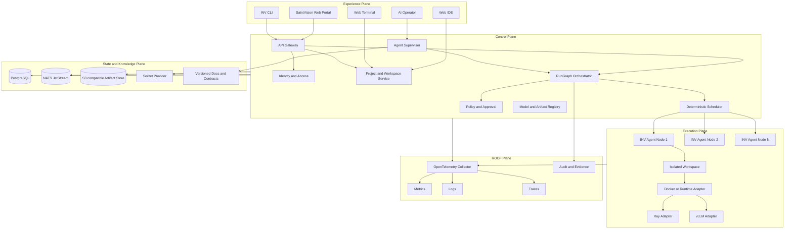
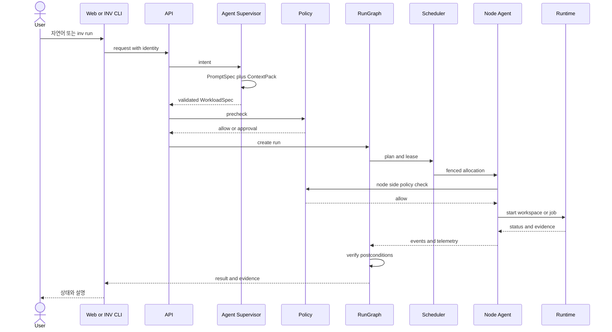

# 시스템 아키텍처와 기술 스택

## 설계 결론

SaintVision의 핵심은 여러 PC를 하나의 거대한 물리 컴퓨터로 속이는 것이 아니다. 사용자가 하나의 개발 환경과 자원 풀을 보도록 만들고, 실제 작업은 정책과 자원 상태에 따라 적합한 노드에 배치하는 **논리적 통합 제어면**이다.

MVP는 중앙 Control Plane, 가벼운 INV Node Agent, 격리 Workspace, 결정론적 Scheduler, 웹 Portal, AI Operator로 구성한다. 대규모 Kubernetes를 처음부터 필수화하지 않고, 5대 노드에서 설치와 복구가 쉬운 구조를 우선한다.

## 설계 원칙

1. **Non invasive**: 기존 OS, 애플리케이션, 사용자 데이터를 보존한다.
2. **Workspace is not Node**: 작업 환경과 물리 자원을 분리한다.
3. **Deterministic core**: 인증, 정책, lease, allocation, 상태 전이는 코드가 결정한다.
4. **Agentic assistance**: AI는 사양 생성, 계획, 설명, 진단, 코드 작업을 담당한다.
5. **Policy before action**: 모든 부작용 작업은 실행 전에 정책을 통과한다.
6. **Data locality first**: 대용량 데이터 이동 비용을 계산한다.
7. **Evidence before completion**: 성공은 모델의 응답이 아니라 테스트와 텔레메트리로 판정한다.
8. **Provider neutral contracts**: 상용 AI와 오픈소스 AI를 Adapter로 연결한다.

## 전체 구조



## 컴포넌트 경계

### SaintVision Web Portal

사용자와 관리자가 Project, Workspace, Node, Workload, Job, Model, Dataset, Approval, Audit를 관리하는 화면이다.

초기 화면:

- cluster overview
- node inventory와 health
- Workspace 목록
- Job 상태와 로그
- 승인 대기
- 자원 사용량과 비용
- `inv explain`과 동일한 배치 설명

### API Gateway

외부 REST와 WebSocket 진입점이다. 사용자 인증, request ID, rate limit, schema validation을 수행하고 내부 서비스로 전달한다.

### Project and Workspace Service

Project metadata, Git remote, WorkspaceProfile, persistent volume, session을 관리한다. Workspace를 만들 때 적합한 노드를 요청하지만 특정 노드를 사용자 계약에 노출하지 않는다.

### INV Node Agent

각 기존 PC에 설치되는 가벼운 서비스다.

- Windows service 또는 Linux systemd
- 노드 pairing과 certificate
- resource inventory와 heartbeat
- host owner policy 적용
- Workspace와 Job lifecycle
- Docker, WSL2, native executor Adapter
- contributed storage folder만 접근
- 텔레메트리와 감사 이벤트 전송

Node Agent는 Control Plane 연결이 끊어지면 새 작업을 받지 않고, 기존 작업은 lease와 local policy에 따라 중단 또는 제한적으로 계속한다.

### Scheduler

Scheduler V1은 AI가 아닌 결정론적 서비스로 구현한다.

```text
hard constraints
  -> policy-adjusted availability
  -> candidate nodes
  -> weighted scoring
  -> optimistic lease
  -> node-side revalidation
  -> allocation
```

기본 점수 요소:

- resource fit
- data locality
- model cache warmness
- network bandwidth와 RTT
- host interference
- fragmentation
- migration와 cold start cost
- energy 또는 시간 정책

점수와 제외 사유를 저장하여 `inv explain`이 재현한다.

### RunGraph Orchestrator

Workload와 Agent 작업을 durable state machine으로 실행한다. API 호출 자체가 성공했다고 다음 단계로 넘어가지 않고, 각 Step의 postcondition과 Evidence를 확인한다.

### Policy and Approval

인증과 정책을 분리한다.

- 인증: 누가 요청하는가
- 권한: 어떤 scope를 갖는가
- 정책: 현재 맥락에서 이 행동을 허용하는가
- 승인: 자동 허용이 아닌 행동을 누가 승인했는가

OPA를 policy decision point로 사용하고 서비스와 Node Agent가 enforcement point가 된다. Node Agent도 로컬 최소 정책을 가지고 중앙 정책 우회를 막는다.

### Agent Supervisor

자연어 요청을 WorkloadSpec 또는 CodingTaskSpec으로 바꾸고, ContextPack을 받아 RunGraph를 제안한다. Scheduler, Policy, Lease 상태를 직접 수정하지 않고 타입이 있는 API만 호출한다.

### Artifact와 Model Registry

소스와 binary, container image, dataset version, model artifact, eval result, evidence bundle을 관리한다. 대용량 binary는 S3 호환 object store, metadata는 PostgreSQL을 사용한다.

## 권장 기술 스택

| 영역 | MVP 선택 | 이유 | 주의점 |
|---|---|---|---|
| Web | React, TypeScript, Vite, TanStack Query | 작고 명확한 SPA와 빠른 개발 | SSR 필요성이 생길 때만 Next.js 검토 |
| Terminal | xterm.js, WebSocket, PTY gateway | 브라우저 Terminal의 검증된 기본 구성 | session과 Workspace scope를 강제 |
| 최소 편집기 | Monaco Editor | 파일 편집과 diff에 충분 | 전체 IDE 기능과 혼동 금지 |
| Web IDE 확장 | code-server 또는 OpenVSCode Server Adapter | 자체 호스팅 가능한 브라우저 IDE | 라이선스와 extension marketplace 검토 |
| Control API | Go | 단일 바이너리, 동시성, Windows와 Linux 배포 | domain package 경계를 엄격히 유지 |
| Node Agent | Go | 경량 서비스와 cross-platform 배포 | OS별 executor를 interface로 분리 |
| Agent Gateway | TypeScript | OpenAI Agents SDK와 Web stack 공유 | 공급자 계약을 내부 domain과 분리 |
| ML Worker | Python | Ray, PyTorch, vLLM, MLflow 생태계 | Control Plane 상태 소유 금지 |
| API contracts | Protobuf, JSON Schema, OpenAPI | 내부와 외부 계약의 기계 검증 | source of truth를 중복 운영하지 않음 |
| State | PostgreSQL | transaction, JSONB, 관계 데이터 | ResourceGraph는 projection으로 시작 |
| Event bus | NATS JetStream | 가벼운 배포, durable consumer, request reply | DB outbox로 일관성 확보 |
| Cache | 필요 시 Redis | rate limit과 ephemeral cache | 초기에는 불필요한 중복 도입 금지 |
| Policy | Open Policy Agent와 Rego | context aware allow deny approval | Node local fallback policy 필요 |
| Secrets | OS credential store 또는 Vault Adapter | 비밀의 직접 노출 방지 | Agent context와 log에 값 기록 금지 |
| Telemetry | OpenTelemetry Collector | trace, metric, log의 공통 경로 | 민감 정보 필터 processor 적용 |
| Metrics | Prometheus와 Grafana | 인프라와 workload 관찰 | label cardinality 제한 |
| Logs and traces | Loki와 Tempo 또는 호환 backend | 저비용 통합 관찰 | 운영 규모에 따라 대체 가능 |
| Containers | Docker Engine 또는 containerd Adapter | 개발자 친화와 기존 설치 활용 | Windows와 Linux 차이를 감추지 않음 |
| Distributed jobs | Ray Adapter | logical resource와 placement group | Ray 자원은 격리 자체가 아님 |
| LLM serving | vLLM Adapter | GPU serving와 병렬 실행 | 네트워크와 GPU topology 검증 필요 |
| MLOps | MLflow | 실험과 model registry MVP | 배포 권한은 별도 정책 |

## 중요한 기술 선택의 해석

### Ray는 INV Scheduler를 대체하지 않는다

Ray의 resource는 scheduling admission을 위한 논리 자원이며 CPU를 물리적으로 격리하지 않는다. INV Scheduler는 사용자의 host policy, storage locality, network cost, lease를 먼저 결정하고, Ray는 선택된 실행 환경 안에서 분산 Python 작업을 수행하는 Adapter로 사용한다.

### 여러 PC의 Memory를 하나의 RAM으로 표현하지 않는다

UI에는 총 memory capacity를 표시할 수 있으나 일반 프로세스가 하나의 address space로 사용할 수 있다고 표현하지 않는다. 분산 작업, object store, cache, model sharding 단위로 사용한다.

### Storage는 단계적으로 통합한다

MVP에서는 사용자가 허용한 폴더를 `StorageContribution`으로 등록하고, `inv://datasets/...`, `inv://models/...`, `inv://artifacts/...` namespace로 접근한다.

1. metadata와 location catalog
2. 읽기 전용 remote access
3. 선택적 replication과 cache
4. object gateway
5. 평가 후 distributed filesystem Adapter

OS partition 전체를 자동 편입하지 않는다.

### Web IDE 라이선스

Microsoft 공식 VS Code Server 문서는 서비스를 호스팅하는 사용을 허용하지 않는다고 명시한다. 제품 내장은 자체 호스팅을 지원하는 code-server 또는 OpenVSCode Server를 Adapter로 검토하고, 배포 전에 라이선스와 extension 공급 조건을 별도로 승인한다.

## 권장 저장소 구조

```text
SaintVision-Invion/
  AGENTS.md
  ARCHITECTURE.md
  README.md
  go.work
  package.json
  pnpm-workspace.yaml
  buf.yaml
  apps/
    web/
    inv-cli/
  services/
    api-gateway/
    project-service/
    scheduler/
    rungraph/
    policy-gateway/
    approval-service/
    agent-gateway/
  agents/
    node-agent/
  workers/
    ml-runtime/
  packages/
    contracts/
    client-ts/
    telemetry/
    ui/
  policies/
    rego/
    tests/
  prompts/
    catalog.yaml
    templates/
  evals/
    datasets/
    graders/
  deploy/
    compose/
    windows/
    linux/
  docs/
    design-docs/
    product-specs/
    exec-plans/
      active/
      completed/
    adr/
    generated/
  tests/
    contract/
    integration/
    e2e/
    chaos/
```

## 계층 의존성 규칙

각 domain package는 아래 방향으로만 의존한다.

```text
types -> config -> repository -> service -> runtime -> transport or UI
```

공통 기능은 provider interface를 통해 들어온다.

```text
identity, policy, telemetry, clock, event bus, secret, storage
```

서비스 간 database table 직접 접근을 금지하고, schema owner를 한 서비스로 지정한다. 구조적 lint와 dependency test로 규칙을 강제한다.

## 핵심 데이터 모델

### Resource

- `Node`: identity, OS, version, labels, health
- `ResourceCapacity`: physical 또는 configured total
- `ResourceOffer`: owner가 현재 제공하도록 허용한 양
- `ResourceSnapshot`: 측정 시각의 사용 가능량
- `ResourcePolicy`: 시간, 사용자, workload type별 제공 규칙
- `Lease`: fencing token이 있는 임시 예약
- `Allocation`: 실제 runtime과 node mapping

### Work

- `Project`
- `WorkspaceProfile`
- `WorkspaceInstance`
- `WorkloadSpec`
- `Job`
- `Task`
- `RunGraph`
- `Run`
- `StepRun`
- `EvidenceBundle`

### Agent

- `PromptSpec`
- `ContextPack`
- `ToolContract`
- `AgentProfile`
- `PolicyDecision`
- `Approval`
- `ModelInvocation`
- `EvalCase`와 `EvalResult`

## 주요 API 초안

| Method | Path | 기능 | 위험도 |
|---|---|---|---|
| POST | `/v1/nodes/pairing-tokens` | Node pairing token 발급 | 2 |
| POST | `/v1/nodes/register` | Node 등록 | 2 |
| POST | `/v1/nodes/{id}/heartbeats` | 상태 갱신 | 0 |
| GET | `/v1/resources/snapshot` | 자원 조회 | 0 |
| POST | `/v1/workspaces` | Workspace 생성 | 1 |
| POST | `/v1/workloads:plan` | 배치 계획과 설명 | 0 |
| POST | `/v1/workloads` | Workload 제출 | 1 또는 2 |
| POST | `/v1/jobs/{id}:cancel` | Job 취소 | 1 또는 2 |
| POST | `/v1/approvals/{id}:decide` | 승인 또는 거절 | 2 |
| POST | `/v1/agent-runs` | Agent Run 시작 | 정책 기반 |
| GET | `/v1/runs/{id}/evidence` | 증거 조회 | 0 |

모든 mutation은 `Idempotency-Key`, actor identity, project scope, trace context를 요구한다.

## 핵심 실행 흐름



## 신뢰 경계

- Browser와 API 사이
- Control Plane과 Node Agent 사이
- Workspace container와 Host 사이
- AI model과 Tool Gateway 사이
- MCP 또는 외부 CLI와 Secret Provider 사이
- Project A와 Project B 사이
- 의료 또는 민감 데이터 영역과 일반 개발 영역 사이

모든 경계는 identity, encryption, scope, audit, timeout을 가져야 한다.

## 확장 시 재검토할 결정

- 20대 이상 또는 다중 사이트에서 event bus와 control plane 고가용성
- Kubernetes, Nomad, Slurm Adapter
- SPIFFE와 SPIRE 기반 workload identity
- 별도 graph database
- erasure coding과 distributed filesystem
- RL 또는 learned Scheduler
- 다중 tenant 강한 격리
- edge와 cloud의 계층 Scheduler
- 의료기기 소프트웨어 규제 범위
