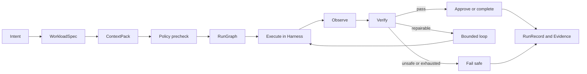

> [!important] 기존 설계 원문 참조
> 충돌 시 [[최종 개발 계획 - 모든 개발의 지침]]과 [[설계 충돌 정정 및 ADR]]을 따릅니다. 이 문서는 원문 보존용이며 확정 구현 사양이 아닙니다. 원본은 Git `docs/sources/10_Concepts/용어 사전과 6단계 통합 모델.md`에 SHA-256과 함께 보존됩니다.

# 용어 사전과 6단계 통합 모델

## 결론

SaintVision의 AI 개발 체계는 다음 질문을 순서대로 해결한다.

| 단계 | 통일 용어 | 해결할 질문 | 핵심 산출물 |
|---|---|---|---|
| 1 | Prompt Engineering | 모델에게 무엇을 어떻게 요구하는가 | `PromptSpec` |
| 2 | Context Engineering | 지금 판단에 어떤 정보를 넣을 것인가 | `ContextPack` |
| 3 | Harness Engineering | 안전하게 실행하고 스스로 검증할 환경이 있는가 | `ToolContract`, `WorkspaceProfile` |
| 4 | Graph Engineering | 작업, 상태, 의존성, 분기를 어떻게 연결하는가 | `RunGraph`, `ResourceGraph` |
| 5 | ROOF Engineering | 위험, 관찰, 승인, 실패를 누가 어떻게 통제하는가 | `PolicyBundle`, `EvidenceBundle` |
| 6 | Agent Engineering | 어떤 책임 주체가 어떤 권한으로 목표를 완수하는가 | `AgentProfile`, `RunRecord` |

Prompt는 지시문 하나이고, Context는 한 번의 판단에 들어가는 전체 정보이며, Harness는 에이전트가 실제 일을 수행하는 실행 환경이다. Graph는 여러 단계와 상태 전이를 조직하고, ROOF는 전체 실행 위에 통제와 복구 능력을 씌우며, Agent는 이 모든 요소를 책임과 권한이 있는 실행 주체로 조합한다.

## 1 Prompt Engineering

### 정의

모델이 수행할 목표, 제약, 출력 형식, 도구 사용 원칙, 완료 조건을 명확한 지시로 표현하고 평가를 통해 개선하는 작업이다. 프롬프트의 문구를 아름답게 만드는 작업이 아니라 관찰 가능한 행동 계약을 만드는 작업으로 통일한다.

### SaintVision 적용

예를 들어 사용자의 자연어 요청인 “GPU 두 개를 사용해 Qwen 모델을 실행해”를 다음 구조의 `WorkloadSpec`으로 변환하도록 지시한다.

- 목적: 모델 서빙
- 요청 자원: GPU 2개와 최소 VRAM
- 실행 정책: 데이터 지역성 우선, 기존 사용자 작업 방해 금지
- 허용 도구: 자원 조회와 계획 생성
- 금지 도구: 실제 실행과 노드 설정 변경
- 출력: 검증 가능한 JSON
- 불확실성: 누락된 모델 경로와 VRAM 요구량

### 필수 요소

- 목적과 성공 조건
- 입력 데이터의 의미와 신뢰 수준
- 허용 및 금지 행동
- 사용할 수 있는 도구와 호출 조건
- 출력 스키마와 예제
- 사실, 추론, 권고의 구분
- 실패 시 행동과 사용자에게 질문할 조건
- 프롬프트 버전과 대상 모델 계열
- 평가 데이터와 회귀 기준

### 금지 패턴

- 프롬프트에 비즈니스 로직을 과도하게 숨기는 것
- 도구 설명과 정책을 긴 자연어로 중복하는 것
- 모델이 반드시 특정 순서로 생각하도록 강제하는 취약한 지시
- JSON을 요구하면서 JSON Schema 검증을 생략하는 것
- 모델 또는 프롬프트를 바꾸면서 평가 기준도 동시에 바꾸는 것

### 완료 기준

- 출력 스키마 유효율 99퍼센트 이상
- 대표 요청 세트의 작업 성공률 목표 달성
- 금지 행동과 권한 초과 시도 100퍼센트 차단
- 프롬프트 변경 전후 회귀 평가 기록 존재
- 프롬프트 ID와 버전이 모든 실행 추적에 남음

## 2 Context Engineering

### 정의

한 번의 모델 추론에 들어갈 시스템 지시, 사용자 요청, 도구 정의, 정책, 프로젝트 지식, 실시간 상태, 과거 실행, 검색 결과를 제한된 토큰 예산 안에서 선택하고 유지하는 작업이다.

### SaintVision 적용

스케줄링 보조 에이전트가 받아야 할 Context는 전체 데이터베이스 덤프가 아니다. 현재 작업에 필요한 노드 자원, 데이터 위치, 네트워크 상태, 관련 정책, 최근 실패, 스케줄러 설명 규칙만으로 구성된 `ContextPack`이어야 한다.

### ContextPack 계층

1. 고정 지침: 제품 원칙, 역할, 금지 행동
2. 작업 계약: 목표, 입력, 출력, 완료 조건
3. 정책 스냅샷: 사용자 권한, 노드 제공 정책, 승인 규칙
4. 현재 상태: 자원, 작업, 저장소, 네트워크 텔레메트리
5. 검색 지식: 관련 설계 문서, 코드, 운영 절차
6. 실행 기억: 직전 단계 결과, 실패와 재시도 횟수
7. 출처 정보: 원본 URI, 생성 시각, 버전, 신뢰 수준

### 필수 요소

- 소스별 권위와 최신성 TTL
- 최소 필요 정보 원칙
- 검색, 필터, 재순위화, 중복 제거
- 토큰 예산과 우선순위
- 긴 실행의 압축과 구조화된 메모
- 개인정보, 비밀, 의료정보의 비식별화 또는 제외
- 인용 가능한 provenance
- 프롬프트 인젝션이 가능한 외부 문서의 불신 표시

### 완료 기준

- 모든 주요 판단이 사용한 근거와 출처를 역추적 가능
- 만료된 자원 정보로 실행 결정하지 않음
- 금지된 비밀값이 모델 컨텍스트와 추적 로그에 나타나지 않음
- 같은 입력과 같은 스냅샷으로 재현 가능한 ContextPack 생성
- 컨텍스트 크기, 검색 지연, 적중률, groundedness를 측정

## 3 Harness Engineering

### 정의

에이전트가 도구를 발견하고 코드를 변경하며 테스트하고 관찰하고 실패에서 회복할 수 있도록 저장소, 작업공간, 샌드박스, 도구, CI, 로그, 규칙, 문서를 함께 설계하는 작업이다.

### SaintVision 적용

Harness는 AI 모델 바깥의 실제 작업 능력이다. `AGENTS.md`의 저장소 지도, 격리된 Workspace, Git 작업 브랜치, Docker 실행기, 테스트 명령, 브라우저와 터미널 관찰, 로그와 메트릭 질의, 패치 도구, 승인 게이트가 하나의 실행 환경을 이룬다.

### 필수 요소

- 짧은 `AGENTS.md`와 구조화된 `docs/`
- 작업별 격리 Workspace와 수명주기
- 명시적 도구 스키마와 작은 권한 범위
- 결정론적 빌드, 린트, 테스트, 스모크 테스트
- 구조적 로그, 메트릭, 분산 추적
- 시간 제한, 자원 제한, 네트워크 제한
- 파일 변경 범위와 위험 명령 정책
- 실행 결과를 읽을 수 있는 증거 수집
- 실패한 작업을 재현할 수 있는 입력과 환경 기록

### 완료 기준

- 새 에이전트가 저장소 지도를 따라 10분 내 핵심 구조를 찾음
- 작업공간 사이의 파일과 비밀이 격리됨
- 테스트와 관찰 도구가 에이전트에게 직접 읽힘
- 동일한 커밋과 환경 정의로 빌드 재현 가능
- 실패가 발생하면 명령, 로그, 변경 diff, 정책 결정을 한 실행 ID로 묶음

## 4 Graph Engineering

### 정의

작업 노드, 에이전트, 상태, 자원, 의존성, 분기, 재시도, 종료 조건을 명시적인 그래프로 표현하고 실행 가능하게 만드는 작업이다. 이 용어는 빠르게 확산 중이지만 단일 국제 표준은 아니므로 SaintVision에서는 아래 세 그래프로 정확히 구분한다.

### 세 가지 그래프

1. **RunGraph**: 계획, 승인, 실행, 검증, 복구를 잇는 작업 오케스트레이션 그래프
2. **ResourceGraph**: Node, CPU, GPU, Storage, Dataset, NetworkLink의 현재 관계 그래프
3. **KnowledgeGraph**: 제품, 코드, 모델, 데이터, 정책의 의미 관계 그래프

그래프를 말할 때는 반드시 세 이름 중 하나를 사용한다. 단순히 “Graph”라고 부르지 않는다.

### RunGraph 필수 요소

- 타입이 있는 노드 입력과 출력
- 허용 상태 전이
- 전이 전 조건과 전이 후 조건
- 실행 중복을 막는 idempotency key
- 체크포인트와 재개
- 최대 재시도 수와 timeout
- 보상 또는 rollback 경로
- 사람 승인 interrupt
- 그래프 버전과 실행 스냅샷

### ResourceGraph 필수 요소

- 노드와 자원의 안정적 식별자
- 자원 용량과 현재 제공 가능량의 분리
- 네트워크 대역폭과 지연
- 데이터와 모델 캐시의 실제 위치
- 정책에 의해 계산된 사용 가능량
- 측정 시각과 TTL
- 예약, 임대, 할당 관계

### 완료 기준

- 모든 실행 경로에 종료 또는 명시적 대기 상태가 있음
- 재시작 후 마지막 안전 체크포인트에서 재개
- 같은 작업의 중복 실행과 이중 자원 할당 방지
- 그래프 시각화와 실제 추적 순서가 일치
- ResourceGraph 기반 배치 결정의 이유를 설명 가능

## 5 ROOF Engineering

### 용어 결정

2026년 9월 기준으로 `Roof Engineering`은 AI 에이전트 분야의 공인된 보편 용어로 확인되지 않는다. 따라서 SaintVision 문서에서는 외부 표준인 것처럼 사용하지 않고, 프로젝트 내부의 상위 통제 계층 이름인 **ROOF Engineering**으로 정의한다.

- **R - Risk controls**: 위험 분류, 최소 권한, 격리, 금지 정책
- **O - Observability**: 로그, 메트릭, 추적, 비용, 자원 사용, 평가
- **O - Ownership and approvals**: 사람과 서비스의 책임, 승인, 변경 권한
- **F - Failure containment and fallback**: 실패 격리, 제한된 재시도, 복구, 안전 정지

ROOF는 Prompt부터 Agent까지 모든 단계 위에 놓이는 가로축이다. 코드 패키지나 외부 문서에서는 오해를 줄이기 위해 `runtime-governance`, `policy`, `observability`, `recovery`라는 표준 이름을 사용하고, 제품 설계 문서에서만 이 네 영역의 묶음을 ROOF라고 부른다.

### Loop Engineering과의 관계

사용자가 의도한 용어가 `Loop Engineering`이라면 그 개념은 다음과 같다.

```text
Plan -> Act -> Observe -> Evaluate -> Repair or Replan -> Verify -> Exit
```

SaintVision에서는 이 루프를 ROOF의 Failure containment 아래에 포함한다. 루프는 무한 반복하지 않으며 최대 반복, 시간, 비용, 변경 범위, 승인 조건을 갖는다.

### 필수 요소

- 명령 위험 등급 0에서 3
- 정책 엔진의 allow, deny, approval 결정
- 위험 작업의 사람 승인과 만료
- 전체 도구 호출의 감사 기록
- 자원, 토큰, 시간, 비용 예산
- 오류 분류와 재시도 가능 여부
- circuit breaker와 안전 정지
- 변경 전후 diff와 rollback 계획
- SLO와 경보 기준

### 완료 기준

- 권한 없는 명령과 자원 접근 100퍼센트 차단
- 모든 부작용 작업에 정책 결정 ID가 존재
- 실패한 실행이 다른 Workspace와 기존 호스트 작업에 전파되지 않음
- 재시도 한도 초과 시 자동 중단과 사람이 이해할 수 있는 보고서 생성
- 감사자가 실행 목적, 승인자, 명령, 결과, 변경 파일을 하나의 RunRecord로 조회

## 6 Agent Engineering

### 정의

모델, 프롬프트, 컨텍스트, 도구, 기억, 그래프, 정책, 평가를 결합해 제한된 책임과 권한을 가진 자율 실행 주체를 설계하고 운영하는 작업이다.

### SaintVision 적용 원칙

처음에는 하나의 `INV Supervisor Agent`가 계획 설명과 제한된 도구 호출을 담당한다. 전문 에이전트는 다음 중 하나가 달라질 때만 분리한다.

- 필요한 도구가 다름
- 접근할 데이터가 다름
- 보안 정책이 다름
- 출력 계약이 다름
- 전문 평가 기준이 다름
- 사용자 대화의 소유권이 달라짐

### 역할 후보

| Agent | 책임 | 기본 권한 | 최종 결정권 |
|---|---|---|---|
| Supervisor | 요청 분해, 전문가 호출, 결과 통합 | 읽기와 계획 | 사용자 응답 |
| Planner | 목표를 WorkloadSpec과 RunGraph로 변환 | 읽기 전용 | 없음 |
| Coding | 격리 Workspace의 코드 변경 | 프로젝트 쓰기 | 없음 |
| Test | 테스트와 증거 수집 | 실행 전용 | 합격 판정 제안 |
| Review | diff, 보안, 아키텍처 검토 | 읽기 전용 | 없음 |
| Infrastructure | 노드와 런타임 작업 제안 | 제한된 운영 도구 | 정책 승인 후 실행 |
| MLOps | 실험, 모델, 배포 워크플로 관리 | 프로젝트별 | 승인 후 배포 |

스케줄링의 최종 자원 할당은 결정론적 Scheduler와 Policy Engine이 수행한다. AI Agent는 후보 계획과 설명을 만들 수 있지만 자원 일관성이나 보안 결정을 단독으로 내리지 않는다.

### 완료 기준

- AgentProfile에 책임, 입력, 출력, 도구, 데이터, 예산, 승인 조건이 명시됨
- 각 에이전트의 성능을 독립 평가 가능
- handoff와 agent-as-tool 사용 이유가 문서화됨
- 도구 권한은 최소 권한이며 작업 종료 시 회수됨
- 모델 공급자를 교체해도 핵심 계약과 정책이 유지됨

## 공통 용어

| 용어 | 통일 정의 | 사용 금지 또는 구분 |
|---|---|---|
| Project | 코드, 문서, 정책, 실행 기록의 관리 단위 | Workspace와 혼용 금지 |
| Workspace | 한 프로젝트 작업을 위한 격리 실행 환경 | 물리 Node가 아님 |
| Node | INV Agent가 설치된 물리 또는 가상 컴퓨터 | Workspace가 아님 |
| Resource | CPU, GPU, memory, storage, network의 측정 가능한 능력 | 실제 용량과 제공 가능량 구분 |
| Workload | 사용자가 원하는 논리적 실행 사양 | 실제 실행 인스턴스인 Job과 구분 |
| Job | Workload에서 생성된 실행 단위 | Task의 상위 단위 |
| Task | Job 내부의 재시도 가능한 최소 실행 단위 | 대화 Task와 혼용 금지 |
| Run | Agent 또는 RunGraph의 한 번의 추적 가능한 수행 | Job과 연결될 수 있으나 동일하지 않음 |
| Step | RunGraph의 한 노드 실행 | Task와 혼용 금지 |
| Tool | Agent가 호출할 수 있는 타입이 있는 능력 | CLI 바이너리 자체와 구분 |
| Adapter | 외부 제품이나 런타임을 내부 계약으로 변환하는 모듈 | Agent와 구분 |
| Lease | 정해진 시간 동안 자원 사용 권리를 예약한 기록 | 실제 Allocation과 구분 |
| Allocation | Lease를 특정 Node와 Runtime에 반영한 결과 | Resource 총량과 구분 |
| Evidence | 완료 또는 실패를 증명하는 테스트, 로그, 메트릭, diff | 모델의 주장만으로 대체 금지 |

## 통일된 식별자와 버전

- `prm_`: PromptSpec
- `ctx_`: ContextPack
- `tool_`: ToolContract
- `wsp_`: Workspace
- `grf_`: RunGraph
- `pol_`: PolicyBundle 또는 PolicyDecision
- `agt_`: AgentProfile
- `run_`: Agent Run
- `wrk_`: Workload
- `job_`: Job
- `evd_`: EvidenceBundle

정의 문서는 의미 버전 또는 날짜 기반 버전을 사용하고, 실제 RunRecord에는 사용된 모든 구성 요소의 불변 버전을 저장한다. `latest` 같은 움직이는 값만 저장하지 않는다.

## 통일된 전체 과정



각 단계는 입력 계약, 출력 계약, 정책 결정, 관찰 데이터, 완료 증거를 남긴다. 이 다섯 항목이 없는 기능은 프로토타입으로만 취급하고 운영 기능으로 승격하지 않는다.
