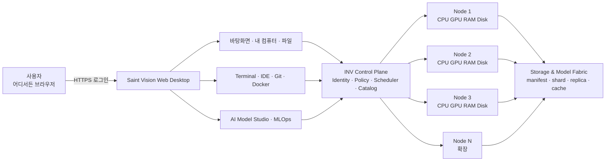

# 웹 단일 가상 컴퓨터와 분산 모델 Fabric 보강 설계

## 결정

Saint Vision의 사용자 경험은 **웹에서 접속하는 하나의 가상 컴퓨터**로 고정한다. 사용자는 바탕화면, 내 컴퓨터, 파일, Terminal, 개발 Studio, AI Model Studio를 한 공간에서 사용한다. INV는 그 아래에서 여러 Node의 CPU·GPU·RAM·스토리지·네트워크를 관측하고, 작업과 데이터를 안전한 실행 단위로 배치한다.

이 결정은 물리 장치를 거짓으로 한 장치처럼 표시하지 않는다. 하나의 WSL이 여러 PC에 걸쳐 동작하는 것도 아니며, 서로 다른 GPU의 VRAM이 자동으로 하나의 VRAM이 되는 것도 아니다. **하나의 사용자 경험과 논리 namespace를 제공하되, 실행 시에는 실제 topology와 capability를 보존한다.**



## 시스템 경계

| 사용자에게 보이는 것 | 내부의 실제 구현 |
|---|---|
| 하나의 내 컴퓨터 | Node별 자원 snapshot을 합산한 논리 Resource Explorer |
| 하나의 저장 경로 | `inv://` namespace와 metadata catalog, 분산 object/chunk, local cache |
| 하나의 Terminal | Workspace session과 PTY Gateway; 명령은 선택된 실행 Node/Container에서 수행 |
| 하나의 AI 모델 | ModelManifest와 검증된 shard/replica 집합 |
| 하나의 실행 버튼 | capability·data locality·network·lease·policy를 계산하는 Scheduler |
| 어디서든 접속 | 공개 WSL/RDP가 아니라 HTTPS Gateway, OIDC, 세션 격리, 감사 기록 |

## 논리 드라이브와 저장 구조

사용자 경로는 다음처럼 단순하게 유지한다.

```text
inv://workspaces/{workspaceId}/...
inv://models/{modelId}/{version}/...
inv://datasets/{datasetId}/{version}/...
inv://artifacts/{runId}/{artifactId}
```

각 URI는 실제 파일 하나를 직접 가리키지 않을 수 있다. Catalog가 manifest를 해석하고, Storage Adapter가 여러 Node의 제공 디스크와 전용 object storage에서 chunk 또는 object를 찾는다.

### 모델 저장 단위

`ModelManifest`는 최소한 아래 정보를 가진다.

| 필드 | 의미 |
|---|---|
| `modelId`, `version`, `format` | 모델의 불변 식별과 형식 |
| `totalBytes`, `contentHash` | 전체 크기와 검증 기준 |
| `shards[]` | shard 순서, byte 범위 또는 tensor 이름, hash |
| `replicas[]` | shard가 존재하는 Storage Node와 상태 |
| `runtimeCompatibility` | PyTorch, Transformers, vLLM 등 실행 조건 |
| `licensePolicy`, `classification` | 배포·복제·외부 전송 허용 범위 |
| `encryption`, `keyRef` | 저장 암호화와 키 참조. 키 원문은 저장하지 않음 |

Storage Fabric은 다음 규칙을 지킨다.

1. manifest가 commit되기 전 모델을 실행 가능으로 표시하지 않는다.
2. 모든 shard는 trusted worker가 실제 bytes hash를 검증한다.
3. 단일 shard 유실이 전체 모델 유실이 되지 않도록 정책 기반 replica를 둔다.
4. 실행 직전 data locality를 우선하고, 없는 shard만 bounded prefetch한다.
5. pin된 모델·실행 중 artifact·Evidence 참조 파일은 GC에서 제외한다.
6. Node가 이탈하면 해당 replica만 unavailable로 표시하고 manifest 자체를 파괴하지 않는다.

## 저장과 실행은 별개다

모델 파일을 여러 디스크에 나누어 저장했다고 해서 자동으로 여러 GPU에서 계산되는 것은 아니다. 실행 방식은 별도 `ExecutionPlan`으로 고정한다.

| 실행 모드 | 용도 | 핵심 조건 |
|---|---|---|
| Single-node | 한 GPU/CPU에 맞는 모델 | 모델이 장비 메모리에 적합 |
| Request routing | 여러 요청을 여러 Node에 분산 | 각 Node가 모델 replica를 보유 |
| Data parallel | 학습 batch 분산 | 동일 모델 replica, collective 통신 가능 |
| Tensor / pipeline parallel | 한 모델을 여러 GPU/Node에 분할 | runtime 지원, 빠른 network, topology 검증 |
| CPU/GPU offload | 일부 layer를 RAM/CPU/스토리지로 이동 | latency 허용, runtime adapter 지원 |

Scheduler는 `WorkloadSpec`, `ModelManifest`, Node capability, 현재 사용자 부하, network benchmark, data locality, 정책과 Lease를 입력으로 받아 모드를 선택한다. 지원이 확인되지 않은 임의 모델을 자동 분할하지 않는다.

## Web Desktop 구성

1. **Desktop Shell** — 앱 launcher, 작업 표시줄, 알림, 세션 복원.
2. **My Computer / Resource Explorer** — 전체 논리 용량과 Node별 실제 topology를 함께 표시.
3. **File Explorer** — `inv://` namespace, 업로드·복사·pin·버전·공유 정책.
4. **Developer Studio** — Web IDE, Bash/PowerShell, Git, Docker/BuildKit, Jupyter.
5. **AI Model Studio** — 모델 import, manifest, shard 배치, 실행 모드, 평가, lineage.
6. **Operations Center** — Node 상태, Lease, queue, 비용/전력, 장애, 감사와 Evidence.

PowerShell은 Windows 실행 Node에서, Bash/Zsh는 Linux/WSL/container에서 실행한다. 브라우저 Terminal은 shell을 흉내 내는 화면이 아니라 인증된 PTY session에 연결된다.

## 외부 접속과 보안

- WSL, Docker socket, Node Agent, database, object storage port를 인터넷에 직접 노출하지 않는다.
- HTTPS Gateway 뒤에서 OIDC Authorization Code + PKCE, MFA, 짧은 session, device/risk policy를 적용한다.
- Workspace와 Project grant를 매 요청과 WebSocket 재연결에서 다시 확인한다.
- Terminal은 one-time ticket, bounded input/output, idle timeout, command audit, secret redaction을 사용한다.
- Node는 outbound 등록 또는 승인된 tunnel을 사용하고, mTLS·permit·fencing token으로 stale 명령을 거부한다.
- 모델 license와 데이터 classification이 허용하지 않으면 다른 지역·사용자 Node로 복제하지 않는다.

## 5대에서 다수 Node로 확장

첫 인수 범위는 5대의 실제 PC로 유지한다. 이후 확장은 무한대를 약속하는 대신 다음 단계로 한다.

1. **Cell** — 하나의 Control Plane이 관리하는 수십 Node 단위.
2. **Federation** — 여러 Cell의 catalog와 capacity를 연결하되 identity·policy·data sovereignty를 유지.
3. **Edge cache** — 사용자와 가까운 Node에 모델 shard와 workspace snapshot을 배치.
4. **Portable AI state** — model, adapter, prompt/config, memory snapshot, tool policy를 버전 묶음으로 이동.

## 검토한 선택지

| 선택지 | 장점 | 한계 | 결정 |
|---|---|---|---|
| 중앙 MinIO/NAS만 사용 | MVP가 단순함 | 기여 Node 디스크 활용과 장애 분산이 약함 | 초기 bootstrap backend로 허용 |
| 모든 PC에 투명 분산 filesystem 강제 | POSIX 경험이 쉬움 | Windows/WSL 혼합, split-brain, 작은 파일, 운영 난도가 큼 | 기본 경로로 채택하지 않음 |
| object namespace + manifest + contributed storage + cache | 무결성·복제·위치 인식·단계적 확장이 가능 | POSIX가 필요한 도구에는 Workspace mount adapter 필요 | **채택** |

구체 backend는 adapter 뒤에 둔다. 초기에는 MinIO-compatible object API와 Node local cache를 사용하고, 실측 뒤 Ceph·SeaweedFS·다른 분산 backend를 선택할 수 있다.

## 결과와 비용

### 얻는 것

- 사용자 경험은 한 컴퓨터처럼 단순해진다.
- 실제 topology를 숨기지 않으므로 잘못된 메모리·GPU 약속을 피한다.
- 모델 저장과 모델 실행을 분리해 복구, locality, runtime 선택을 각각 검증할 수 있다.
- 5대 MVP를 버리지 않고 Cell/Federation으로 확장할 수 있다.

### 감수할 것

- metadata catalog, manifest transaction, replica repair, cache eviction이 새 핵심 운영 영역이 된다.
- 네트워크가 느리면 분산 tensor 실행이 단일 Node보다 나쁠 수 있다.
- POSIX를 요구하는 개발 도구에는 materialized Workspace와 write-back 정책이 필요하다.
- 모든 Node를 신뢰할 수 없으므로 zero-trust identity, encryption, attestation 수준을 단계적으로 높여야 한다.

## 합격 증거

- 외부 브라우저 로그인부터 Web Desktop·파일·Terminal·모델 실행까지 종단간 성공.
- 5대 실제 Node에서 논리 용량과 Node별 실제 자원이 모두 정확히 표시됨.
- 모델 shard 하나를 의도적으로 제거했을 때 replica repair 또는 명시적 실행 거부가 증명됨.
- Scheduler가 locality와 network profile에 따라 실행 계획을 재현 가능하게 설명함.
- unsupported model/runtime은 자동 분할 대신 명확한 capability 오류를 반환함.
- Node 이탈, stale permit, 권한 회수, WebSocket 재연결, 저장 장애 시험이 모두 Evidence로 남음.

