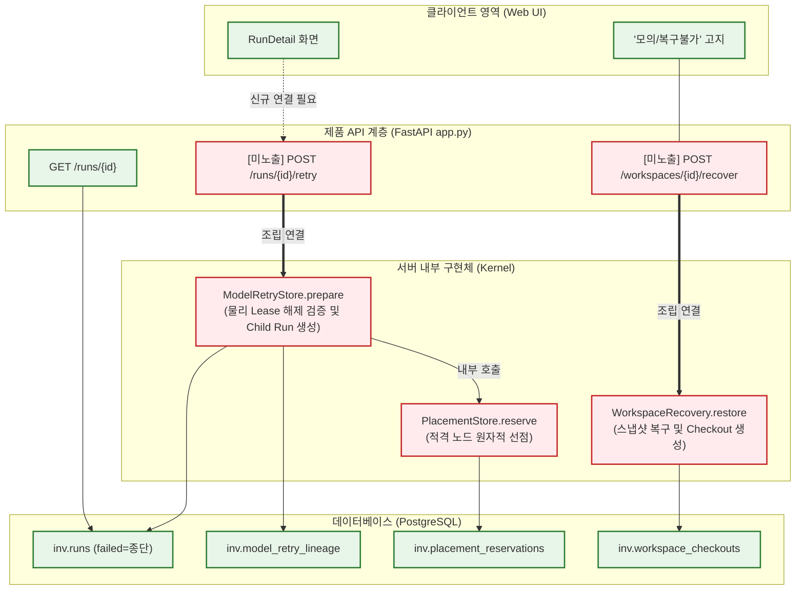

# 미연결 능력 부류 현황 및 제품 노출 분석 (결정 #6 준비)

> **목적**: [[사용자_결정대기_브리프_2026-09-22]] 항목 6(미연결 능력 부류)에 명시된 3대 서버 내부 구현체(실패 Run 재시도, 온디맨드 복구 API, 배치 예약)의 코드 위치, 계약, 진입점 노출 여부, 소유권, 노출 시 최소 작업 및 위험을 정밀 분석하여 제품 노출 결정을 지원한다.

---

## 1. 개요: 왜 '미연결 능력 부류'인가?

Codex의 정적 감사([[2026-09-22_Run_retry_path_and_low_risk_write_contracts_Codex]], [[2026-09-22_ControlPlane_제품경로_도달성_감사_Codex]])와 Claude의 독립 검토([[2026-09-22_Codex_재시도부재_및_저위험7결속_독립검토_Claude]])를 통해, 시스템 내부에 **구현과 DB 트랜잭션 시험은 완비되어 있으나 제품 진입점(REST API 및 Worker 조립)이 없어 외부에서 도달할 수 없는 기능군**이 존재함이 확인되었다.

이 항목들은 작업 진행을 막는 "차단(Blocker)"이 아니라, 사용자가 당연히 존재할 것으로 기대하지만 실제로는 호출 경로가 닫혀 있는 **"기대-공백(Expectation Gap)"**의 성격을 띤다. 특히 일반 실패 Run의 재시도는 일반적인 SaaS/플랫폼 사용자의 1차적 기대와 직결되어 있어 가장 큰 불일치를 유발한다.

---

## 2. 미연결 능력 부류 현황 총괄 표

| 능력 항목 | 코드 위치 | 계약 존재 여부 | 제품 진입점 노출 여부 | 제안 Owner | 노출 시 필요한 최소 작업 | 주요 위험 및 방어 기제 |
|:---|:---|:---|:---|:---|:---|:---|
| **6a. 실패 Run 재시도** (ModelRetry) | `services/control-plane/src/inv/model_retry.py` (`ModelRetryStore.prepare`) `inv/migrations/0018_execution_runs.sql` | **내부 계약 있음** (Pydantic/DB DDL 완비) **공개 REST 계약 없음** | **미노출 (호출 0건)** - `app.py` 라우트 없음 - 상태기계상 `failed`는 종단 - UI 버튼은 단순 재조회 | **Codex** (커널/DB) + **Claude** (API) + **Gemini** (UI) | 1. `POST /runs/{id}/retry` 계약/라우트 신설 2. `ModelRetryStore.prepare` 호출 조립 3. `run:retry` 권한 결속 4. UI 재시도 액션 버튼 연결 | **위험**: 무한 재시도 및 Lease 중복 점유 **방어**: 4세대 제한(`generation >= 4` 거부) 및 선행 lease 물리 해제 단언 이미 구현됨 |
| **6b. 온디맨드 복구 API** (WorkspaceRecovery) | `services/control-plane/src/inv/workspace_recovery.py` (`restore`, `checkout`) `tests/integration/test_workspace_recovery.py` | **내부 계약 있음** (스냅샷/세대 스키마) **공개 REST 계약 없음** | **미노출 (호출 0건)** - `configured_workspace`는 `WorkspaceAPI`만 조립 - UI는 '복구 불가' 정직 고지 | **Codex** (스토리지/DB) + **Claude** (API) | 1. `POST /workspaces/{id}/recover` 계약/라우트 2. Lock 획득 후 `restore()` 호출 3. 복구 세대 checkout 영수증 반환 | **위험**: 활성 워크스페이스 덮어쓰기 경합 **방어**: 대상 워크스페이스 동결 상태 확인 및 트랜잭션 롤백 보장 |
| **6c. 배치 예약** (PlacementStore) | `services/control-plane/src/inv/placement.py` (`PlacementStore.reserve`) `services/control-plane/src/inv/scheduler.py` | **내부 계약 있음** (`inv.placement_reservations`) **독립 API 계약 불필요** | **미노출 (호출 체인 고립)** - 유일한 제품 caller 후보가 미연결 `ModelRetry`임 | **Codex** (스케줄링/배치) | 독립 작업 불필요. **6a(ModelRetry) 노출 시 내부 트랜잭션으로 자동 활성화됨** | **위험**: 노드 자원 Overcommit **방어**: DB 행 잠금(`FOR UPDATE`) 및 스큐 노드 배제 가드 작동 |

---

## 3. 항목별 심층 기술 분석

### 3.1. 6a. 실패 Run 재시도 (`ModelRetryStore`)

1. **상태기계 및 아키텍처 특성**:
   - `0001_core.sql` 및 `0018_execution_runs.sql`에 정의된 상태 전이 규칙 상, `failed`는 **종단 상태(Terminal State)**다. 즉, 실패한 Run 객체 자체를 다시 `pending`이나 `running`으로 되돌리는 상태 전이(`failed -> *`)는 엄격히 금지되어 있다.
   - `ModelRetryStore.prepare`는 기존 Run을 변이(mutate)시키는 것이 아니라, 선행 Run의 모든 물리 Lease가 완전히 해제되었음을 실측 검증한 뒤, 동일한 모델 ID·버전·입력 해시를 가지는 **새로운 Child Run**을 생성하고 `inv.model_retry_lineage` 테이블에 족보(Lineage)를 기록한다.
2. **유사 재시도 메커니즘과의 엄밀한 구분**:
   - `DeliveryQueue`: 네트워크 단절 등으로 전송되지 못한 동일 커맨드/영수증의 재전송을 담당 (실행 재시도가 아님).
   - `OutputIngestion`: 이미 실행된 결과 산출물의 수집 실패 시 재수집을 담당.
   - `WorkspaceResume`: `recovering` 상태인 워크스페이스의 다음 step을 진행하는 협소한 흐름.
   - `RunList UI "다시 시도"`: 실패한 실행을 재실행하는 것이 아니라, HTTP 목록 데이터를 새로고침(refetch)하는 조회 버튼임.
3. **노출 시 최소 작업**:
   - `POST /v1/projects/{projectId}/runs/{runId}/retry` 엔드포인트 명세 정의 (`contracts/v1alpha1`).
   - `app.py` 라우터에 엔드포인트를 마운트하고 호출자의 `run:retry` 권한 검증.
   - UI(`RunDetail.tsx`)에서 Run 상태가 `failed`일 때 "새 Run으로 재시도" 버튼 활성화.

### 3.2. 6b. 온디맨드 복구 API (`WorkspaceRecovery`)

1. **현재 구현 상태**:
   - `WorkspaceRecovery.restore`와 `checkout`은 스토리지 파일과 스냅샷을 읽어 정상 복구 세대를 생성하는 DB 로직 및 단위/통합 시험이 100% 갖추어져 있다.
   - 그러나 `services/control-plane/src/inv/workspace_config.py`의 조립 팩토리는 오직 `WorkspaceAPI`만 인스턴스화하여 라우터에 넘기며, `WorkspaceRecovery`는 제품 조립에서 완전히 제외되어 있다.
   - 웹 프런트엔드는 이를 우회하거나 허위로 성공 처리하지 않고 "모의 / 복구 불가·미수행"으로 사용자에게 정직하게 고지하고 있다.
2. **노출 시 최소 작업**:
   - `POST /v1/workspaces/{workspaceId}/restore` 엔드포인트 신설.
   - 워크스페이스 동결 확인, 스냅샷 파일 무결성 해시 검증, `WorkspaceRecovery.restore()` 트랜잭션 수행.

### 3.3. 6c. 배치(Placement) 예약 (`PlacementStore`)

1. **연계 및 종속 관계**:
   - `PlacementStore.reserve`는 노드 후보군 중 가용 자원과 시각 스큐 한도(`abs(skew) <= 5`)를 만족하는 노드를 원자적으로 선점하는 고도화된 스케줄러 서브루틴이다.
   - 저장소 전체에서 이 메서드를 호출하도록 설계된 유일한 비-테스트 코드가 바로 `ModelRetryStore.prepare`다.
   - 따라서 배치 예약은 독자적인 API로 노출할 대상이 아니라, **6a(실패 Run 재시도)가 활성화되면 자동으로 제품 경로에 편입되어 함께 살아나는 종속 관계**에 있다.

---

## 4. 상호 연계 아키텍처 다이어그램

---

## 5. 결론 및 코디네이터/사용자 결정 지원 제언

미연결 능력 부류 3종에 대한 권고 및 액션 플랜은 다음과 같다.

1. **6a(실패 Run 재시도) + 6c(배치 예약)**: **제품 연결 강력 권고 (Option A)**
   - **이유**: 일반 사용자는 실패한 Run을 재시도할 수 있기를 당연히 기대하며, 현재의 부재는 가장 큰 사용자 경험 공백이다. 커널 트랜잭션, 리니지 보존, 4세대 제한 가드가 이미 완벽히 검증되어 있으므로 엔드포인트 1개 신설(`POST /runs/{id}/retry`) 및 UI 버튼 연결만으로 안전하게 제품화할 수 있다. 6c(배치)는 6a와 함께 즉시 자동 해소된다.
   - **배정 안**: Codex(계약 및 API 조립) -> Gemini(UI 재시도 액션 구현) -> Claude(통합 검증 및 회귀 시험).
2. **6b(온디맨드 복구 API)**: **현행 '모의/복구불가' 고지 유지 후 파일럿 안정화 이후 연결 (Option B)**
   - **이유**: 복구 API는 스토리지 백업/스냅샷의 실물 파일 상태에 강하게 결속되며, 파일럿 단계에서는 자동 복구보다 수동 운영자 개입이 더 안전하다. 현재 UI가 정직하게 고지하고 있으므로 거버넌스 위반이 없다.
