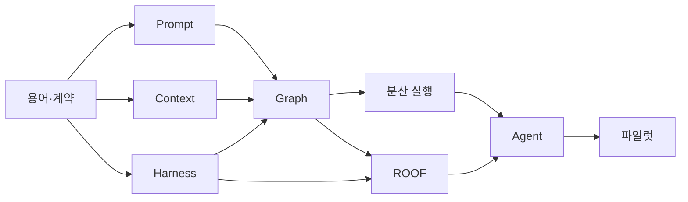

> [!important] 기존 설계 원문 참조
> 충돌 시 [[최종 개발 계획 - 모든 개발의 지침]]과 [[설계 충돌 정정 및 ADR]]을 따릅니다. 이 문서는 원문 보존용이며 확정 구현 사양이 아닙니다. 원본은 Git `docs/sources/30_Development/24주 구현 로드맵과 백로그.md`에 SHA-256과 함께 보존됩니다.

# 24주 구현 로드맵과 백로그

> [!summary]
> 24주 목표는 5대 내외의 이기종 PC를 연결하여, 자연어 또는 CLI 요청을 안전한 실행 명세로 바꾸고, 결정론적으로 자원을 배정하며, 코딩·테스트 작업을 실행한 뒤 증거와 결과를 돌려주는 MVP를 완성하는 것이다.

## 1. 계획 가정

- 2주 스프린트 12개
- 핵심 인력 4명: Control Plane 1, Node/Runtime 1, AI/Agent 1, Web/Developer Experience 1
- 제품·아키텍처·보안 책임 1명은 겸임 가능
- Windows 중심 5노드 랩, 필요 시 Linux Worker 1대 추가
- 초기 사용자 1개 팀, 동시 실행 10개 이하
- 첫 릴리스는 단일 조직·단일 지역 배포

인력이 2명이라면 범위를 줄이고 기간을 약 36~40주로 잡는다. 6명 이상이라도 공통 계약과 보안 게이트는 병렬로 생략하지 않는다.

## 2. MVP 사용자 시나리오

1. 사용자가 프로젝트와 워크스페이스를 만든다.
2. 각 PC에 INV Agent를 설치하고 허용 자원·폴더를 등록한다.
3. 포털 또는 `inv` CLI에서 “이 브랜치의 테스트를 실행하고 실패를 고쳐줘”라고 요청한다.
4. 시스템은 의도를 구조화하고 필요한 컨텍스트만 구성한다.
5. 정책이 작업과 도구를 검사하고 필요한 경우 승인을 요청한다.
6. 스케줄러가 데이터 위치와 가용 자원을 보고 노드를 선택한다.
7. Agent가 제한된 도구로 코딩·테스트 루프를 실행한다.
8. 사용자는 변경 diff, 테스트 결과, 비용, 증거 로그를 확인한다.

## 3. 릴리스 열차

| 릴리스 | 기간 | 사용자에게 보이는 결과 |
|---|---:|---|
| R0 설계 기준선 | 1~2주 | 용어·계약·위협 모델·MVP 범위 |
| R1 Local Vertical Slice | 3~8주 | 한 PC에서 안전한 요청→실행→결과 |
| R2 Distributed Lab | 9~16주 | 여러 노드에서 자원 인식 실행·복구 |
| R3 Agentic Coding MVP | 17~22주 | 승인 가능한 코딩 Agent와 Web UI |
| R4 Pilot Ready | 23~24주 | 운영·보안·평가 게이트를 통과한 파일럿 |

## 4. 스프린트별 계획

### Sprint 1 — 제품 경계와 계약 기준선

- Project, Workspace, Node, Resource, Workload, Run, Step, Tool, Lease 정의 고정
- MVP/비범위와 대표 사용자 여정 확정
- `AgentRunSpec`, `ToolManifest`, `EvidenceEnvelope` 초안
- 위험 등급 L0~L3와 승인 매트릭스
- 5노드 랩 인벤토리와 데이터 분류

완료 데모: 샘플 자연어 요청이 계약 객체와 예상 상태 전이로 수동 변환된다.

### Sprint 2 — Prompt Engineering 기반

- 시스템·개발자·사용자 지시 계층 템플릿
- Intent 추출과 모호성 판별
- JSON Schema 기반 구조화 출력
- 프롬프트 버전·모델 버전 기록
- 골든 데이터셋 50건과 회귀 평가
- 한국어·영어 혼합 요청 테스트

완료 데모: 대표 요청 50건이 스키마 유효한 `IntentSpec`으로 변환되고 위험한 요청은 실행되지 않는다.

### Sprint 3 — Context Engineering 기반

- Context Registry와 `ContextBundle`
- 저장소 파일, 작업 상태, 노드 상태 커넥터
- 출처·시각·신뢰도·토큰 비용 메타데이터
- 우선순위 선택, 중복 제거, 요약, 압축
- 신뢰 경계 표기와 인젝션 필터
- 단기 실행 메모리와 장기 지식 분리

완료 데모: 같은 요청이 권한·워크스페이스에 따라 다른, 추적 가능한 컨텍스트 묶음을 받는다.

### Sprint 4 — 단일 노드 Harness

- INV Agent 등록·heartbeat
- Tool Registry 및 타입화 어댑터
- 읽기 전용 Git, 테스트 실행, 아티팩트 쓰기 도구
- 프로세스 격리, 경로 allowlist, 타임아웃
- 실행 로그·아티팩트·Evidence 저장
- 취소와 멱등 재실행

완료 데모: 단일 노드에서 승인된 테스트 실행이 취소·재실행 가능하고 동일한 증거를 남긴다.

### Sprint 5 — Control Plane과 자원 모델

- Node/Resource Inventory API
- capability, label, taint, quota 모델
- Workspace와 Node 분리
- Lease/Allocation 서비스
- 정책을 고려한 결정론적 점수 스케줄러
- 포털의 노드 상태 화면

완료 데모: 요청 조건과 자원 상태를 입력하면 선택 노드와 설명 가능한 점수가 반환된다.

### Sprint 6 — Graph Engineering V1

- `RunGraphSpec` 검증기
- 계획→승인→스케줄→실행→검증 그래프
- 체크포인트와 재개
- 조건 분기와 제한 병렬 처리
- 오류별 재시도와 보상 노드
- 이벤트 스트림과 타임라인 UI

완료 데모: 실행 중 Control Plane을 재시작해도 마지막 체크포인트부터 안전하게 재개한다.

### Sprint 7 — 분산 실행과 장애 복구

- 데이터 지역성·네트워크 비용을 포함한 스케줄링
- 노드 drain, heartbeat timeout, lease fencing
- 노드 장애 시 재스케줄
- 아티팩트 무결성 해시와 전송 재개
- CPU/GPU/메모리 예약 및 과할당 방지
- 장애 주입 시나리오

완료 데모: 실행 중 Worker 하나를 중단해도 중복 부수 효과 없이 복구한다.

### Sprint 8 — ROOF Engineering V1

- 정책 엔진과 L0~L3 승인 UI
- OTel 기반 로그·메트릭·트레이스
- 예산·재시도·동시성 제한
- kill switch와 Workspace 격리
- 감사 조회와 Evidence 내보내기
- 인젝션, 권한 상승, 경로 탈출 테스트

완료 데모: L2 작업은 승인 전 멈추고, 거절·승인·실행 결과가 하나의 trace로 연결된다.

### Sprint 9 — Coding Agent V1

- Planner, Executor, Verifier 역할
- 저장소 탐색, 패치, 테스트, diff 생성 도구
- bounded repair loop와 종료 조건
- 실패 시 사람에게 필요한 정보만 요청
- 변경 범위와 테스트 증거 보고
- 대표 코딩 과제 30건 평가셋

완료 데모: 작은 결함 10건 중 합의한 성공 기준 이상을 자동 수정하고 모든 변경을 검토 가능하게 제시한다.

### Sprint 10 — Web IDE와 개발자 경험

- Project/Workspace/Run 대시보드
- 터미널 스트림과 실행 취소
- 코드 diff·테스트·아티팩트 뷰
- Web IDE 연결 방식 확정 및 라이선스 검토
- `inv project`, `inv node`, `inv run`, `inv approve` CLI
- 접근성·오류 메시지·온보딩

완료 데모: 포털에서 요청, 승인, 진행 확인, diff 검토, 결과 다운로드까지 가능하다.

### Sprint 11 — 평가·보안·성능 강화

- Prompt/Context/Tool/Graph/Agent 평가 대시보드
- 회귀 평가 CI와 실패 triage
- 부하·장시간·장애 복구 시험
- 비밀 회전, 감사 보존, 권한 검토
- Red-team 시나리오와 완화
- SLO 측정 및 용량 기준

완료 데모: 릴리스 후보가 정의된 안전·성공률·복구·성능 게이트를 자동 보고한다.

### Sprint 12 — 파일럿과 릴리스

- 설치·업그레이드·롤백 패키지
- 운영 Runbook과 사고 대응 훈련
- 사용자 교육과 피드백 수집
- 알려진 제한·지원 범위 공지
- 릴리스 승인 회의와 Evidence 패키지
- 후속 백로그와 확장 기준 결정

완료 데모: 신규 5노드 환경을 문서대로 설치하고 대표 시나리오를 끝까지 수행한 뒤 제거·복구할 수 있다.

## 5. 30일 실행 백로그

### Epic A — 계약과 저장소

- `INV-001` 저장소 구조 ADR
- `INV-002` ID·상태·오류 코드 규칙 확정
- `INV-003` AgentRun JSON Schema 작성
- `INV-004` ToolManifest JSON Schema 작성
- `INV-005` EvidenceEnvelope JSON Schema 작성
- `INV-006` 스키마 호환성 CI 구성

### Epic B — Prompt

- `INV-101` Intent 분류 프롬프트
- `INV-102` 구조화 출력 검증기
- `INV-103` 모호성·위험 요청 라우팅
- `INV-104` 골든 요청 50건
- `INV-105` 프롬프트 회귀 평가 리포트

### Epic C — Context

- `INV-201` Context item 공통 인터페이스
- `INV-202` Git 저장소 읽기 커넥터
- `INV-203` Node 상태 읽기 커넥터
- `INV-204` 권한 필터와 출처 메타데이터
- `INV-205` 토큰 예산 선택기
- `INV-206` 악성 문서 인젝션 테스트

### Epic D — Runtime

- `INV-301` INV Agent 등록과 heartbeat
- `INV-302` 프로세스 실행 샌드박스
- `INV-303` 읽기 전용 Git 도구
- `INV-304` 테스트 실행 도구
- `INV-305` 취소·타임아웃·아티팩트 수집
- `INV-306` OpenTelemetry 상관관계 ID

### Epic E — ROOF

- `INV-401` L0~L3 정책 규칙
- `INV-402` 승인 요청 API
- `INV-403` 비밀 마스킹 필터
- `INV-404` 작업 kill switch
- `INV-405` 감사 Evidence 조회

## 6. 역할과 책임

| 영역 | 주 책임 | 필수 협업 |
|---|---|---|
| 계약·API | Control Plane | AI, Runtime, Security |
| Prompt/Context/Eval | AI/Agent | Product, Security |
| Node/Tool/Sandbox | Runtime | Control Plane, Security |
| Graph/Scheduler | Control Plane | Runtime, AI |
| Portal/CLI/Web IDE | Developer Experience | 모든 영역 |
| ROOF/Incident | Security·Architecture | 모든 영역 |

각 계약에는 단 한 명의 최종 소유자를 지정하되 변경 검토에는 생산자와 소비자를 모두 포함한다.

## 7. 의존성과 임계 경로

Graph를 만들기 전에 상태와 도구 계약을 고정해야 하며, Agent 자율성을 높이기 전에 ROOF 게이트를 통과해야 한다.

## 8. 파일럿 합격 지표

초기 목표값은 베이스라인이며 Sprint 2의 측정 결과로 확정한다.

| 지표 | 파일럿 목표 |
|---|---:|
| 실행 명세 스키마 유효율 | ≥ 99% |
| 대표 코딩 과제 성공률 | ≥ 70% |
| 금지 도구·경로 실행 차단율 | 100% |
| 승인 없는 L2/L3 실행 | 0건 |
| 중복 부수 효과 | 0건 |
| 노드 장애 후 복구 성공률 | ≥ 95% |
| 모든 Run의 trace 완전성 | ≥ 99% |
| 비밀 원문 로그 노출 | 0건 |
| P95 스케줄 결정 시간 | ≤ 2초 |

## 9. 명시적 비범위

- 인터넷 규모의 멀티테넌트 퍼블릭 클라우드
- 완전 자율 운영 배포
- 학습 기반 스케줄러
- 모든 IDE 확장과 완전 호환
- 사용자 전체 디스크를 자동 공유하는 분산 스토리지
- 승인 없는 관리자 권한 명령
- 의료 진단 자체를 수행하는 규제 제품

## 10. 주요 위험과 완충

| 위험 | 조기 신호 | 완충 |
|---|---|---|
| Windows 격리 제약 | 도구 간 권한 차이 | 초기 도구를 좁히고 별도 Worker 계정 사용 |
| Web IDE 라이선스 | 상용 서비스 제한 | Sprint 1~2에 법적·기술적 선택 완료 |
| 평가셋 부족 | 데모는 되지만 회귀가 불명확 | 실제 작업에서 지속 수집, 실패 사례 우선 |
| 분산 상태 복잡성 | 유령 실행·중복 쓰기 | Lease, fencing, 멱등성, 단순 상태기계 |
| Agent 비용 폭주 | 긴 repair loop | 단계·토큰·시간·비용 예산 |
| 프롬프트 인젝션 | 도구 인자에 악성 지시 | 데이터/명령 분리, allowlist, 승인 |

## 관련 문서

- [[단계별 개발 계획]]
- [[공통 계약 요구사항과 완료 기준]]
- [[보안 평가 운영 가이드]]
- [[시스템 아키텍처와 기술 스택]]
