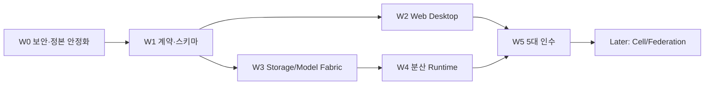

# 57.81퍼센트 이후 단일 가상 컴퓨터 보강 로드맵

## 현재 기준선

- 기존 범위 독립 산식: **2,775 / 4,800 = 57.81%**.
- 이 수치는 코드 진척 참고값이며 공식 48개 Task의 운영 인수 완료율이 아니다.
- 새 Web Desktop·분산 Storage/Model Fabric 범위는 기존 비율에 소급 반영하지 않는다.
- 새 범위의 분모는 카드와 acceptance evidence가 등록된 뒤 별도로 고정한다.

## 우선순위 원칙

새 화면보다 먼저 실제 배포 경계의 위험을 닫는다. 특히 임의 bearer를 관리자처럼 받는 인증, DB와 분리된 fixture backend, 두 개의 FastAPI 응용, 기본 credential, 미구성 PITR은 P0다. 이 위험을 남긴 채 외부 Web Desktop을 공개하지 않는다.

## Outcome

| ID | 결과 | 완료 증거 |
|---|---|---|
| VF-01 | 하나의 canonical secure control plane | 실제 DB·OIDC·RLS·route coverage·거부 시험 |
| VF-02 | Web Desktop 단일 PC 경험 | 외부 브라우저 E2E, 접근성, 세션 복원 |
| VF-03 | 통합 `inv://` 저장 namespace | create/read/version/checksum/recovery 시험 |
| VF-04 | ModelManifest와 shard/replica 관리 | import·hash·pin·repair·GC 시험 |
| VF-05 | locality-aware 분산 실행 | 설명 가능한 placement와 runtime별 실제 실행 |
| VF-06 | 5대 실제 PC 인수 | Node 이탈·재접속·저장·GPU·Terminal·복구 Evidence |
| VF-07 | Cell/Federation 확장 준비 | scale test, catalog boundary, 정책 분리 설계 |

## 재편된 상대 일정

장비와 담당자 가용성이 확정되지 않았으므로 달력 마감일이 아니라 **선행조건 기준 12주 상대 계획**으로 관리한다.

| Wave | 기간 | 핵심 결과 | Gate |
|---|---:|---|---|
| W0 안정화 | 1주 | canonical app, 실제 인증/DB, credential 교체, PITR 결정, CI 대안 | VF-01 보안 거부 시험 |
| W1 계약 | 2주 | `inv://`, ModelManifest/Shard/Replica, capability, ADR·schema | migration·contract test |
| W2 Web Desktop MVP | 2주 | Desktop Shell, My Computer, File Explorer, Terminal launcher | 브라우저 E2E |
| W3 Storage/Model Fabric | 2주 | contributed storage, cache, replica, pin/repair/GC | 장애·무결성 시험 |
| W4 Distributed Runtime | 3주 | single/routing/data/tensor-pipeline adapter와 Scheduler 연동 | network별 실행 비교 |
| W5 5대 인수 | 2주 | 실제 5대 종단간, 외부 HTTPS, 운영·복원·관측 | VF-02~06 인수 보고 |

## Now / Next / Later

### Now

- P0 인증·canonical backend·credential·PITR·route 정합.
- Storage/Model manifest 계약과 기존 `DataLocation`, locality, shard runtime의 재사용 경계 확정.
- Web Desktop information architecture와 API contract 고정.
- Agent 연속 실행 정책을 모든 진입 파일과 작업판에 반영.

### Next

- `inv://` resolver, contributed storage registration, model import와 shard repair.
- Web Desktop Shell, Resource Explorer, File Explorer, Terminal/IDE 진입.
- Scheduler의 capability·locality·network-aware execution plan.
- 5대 실제 PC 설치와 장애/복구/성능 증거.

### Later

- 공용 멀티테넌트 marketplace.
- 임의 모델의 무조건 자동 tensor 분할.
- Internet의 불특정 개인 PC를 신뢰하는 permissionless network.
- 다지역 Federation, 경제 보상, confidential computing/attestation 강화.

이 Later 항목을 뒤로 이동해 W0~W5의 보안·저장·Web Desktop·실장비 인수 용량을 확보한다.

## Agent별 실행 카드

### Codex — 코어·무결성·통합

| 카드 | 작업 | 선행 | 합격 증거 |
|---|---|---|---|
| VF-CX-01 | canonical control app 선택, fixture 격리, OIDC/RLS/route gap 봉합 | 현재 branch | auth negative tests, deployment surface pass |
| VF-CX-02 | ModelManifest/Shard/Replica 계약, hash commit, lease/fencing | VF-CX-01 일부 | migration + concurrency + corruption tests |
| VF-CX-03 | storage locality와 Scheduler/ExecutionPlan 연동 | VF-CX-02 | deterministic placement explain |
| VF-CX-04 | runtime adapter와 multi-node failure recovery | VF-CX-03 | stale permit, cancel, retry, node-loss tests |
| VF-CX-05 | 5대 인수·성능·복원 통합 | W2~W4 | signed Evidence와 최종 gap report |

### Claude — 서비스·DB·운영·독립 검토

| 카드 | 작업 | 선행 | 합격 증거 |
|---|---|---|---|
| VF-CL-01 | storage catalog/API, migration, DataLocation 재사용 | VF-CX-02 contract | API/DB integration tests |
| VF-CL-02 | `inv://` resolver, workspace materialization/write-back | VF-CL-01 | conflict/restart/rollback tests |
| VF-CL-03 | model registry, MLflow/lineage, import adapter | VF-CX-02 | import/version/license tests |
| VF-CL-04 | replica repair, backup/PITR, metrics/runbook | VF-CL-01 | restore drill and observability evidence |
| VF-CL-05 | Codex/Gemini 산출물 독립 검토 | 각 카드 review | finding, reproduction, verdict |

### Gemini / Antigravity — 사용자 경험·Frontend·웹 인수

| 카드 | 작업 | 선행 | 합격 증거 |
|---|---|---|---|
| VF-GM-01 | Web Desktop Shell과 navigation | API mock contract | responsive/accessibility tests |
| VF-GM-02 | My Computer / Resource Explorer | resource API | logical total + physical topology 검증 |
| VF-GM-03 | File Explorer와 `inv://` UX | VF-CL-01 | upload/version/error/partial failure E2E |
| VF-GM-04 | Model Studio와 shard/replica 상태 | VF-CL-03 | import/repair/run journey E2E |
| VF-GM-05 | Terminal/IDE/PowerShell/Bash session UX | PTY API | reconnect/expiry/permission E2E |
| VF-GM-06 | 외부 HTTPS, browser matrix, rollback | W0~W4 | real-browser acceptance report |

## 병렬화와 통합 규칙

- Codex는 계약과 코어 경계를 먼저 고정한다.
- Claude는 확정 계약 아래 API/DB/운영을 구현하고 Codex 코어를 독립 검토한다.
- Gemini는 mock contract로 UI를 앞당길 수 있지만 실제 API E2E 전에는 done이 아니다.
- 같은 파일을 동시에 수정하지 않는다. 공통 계약 변경은 Codex가 통합한다.
- 차단 카드가 생기면 같은 Agent의 다음 ready 카드를 자동 선택한다.

## 연속 실행 방식

세 Agent는 승인된 프로젝트 범위에서 `ready 선택 → 구현 → 로컬 검증 → Evidence → 인계 → 다음 ready`를 반복한다. 사용자에게 중간 선택을 요구하지 않는다. 다만 내부 test, CI, 교차 검토, 실장비 인수는 생략하지 않는다. 자격증명 제공, 유료 계정, 공개 배포, 데이터 삭제, 제품 범위를 바꾸는 결정처럼 새 권한이 필요한 경우에만 하나의 정리된 질문으로 멈춘다.

세부 규칙은 [[Agent 연속 실행과 최종 보고 정책]]을 따른다.

## 최종 완료 보고

최종 보고는 다음을 한 번에 제시한다.

1. 완료한 Outcome과 code SHA.
2. 로컬/CI/브라우저/실장비 검증 증거.
3. 모델 저장과 실행 모드별 지원 범위.
4. 보안·복원·5대 Node 인수 결과.
5. 남은 외부 blocker와 Later 항목.
6. 기존 57.81%와 새 보강 범위의 별도 진행률.

