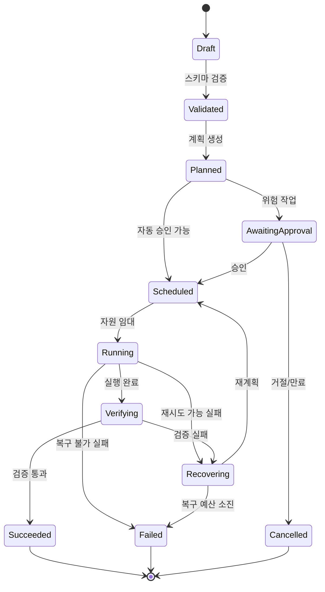

> [!important] 기존 설계 원문 참조
> 충돌 시 [[최종 개발 계획 - 모든 개발의 지침]]과 [[설계 충돌 정정 및 ADR]]을 따릅니다. 이 문서는 원문 보존용이며 확정 구현 사양이 아닙니다. 원본은 Git `docs/sources/30_Development/공통 계약 요구사항과 완료 기준.md`에 SHA-256과 함께 보존됩니다.

# 공통 계약 요구사항과 완료 기준

> [!summary]
> SaintVision의 모든 구성요소는 같은 실행 계약, 상태 전이, 오류 분류, 승인 방식, 증거 형식을 사용한다. 이 문서는 여섯 엔지니어링 단계를 실제 코드와 테스트로 연결하는 공통 기준이다.

## 1. 계약 우선 원칙

1. 프롬프트가 직접 인프라를 변경하지 않는다.
2. 모델 출력은 반드시 구조화된 실행 명세로 변환하고 검증한다.
3. 모든 부수 효과는 도구 계층을 통과한다.
4. 정책 엔진이 승인한 작업만 실행한다.
5. 상태 전이는 RunGraph가 소유한다.
6. 실행 전후의 입력, 결정, 승인, 결과를 Evidence로 남긴다.
7. 실패는 숨기지 않고 분류하여 재시도·보상·중단 중 하나로 처리한다.

## 2. 공통 실행 수명주기



허용 상태는 `draft`, `validated`, `planned`, `awaiting_approval`, `scheduled`, `running`, `verifying`, `recovering`, `succeeded`, `failed`, `cancelled`로 고정한다. 임의 문자열을 추가하지 않는다.

## 3. AgentRunSpec

자연어 요청이 실제 동작으로 바뀌는 경계 계약이다. 아래는 개념 스키마이며, 구현 시 JSON Schema와 언어별 타입을 단일 원본에서 생성한다.

```yaml
apiVersion: inv.saintvision.ai/v1alpha1
kind: AgentRun
metadata:
  runId: run_01J...
  projectId: prj_01J...
  workspaceId: wsp_01J...
  requestedBy: usr_01J...
spec:
  objective: "테스트를 실행하고 실패 원인을 요약한다"
  inputs:
    repositoryRef: "refs/heads/main"
    artifactRefs: []
  constraints:
    allowedNodes: ["node_lab_01", "node_lab_02"]
    allowedTools: ["git.read", "test.run", "artifact.write"]
    deniedPaths: ["C:/Users/{user}/.ssh", "C:/Windows"]
    maxWallTimeSeconds: 1800
    maxCost:
      currency: KRW
      amount: 5000
    networkPolicy: restricted
  execution:
    graphRef: "graph_ci_debug_v1"
    retryBudget: 2
    parallelism: 2
  approval:
    requiredRiskLevel: 1
  output:
    requiredArtifacts: ["test-report", "run-summary"]
    evidenceLevel: full
```

### 필수 검증

- `runId`, `projectId`, `workspaceId`, `requestedBy`는 존재하고 권한 범위와 일치해야 한다.
- `objective`는 사람이 이해할 수 있는 단일 목표여야 한다.
- 자원, 시간, 비용, 네트워크, 도구 허용 범위가 명시되어야 한다.
- 경로는 정규화한 절대 경로로 검증하고 허용 루트 밖으로 탈출할 수 없어야 한다.
- 위험 등급은 정책 엔진이 재계산한다. 모델이 제안한 등급을 신뢰하지 않는다.
- 스키마에 없는 필드는 기본적으로 거부한다.

## 4. 구성요소별 공통 계약

| 계약 | 생산자 | 소비자 | 최소 필드 | 실패 시 처리 |
|---|---|---|---|---|
| `IntentSpec` | Prompt | Context/Harness | 목표, 제약, 기대 산출물 | 사용자에게 모호성 반환 |
| `ContextBundle` | Context | Prompt/Agent | 항목, 출처, 시각, 신뢰도, 토큰 비용 | 누락 또는 축약 표시 |
| `ToolManifest` | Harness | Agent/Policy | 이름, 버전, 입력·출력 스키마, 부수 효과 | 도구 비활성화 |
| `RunGraphSpec` | Graph | Orchestrator | 노드, 에지, 조건, 체크포인트 | 실행 생성 거부 |
| `PolicyDecision` | ROOF | Orchestrator | 허용 여부, 근거, 승인 요구, 만료 | 안전 중단 |
| `ResourceLease` | Scheduler | Worker | 대상 노드, 자원량, TTL, 펜싱 토큰 | 재스케줄 |
| `StepResult` | Worker/Tool | Graph | 상태, 출력 참조, 오류, 측정값 | 오류 정책 적용 |
| `EvidenceEnvelope` | 모든 계층 | Audit/Eval | 상관관계 ID, 행위자, 입력 해시, 결정, 결과 | 완료 처리 금지 |

## 5. EvidenceEnvelope

```json
{
  "evidenceId": "evd_01J...",
  "traceId": "trc_01J...",
  "runId": "run_01J...",
  "stepId": "stp_01J...",
  "timestamp": "2026-09-09T10:00:00+09:00",
  "actor": {"type": "agent", "id": "agt_operator_v1"},
  "action": "test.run",
  "decision": {
    "policyId": "pol_tool_execution_v3",
    "effect": "allow",
    "approvalId": null
  },
  "input": {"schema": "TestRunInput@1", "sha256": "..."},
  "output": {"schema": "TestRunResult@1", "artifactRef": "art_01J..."},
  "result": "succeeded",
  "telemetry": {"durationMs": 18342, "cpuSeconds": 21.4}
}
```

민감한 원문과 비밀값은 Evidence에 넣지 않는다. 원문이 필요하면 암호화된 별도 저장소에 두고 Evidence에는 참조와 해시만 기록한다.

## 6. 오류 분류

| 코드군 | 의미 | 기본 처리 |
|---|---|---|
| `VAL-*` | 입력·스키마 검증 실패 | 수정 전까지 중단 |
| `AUTH-*` | 인증·권한·정책 거부 | 중단 및 감사 기록 |
| `CTX-*` | 컨텍스트 누락·충돌·만료 | 재조회 또는 사람 확인 |
| `TOOL-*` | 도구 실행·어댑터 실패 | 멱등성 확인 후 제한 재시도 |
| `RES-*` | 자원 부족·임대 만료 | 재스케줄 |
| `NET-*` | 네트워크·서비스 일시 장애 | 지수 백오프 |
| `GRAPH-*` | 잘못된 전이·교착 | 체크포인트 복원 또는 중단 |
| `VERIFY-*` | 테스트·검증 실패 | 수정 루프로 전환 |
| `SEC-*` | 비밀 노출·프롬프트 인젝션·격리 위반 | 즉시 격리 및 사고 대응 |
| `BUDGET-*` | 시간·토큰·비용 한도 초과 | 중단 또는 추가 승인 |

모든 오류는 `code`, `category`, `retryable`, `message`, `causeRef`, `evidenceId`를 가져야 한다.

## 7. 위험 등급과 승인

| 등급 | 예시 | 기본 승인 |
|---|---|---|
| L0 관찰 | 상태 조회, 로그 검색, 읽기 전용 Git | 자동 |
| L1 제한 변경 | 워크스페이스 내부 파일 생성, 테스트 실행 | 정책 허용 시 자동 |
| L2 중요 변경 | 패키지 설치, 컨테이너 실행, 외부 쓰기, 배포 | 사람 승인 |
| L3 파괴·민감 | 삭제, 자격 증명 변경, 운영 DB 쓰기, 광범위 네트워크 | 이중 확인 또는 금지 |

등급은 명령 문자열뿐 아니라 대상, 데이터 민감도, 실행 환경, 영향 반경을 함께 평가한다.

## 8. 비기능 요구사항

### 신뢰성

- 모든 쓰기 도구는 멱등성 키 또는 중복 방지 전략을 제공한다.
- 체크포인트는 단계 완료 시점에 원자적으로 저장한다.
- 임대 기반 실행은 TTL과 펜싱 토큰으로 이중 실행을 차단한다.
- 재시도는 최대 횟수뿐 아니라 총 시간·비용 예산을 가진다.

### 보안

- 워크스페이스별 최소 권한 서비스 계정을 사용한다.
- 비밀은 Vault 참조로만 전달하고 로그·프롬프트·아티팩트에서 마스킹한다.
- 외부 콘텐츠와 MCP 응답은 신뢰하지 않는 데이터로 취급한다.
- 네트워크는 기본 거부 후 목적지 단위로 허용한다.

### 성능

- Control Plane의 P95 읽기 API 목표는 300ms 이하로 둔다.
- 단일 실행 생성부터 스케줄 결정까지 P95 목표는 2초 이하로 둔다.
- 상태 이벤트 전달의 P95 지연 목표는 5초 이하로 둔다.
- 목표치는 5노드 랩 기준이며 부하시험 결과로 조정한다.

### 관찰성

- 모든 요청에 `traceId`, `runId`, `stepId`, `workspaceId`, `nodeId`를 전파한다.
- 로그·메트릭·트레이스는 동일한 상관관계 ID로 연결한다.
- 모델명, 프롬프트 버전, 컨텍스트 버전, 도구 버전, 정책 버전을 기록한다.
- 사용자 콘텐츠와 민감정보는 기본적으로 텔레메트리에서 제외한다.

## 9. Definition of Ready

개발 항목은 다음 조건을 모두 만족해야 시작할 수 있다.

- 사용자 가치와 성공 조건이 한 문장으로 정의됨
- 범위와 비범위가 명시됨
- 영향받는 공통 계약과 스키마가 식별됨
- 위험 등급과 승인 경로가 정해짐
- 실패·복구 시나리오가 최소 1개 이상 작성됨
- 필요한 테스트 데이터와 테스트 환경이 준비됨
- 관찰할 메트릭과 로그 필드가 정해짐
- 외부 의존성, 라이선스, 보안 제약이 확인됨

## 10. Definition of Done

개발 항목은 다음 조건을 모두 만족해야 완료다.

- 코드와 스키마가 버전 관리됨
- 정상·경계·실패·복구 테스트가 통과함
- 권한 우회와 프롬프트 인젝션 테스트가 필요한 범위에서 통과함
- 실행 로그·메트릭·트레이스가 상관관계 ID로 연결됨
- 감사 증거가 재현 가능하게 저장됨
- 롤백 또는 비활성화 방법이 검증됨
- 운영 문서와 사용자 문서가 갱신됨
- 알려진 제한과 잔여 위험이 기록됨
- 단계 게이트의 정량 지표를 충족함

## 11. 테스트 계층

| 계층 | 대상 | 핵심 사례 |
|---|---|---|
| 스키마 테스트 | 모든 계약 | 하위 호환, 미지 필드 거부, 경계값 |
| 단위 테스트 | 정책, 라우팅, 선택기 | 결정론, 오류 분류 |
| 계약 테스트 | API, Tool Adapter, MCP | 버전, 타임아웃, 권한 |
| 통합 테스트 | Control Plane ↔ Agent | 임대, 체크포인트, 취소 |
| 시뮬레이션 | Scheduler/Graph | 노드 장애, 네트워크 분할, 재시도 폭주 |
| 보안 테스트 | 전체 경계 | 인젝션, 경로 탈출, 비밀 유출, 권한 상승 |
| 에이전트 평가 | Prompt/Context/Agent | 성공률, 도구 선택, 정책 준수 |
| 종단간 테스트 | 사용자 시나리오 | 자연어 요청부터 증거 보고서까지 |

## 12. 단계 게이트

| 게이트 | 통과 기준 |
|---|---|
| G0 문제·용어 | 용어 사전, 경계, MVP 시나리오 승인 |
| G1 Prompt | 구조화 출력 성공률과 모호성 처리 기준 충족 |
| G2 Context | 출처·시각·권한이 추적되고 오염 테스트 통과 |
| G3 Harness | 도구 계약·샌드박스·재현·평가 루프 동작 |
| G4 Graph | 체크포인트, 중단·재개, 보상, 교착 방지 검증 |
| G5 ROOF | 승인, 감사, 격리, SLO, 사고 대응 훈련 통과 |
| G6 Agent | 대표 업무 성공률, 비용, 안전 지표 충족 |

## 13. 변경 관리

- 계약은 의미적 버전 규칙을 사용한다.
- 필드 삭제·의미 변경은 새 메이저 버전에서만 허용한다.
- 스키마 변경 PR에는 마이그레이션, 호환성 테스트, 롤백 계획을 포함한다.
- Prompt, Context 정책, Graph, Tool, Agent도 모두 불변 버전으로 배포한다.
- 실행 기록은 사용된 모든 버전의 조합을 보존한다.

## 관련 문서

- [[용어 사전과 6단계 통합 모델]]
- [[단계별 개발 계획]]
- [[시스템 아키텍처와 기술 스택]]
- [[보안 평가 운영 가이드]]
- [[24주 구현 로드맵과 백로그]]
