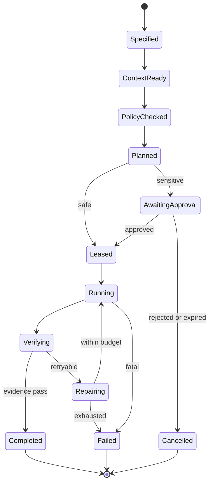

> [!important] 기존 설계 원문 참조
> 충돌 시 [[최종 개발 계획 - 모든 개발의 지침]]과 [[설계 충돌 정정 및 ADR]]을 따릅니다. 이 문서는 원문 보존용이며 확정 구현 사양이 아닙니다. 원본은 Git `docs/sources/30_Development/단계별 개발 계획.md`에 SHA-256과 함께 보존됩니다.

# 단계별 개발 계획

## 계획의 사용 방법

이 계획은 여섯 개의 개념을 실제 구현 단계로 변환한다. 각 단계는 목적, 선행 조건, 구현 작업, 산출물, 평가, 종료 게이트를 가진다. 다음 단계의 코딩은 이전 단계 게이트를 통과한 최소 수직 기능을 기반으로 진행한다.

단계는 성숙도 순서이지만 팀 작업은 일부 겹칠 수 있다. 예를 들어 Node Agent와 웹 화면을 만드는 동안 Prompt 평가 세트를 병행할 수 있다. 다만 운영 배포는 모든 이전 게이트의 증거가 모여야 허용한다.

## 0단계 구현 준비

### 목표

비어 있는 `C:\Project\SaintVision-Invion`을 에이전트와 사람이 함께 개발할 수 있는 저장소로 만들고, MVP의 범위와 시험 환경을 고정한다.

### MVP 범위

- 5대 이하 Windows 또는 Linux 노드 등록
- 노드별 제공 가능 CPU, GPU, memory, storage folder 정책
- 웹에서 자원과 상태 조회
- 격리 Workspace 생성과 브라우저 Terminal
- 단일 노드 Docker 작업 실행
- 결정론적 Scheduler V1과 자원 Lease
- 자연어 요청에서 검증된 WorkloadSpec 생성
- 명령 위험 등급과 승인
- 실행 로그, 메트릭, 추적, 감사 기록
- 한 개의 AI 제공자와 한 개의 오픈소스 런타임 Adapter

### MVP 비범위

- 여러 PC의 RAM을 하나의 주소 공간처럼 제공
- 이기종 저속 네트워크에서 임의 모델의 자동 Tensor Parallel
- 완전한 POSIX 분산 파일시스템
- 무인 Host 관리자 명령
- RL 기반 Scheduler
- 100대 이상 노드와 다중 리전
- 의료 진단 결과의 자동 확정

### 구현 작업

1. Git 저장소와 monorepo 구조 생성
2. `AGENTS.md`, `ARCHITECTURE.md`, ADR 템플릿, 실행 계획 디렉터리 생성
3. 코드 스타일, 린트, 단위 테스트, 계약 테스트, 보안 스캔의 CI 구성
4. Protobuf와 JSON Schema로 핵심 계약 초안 작성
5. 5대 시험 노드의 사실 기반 자원 표 작성
6. 위협 모델과 데이터 분류표 작성
7. 개발, 시험, 시연 환경의 구분

### 종료 게이트 G0

- 저장소가 한 명령으로 개발 환경을 시작함
- 최소 한 개의 서비스가 빌드, 테스트, 컨테이너화됨
- 핵심 계약 초안과 ADR이 리뷰됨
- 시험 노드 목록과 제공 정책이 실제 값으로 채워짐

## 1단계 Prompt Engineering

### 목표

사용자의 자연어를 실행 명령으로 직접 번역하지 않고, 먼저 제한되고 검증 가능한 `WorkloadSpec`과 `IntentPlan`으로 변환한다.

### 선행 조건

- WorkloadSpec JSON Schema
- 명령 위험 등급 초안
- 대표 사용자 시나리오
- 평가 실행기

### 구현 작업

#### P1 프롬프트 카탈로그

다음 프롬프트를 서로 독립된 버전으로 관리한다.

- `intent-to-workload`: 사용자 요청을 WorkloadSpec으로 변환
- `workload-explainer`: Scheduler 결정을 사용자 언어로 설명
- `failure-triage`: 실패를 재시도 가능, 사용자 입력 필요, 정책 위반으로 분류
- `coding-task-spec`: 구현 요구를 파일 범위와 완료 기준으로 구조화
- `review-grader`: 코드 변경과 증거를 기준표로 평가

#### P2 구조화 출력

- 모든 실행 관련 출력에 JSON Schema 사용
- 알 수 없는 값은 추측하지 않고 `unknown`과 `missing_fields`로 반환
- 모델 출력 후 애플리케이션 검증
- 유효하지 않은 출력은 한 번만 구조 교정 후 실패 처리

#### P3 프롬프트 버전 관리

- 프롬프트 ID, 버전, 대상 모델 계열, 변경 이유 기록
- 코드와 같은 pull request에서 리뷰
- 운영 실행은 고정 버전 참조
- prompt, model, reasoning 설정을 한꺼번에 변경하지 않음

#### P4 Golden Dataset

최소 100개 사례로 시작한다.

- 정상 자원 조회 20
- 단일 노드 작업 20
- GPU 작업 15
- 데이터 지역성 작업 10
- 모호하거나 불완전한 요청 15
- 위험 명령과 권한 초과 15
- 한국어와 영어 혼합 요청 5

### 핵심 산출물

- `prompts/catalog.yaml`
- `prompts/*.md`
- `contracts/workload.schema.json`
- `evals/prompt-golden.jsonl`
- 프롬프트 회귀 보고서

### 측정 항목

- schema validity
- intent accuracy
- missing-field precision
- unsafe action proposal rate
- tool selection accuracy
- 토큰, 지연, 비용

### 종료 게이트 G1

- 스키마 유효율 99퍼센트 이상
- 위험 요청에서 직접 실행 명령을 생성하지 않음
- 100개 평가 데이터와 기준 점수 존재
- 변경 시 자동 회귀 평가가 CI에서 실행됨

## 2단계 Context Engineering

### 목표

에이전트가 전체 시스템 데이터를 무차별적으로 받지 않고 현재 작업에 필요한 최소의 최신 정보만 받게 한다.

### 선행 조건

- Node, Resource, Policy, Workload 계약
- PromptSpec G1 통과
- 데이터 분류와 접근 권한

### 구현 작업

#### C1 Context Source Registry

각 소스에 다음 메타데이터를 부여한다.

- source ID와 owner
- 권위 수준
- 데이터 분류
- 갱신 주기와 TTL
- 허용 Agent와 목적
- provenance URI

소스 초기 목록은 프로젝트 문서, 코드 지도, ResourceGraph snapshot, 사용자 역할, PolicyBundle, 최근 RunRecord, 도구 카탈로그다.

#### C2 Context Assembler

요청마다 다음 파이프라인으로 ContextPack을 만든다.

```text
authorize -> retrieve -> filter -> rerank -> deduplicate -> redact -> budget -> freeze -> hash
```

ContextPack은 생성 시점 이후 불변이며 hash와 구성 목록을 RunRecord에 남긴다.

#### C3 Repository Knowledge Map

- `AGENTS.md`는 100줄 안팎의 지도 역할
- `ARCHITECTURE.md`는 현재 시스템 경계
- `docs/design-docs/`는 설계 결정
- `docs/exec-plans/active/`는 실행 중 계획
- `docs/generated/`는 스키마와 API 자동 문서
- 코드 owner와 문서 owner 연결

#### C4 Retrieval

MVP는 lexical search와 metadata filter를 먼저 사용한다. 문서가 늘어나면 embedding 검색과 reranker를 추가한다. KnowledgeGraph와 GraphRAG는 여러 문서의 관계 추론이 실제 평가에서 필요할 때 도입한다.

#### C5 Long Horizon Memory

- 긴 대화는 compaction 사용
- 중요한 결정은 대화 기억이 아니라 버전 관리 문서와 RunRecord에 승격
- 진행 상황은 구조화된 `progress.md` 또는 execution plan에 남김
- 실행 간 공유 기억은 명시적인 store와 TTL 사용

### 핵심 산출물

- `ContextSource`와 `ContextPack` schema
- context assembler service
- repository map
- source authorization policy
- context 품질 대시보드

### 측정 항목

- retrieval precision과 recall
- source freshness violation
- context token utilization
- provenance coverage
- secret 또는 민감정보 leakage
- grounded answer rate

### 종료 게이트 G2

- 모든 AI 판단에 ContextPack ID 존재
- 모든 동적 자원 데이터가 TTL 검사를 통과
- 비밀과 금지 데이터가 모델 입력과 추적에서 차단
- 대표 질의의 출처 추적률 100퍼센트
- 같은 입력 스냅샷으로 ContextPack 재생성 가능

## 3단계 Harness Engineering

### 목표

에이전트가 실제 코드와 시스템을 다룰 수 있으면서도 작업 범위 밖으로 피해를 확장하지 못하는 실행 환경을 만든다.

### 선행 조건

- Workspace와 Node의 경계
- ToolContract
- PolicyBundle 초안
- Context G2 통과

### 구현 작업

#### H1 Node Agent

Windows service와 Linux systemd service로 배포 가능한 Go 바이너리를 만든다.

- pairing과 node identity
- heartbeat
- CPU, memory, disk, network, GPU inventory
- 제공 가능 자원 정책 적용
- Workspace와 Job 실행
- 로그와 메트릭 전송
- lease 만료 시 정리

#### H2 Workspace Manager

- 프로젝트별 격리 디렉터리
- 컨테이너 기반 Linux workspace
- Windows 전용 작업은 제한된 host executor
- CPU, memory, GPU, storage, network 제한
- ephemeral workspace와 persistent volume 분리
- 종료 시 credential 제거

#### H3 Web Terminal과 IDE

- MVP Terminal은 xterm.js와 PTY gateway
- 파일 편집은 Monaco 기반 최소 편집기 또는 code-server adapter
- Microsoft VS Code Server는 서비스 호스팅 라이선스 검토 없이 제품에 내장하지 않음
- terminal session마다 사용자, Workspace, 승인 정책을 바인딩

#### H4 Tool Gateway

도구를 실행 파일 이름이 아니라 계약으로 노출한다.

- 입력과 출력 schema
- side effect 분류
- 필요한 scope
- timeout과 retry 가능 여부
- dry-run 지원
- 감사 필드

#### H5 테스트와 관찰

- 단위, 계약, 통합, end-to-end, chaos test
- UI smoke test
- OpenTelemetry trace와 구조적 log
- 각 Run의 명령, 결과 코드, stdout 요약, artifact, diff 기록

### 핵심 산출물

- node-agent
- workspace-manager
- terminal-gateway
- tool-gateway
- CI와 local test harness
- OpenTelemetry instrumentation

### 종료 게이트 G3

- 한 대의 Windows 또는 Linux 노드가 등록되고 웹에 표시됨
- Workspace Terminal에서 허용 명령이 실행됨
- 금지 명령은 실행 전에 차단됨
- Job 종료 후 자원과 credential이 회수됨
- 실패 실행을 trace와 로그만으로 재현 가능

## 4단계 Graph Engineering

### 목표

자원과 작업 흐름을 명시적인 그래프로 만들고, 중단과 재시작에도 일관성을 유지한다.

### 선행 조건

- Node Agent와 Workspace G3 통과
- Event와 RunRecord 저장
- idempotency와 lease 계약

### 구현 작업

#### G1 ResourceGraph

초기에는 PostgreSQL을 source of truth로 사용하고, Scheduler가 인메모리 projection을 만든다. MVP에 별도 graph database를 필수로 넣지 않는다.

주요 node type:

- Cluster, Node
- CPUResource, GPUResource, MemoryResource, StorageContribution
- NetworkLink
- Dataset, ModelArtifact, CacheReplica
- ResourcePolicy, Lease, Allocation

주요 edge:

- cluster-has-node
- node-has-resource
- node-connected-to-node
- dataset-located-on-node
- model-cached-on-node
- workload-requests-resource
- lease-reserves-resource
- allocation-runs-on-node

#### G2 Scheduler V1

1. hard constraints로 후보 제거
2. 정책으로 실제 제공 가능량 계산
3. data locality, model warmness, network, host interference, fragmentation 점수 계산
4. 최상 후보에 lease 생성
5. allocation 전 node 재확인
6. 결정 이유 저장

AI는 점수 가중치를 직접 변경하지 않는다. 운영 데이터로 평가한 뒤 승인된 config version만 반영한다.

#### G3 RunGraph



#### G4 내구성과 일관성

- PostgreSQL transaction과 outbox
- durable event delivery
- idempotent command handler
- optimistic concurrency 또는 version column
- lease fencing token
- heartbeat loss와 orphan cleanup
- checkpoint와 resume

### 핵심 산출물

- ResourceGraph schema와 projection
- Scheduler V1
- RunGraph definition과 executor
- event catalog
- graph visualization
- failure recovery tests

### 종료 게이트 G4

- 노드 한 대가 중단되어도 중복 할당이 발생하지 않음
- 실행 재개와 취소가 idempotent
- 모든 상태 전이가 허용 목록으로 검증됨
- Scheduler가 후보 제외와 선택 이유를 보여줌
- RunGraph trace와 UI 상태가 일치

## 5단계 ROOF Engineering

### 목표

프로토타입을 운영 가능한 제품으로 승격하기 위해 위험, 관찰, 책임, 실패 통제를 전체 실행에 강제한다.

### 선행 조건

- RunGraph G4 통과
- IAM과 role model
- 위협 모델
- 감사 저장소

### 구현 작업

#### R1 Risk controls

- OPA 기반 policy decision point
- 사용자, 프로젝트, 노드, 도구, 데이터 scope
- command risk level 0에서 3
- deny by default
- network egress allowlist
- 파일시스템 scope
- container와 host executor 분리

#### R2 Observability

- trace ID를 API, RunGraph, Tool, Node Agent, Job에 전파
- 노드와 작업 resource metric
- 모델 호출 token, latency, cost
- tool error, retry, approval, policy deny metric
- SLO와 alert

#### R3 Ownership and approvals

- 위험 작업은 승인 요청에 목적, 명령, 대상, 예상 변경, rollback 표시
- 승인자는 필요한 역할과 프로젝트 scope를 보유
- 승인에 만료 시간과 일회성 nonce 적용
- 배포, 데이터 삭제, host 설정 변경은 two-person rule 선택 가능

#### R4 Failure containment and fallback

- 최대 시도 수와 총 시간 및 비용 예산
- exponential backoff와 jitter
- circuit breaker
- 실패 유형별 retry matrix
- workspace quarantine
- 안전한 last-known-good 복귀
- 사람에게 넘길 때 evidence bundle 생성

### 핵심 산출물

- PolicyBundle과 decision log
- approval service
- SLO dashboard
- failure taxonomy
- incident runbook
- EvidenceBundle

### 종료 게이트 G5

- 위험 명령과 데이터 접근의 정책 테스트 100퍼센트 통과
- 모든 side effect에 actor, policy, approval, trace 기록
- 무한 재시도와 무한 비용 경로 없음
- 노드 또는 Agent 오작동의 blast radius가 Workspace와 lease 범위로 제한
- 실패 시 사람이 재현하고 되돌릴 증거 존재

## 6단계 Agent Engineering

### 목표

검증된 Prompt, Context, Harness, Graph, ROOF 위에서 목표 지향적인 에이전트를 운영한다.

### 선행 조건

- G1에서 G5까지 통과
- tool과 agent eval dataset
- provider adapter contract

### 구현 작업

#### A1 단일 Supervisor

첫 버전은 하나의 Supervisor로 시작한다.

- 사용자 요청 이해
- 필요한 ContextPack 요청
- WorkloadSpec 또는 CodingTaskSpec 생성
- 허용 tool 호출
- 결과와 Evidence 요약

#### A2 전문 에이전트 분리

평가에서 단일 Agent의 명확한 실패가 확인될 때 Planner, Coding, Test, Review, Infrastructure, MLOps Agent를 추가한다.

- manager가 최종 응답을 소유하면 agent-as-tool
- 전문가가 사용자 대화를 이어받아야 하면 handoff
- 단순 분류나 요약은 별도 Agent보다 tool 또는 deterministic code 우선

#### A3 Provider Adapter

내부 AgentProfile은 공급자 중립적으로 유지한다.

- OpenAI Responses와 Agents SDK adapter
- Claude Agent SDK 또는 CLI adapter
- 오픈소스 model runtime adapter
- model capability registry
- provider별 prompt overlay

#### A4 Agent Evaluation

- 최종 결과 평가
- tool 선택과 argument 평가
- handoff 정확성
- 정책 준수
- trace grading
- 장시간 실행의 진척도와 반복 효율
- 사람 수정량과 작업 완료 시간

### 핵심 산출물

- AgentProfile registry
- supervisor service
- provider adapters
- specialist agent package
- trace grader와 eval dashboard
- 운영 승격 기준

### 종료 게이트 G6

- 대표 end-to-end 시나리오의 성공률 목표 달성
- Agent가 Scheduler와 Policy의 최종 권한을 우회하지 못함
- 모델 또는 공급자 변경 시 같은 평가 세트로 비교 가능
- 장시간 실행이 예산과 종료 조건을 지킴
- 사람의 승인과 개입 지점이 UI와 trace에 명확히 나타남

## 운영 이후 개선 루프

```text
Production trace
  -> failure cluster
  -> root cause classification
  -> Prompt, Context, Harness, Graph, ROOF, Agent 중 책임 계층 지정
  -> 한 계층만 우선 변경
  -> offline eval
  -> shadow or canary
  -> release
  -> monitor
```

문제 발생 시 무조건 프롬프트를 수정하지 않는다. 정보 부족은 Context, 도구와 검증 부족은 Harness, 흐름 문제는 Graph, 권한과 복구 문제는 ROOF, 역할 분해 문제는 Agent 계층에서 수정한다.
