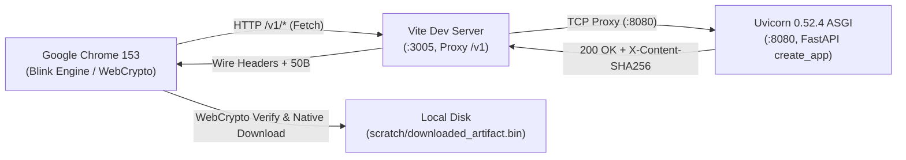

# 실제 브라우저 및 백엔드 종단간 실측 운영 가이드

> 이 문서는 Playwright 네트워크 모의(Mock)를 걷어내고, **실제 Uvicorn 0.52.4 ASGI 서버**와 **실제 Google Chrome (Blink) 브라우저**를 종단간으로 연결하여 실측하는 공식 도구(`tools/run_real_browser_acceptance.py`)의 운영 절차 및 장애 회피 지침입니다.

---

## 1. 운영 원칙

1. **도구(Tool)와 증거(Evidence)의 분리**:
   - 재사용 가능한 실행 도구는 정식 저장소 경로인 `tools/run_real_browser_acceptance.py`에 보존합니다.
   - 실행 중 생성되는 일회성 증거 파일(스크린샷 이미지, 다운로드 바이너리, 결과 JSON 레코드)은 `.gitignore`에 등록된 `scratch/` 디렉터리에만 보존하며, 저장소 Git 트리를 오염시키지 않습니다.
2. **선택적·온디맨드 실행 정책**:
   - 실제 브라우저(Chrome) 기동 및 TCP 소켓 바인딩을 포함하는 종단간 실측은 무겁고 느리며 로컬 환경(Chrome 바이너리 설치 등)에 종속됩니다.
   - 따라서 매 커밋 CI 게이트에 강제하지 않고, 주요 마일스톤 수용 검증이나 대역 층 제거 감사 시 온디맨드로 수동 실행합니다.

---

## 2. 아키텍처 및 통신 경로



- **네트워크 모의 0건 (ZERO MOCK)**: `/v1` 엔드포인트에 대한 Playwright `route` 가로채기가 일체 없으며, 모든 패킷은 브라우저에서 Vite 프록시를 거쳐 Uvicorn의 실제 TCP 소켓(127.0.0.1:8080)으로 왕복합니다.

---

## 3. 실행 절차 (Runbook)

### Step 1. 프런트엔드 개발 서버 기동 (터미널 1)
```powershell
cd apps/web
npm run dev -- --port 3005
```
*포트 3005에서 Vite가 기동되고 `/v1` 프록시가 `:8080`을 향하고 있음을 확인합니다.*

### Step 2. 실측 도구 실행 (터미널 2)
```powershell
.venv\Scripts\python.exe tools/run_real_browser_acceptance.py
```

### CLI 옵션
- `--backend-port`: Uvicorn 포트 지정 (기본값: `8080`)
- `--frontend-port`: Vite 개발 서버 포트 지정 (기본값: `3005`)
- `--chrome-path`: Google Chrome 실행 파일 경로 지정 (기본값: 시스템 기본 경로)
- `--output-dir`: 증거 파일 저장 디렉터리 (기본값: `scratch/`)
- `--headed`: 브라우저 GUI 창을 띄워 시각적으로 관측할 때 사용 (기본값: headless)

---

## 4. 규명된 6대 장애 요인과 회피 지침 (Gotchas)

> 2026-09-22 실측 과정에서 확인된 문제들과 해결책입니다. 다음 작업자의 불필요한 시행착오를 방지하기 위해 정직하게 기록합니다.

### ① `PYTHONPATH` 미설정으로 인한 모듈 임포트 실패
- **증상**: `ModuleNotFoundError: No module named 'inv'`
- **원인**: 백엔드 모듈은 `services/control-plane/src`와 `src`에 나뉘어 있음.
- **해결책**: 도구 최상단에 `sys.path.insert(0, ...)`로 리포지토리 루트 기준 `services/control-plane/src` 및 `src`를 자동 주입하도록 결속.

### ② FastAPI 라우터 등록 순서와 우선순위
- **증상**: `@app.get("/v1/projects")` 등으로 덮어쓰려 해도 기존 라우트의 503(DB 미연결) 에러가 반환됨.
- **원인**: FastAPI/Starlette 라우터는 등록된 순서대로 매칭하므로, `create_app()` 내부에서 이미 등록된 라우트는 나중에 `@app.get`으로 재정의해도 선행 핸들러가 우선 실행됨.
- **해결책**: `Control` 클래스(`Control.projects`, `Control.list_runs`, `Control.get`, `Control.list_approvals`) 및 `ResultView` 클래스(`ResultView.result`, `ResultView.artifacts`, `ResultView.download`)의 메서드를 직접 결속(monkeypatch)하여 정본 라우터를 그대로 통과시킴.

### ③ `core.schema.json` 계약 스키마의 엄격한 제약
- **증상**: `VAL-0002: RunResultView: invalid contract` (HTTP 422)
- **원인**:
  - `runId`, `projectId`, `nodeId`는 임의의 문자열이 아닌 Crockford Base32 정규식(`^[a-z]{3}_[0-9A-HJKMNP-TV-Z]{26}$`)을 엄격히 요구함.
  - `RunResultView`는 `source`, `runId`, `projectId`, `state`, `version`, `attemptCount`, `stateUpdatedAt`, `sealed`, `executionConfirmed`, `commandId`, `nodeId`, `stopReceipt`, `evidence`, `completedAt`, `output`, `outputAbsentReason`, `resourceReleasePending` 17개 필드 전수를 필수로 요구함 (`additionalProperties: false`).
- **해결책**: 계약 스키마(`core.schema.json`)의 규격에 100% 부합하는 목 객체를 구성하여 주입.

### ④ UI 컴포넌트 탭 선택자 불일치
- **증상**: `Locator.click: Timeout 10000ms waiting for button:has-text("4. 결과 및 아티팩트")`
- **원인**: `DeveloperStudio.tsx`의 4단계 탭 실제 라벨은 `'4. 실행 상태 & 실시간 로그'`이며, `role="tab"` 속성을 가짐.
- **해결책**: `page.locator('button:has-text("4. 실행 상태 & 실시간 로그")')`로 정확한 DOM 텍스트 지정.

### ⑤ `artifact_content_response`의 불변 계약 검증
- **증상**: `DomainError("VERIFY-0023", "Committed artifact bytes differ")` (HTTP 500)
- **원인**: `services/control-plane/src/inv/app.py` L62~66에서 실제 응답 바이트의 길이와 SHA-256이 `artifact.byteSize` 및 `artifact.checksumSha256`과 정확히 일치하지 않으면 즉시 예외를 발생시킴.
- **해결책**: 바이트 원본(`SAMPLE_CONTENT`)과 체크섬(`SAMPLE_SHA256`), 크기(`len(SAMPLE_CONTENT)`)를 완전히 일치시켜 불변 계약을 충족.

### ⑥ Vitest의 타입 오류 미검출과 `tsc -b` 필수성
- **증상**: 단위 테스트(Vitest)는 646/646 초록인데 프로덕션 빌드(`npm run build`) 시 `error TS2304: Cannot find name '...'`로 실패.
- **원인**: Vitest는 esbuild/swc 기반으로 타입을 제거(strip)하고 실행하므로 순수 타입 컴파일 결함을 잡지 못함.
- **해결책**: 프런트엔드 착지 전 확인 목록에 **`npx tsc -b` 및 `npm run build`를 필수 관문으로 영구 고정**.

---

## 5. 산출물 검증 기준

실측 성공 시 `scratch/` 디렉터리에 다음 증거물이 생성되며, 테스트 러너는 exit code `0`으로 종료합니다:
1. `downloaded_real_uvicorn_artifact.bin`: Uvicorn 서버가 보낸 정확히 50바이트의 바이너리.
2. `real_chrome_real_uvicorn_transmission_verified.png`: Chrome 화면 상의 `[전송 확인 완료]` 배너 스크린샷 (민감 자격증명 미포함).
3. `chrome_real_uvicorn_acceptance_result.json`: 각 검증 항목(헤더, 바이트, WebCrypto, 디스크)의 불리언 판정 레코드.
