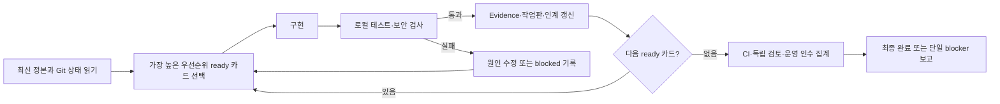

# Agent 연속 실행과 최종 보고 정책

## 정책

사용자가 승인한 Saint Vision / INV 프로젝트 범위에서는 Codex·Claude·Gemini가 routine 중간 확인을 사용자에게 반복하지 않고 **완료 또는 실제 권한 blocker까지 연속 실행**한다. “확인 없이 진행”은 사용자 확인 대화를 줄인다는 뜻이며, 기술 검증·보안 통제·독립 review를 생략한다는 뜻이 아니다.

## 연속 실행 Loop

## 묻지 않고 진행하는 범위

- 저장소 안의 승인된 코드·test·migration·문서 수정.
- 로컬 build, lint, unit/integration/E2E, 보안 negative test.
- 별도 worktree/branch에서의 일반 commit과 정해진 handoff.
- 기존 계약을 따르는 버그 수정과 재검증.
- 실패한 카드의 원인 분석 후 동일 범위 재시도.
- 한 카드가 외부 요인으로 막혔을 때 다른 ready 카드로 이동.

## 반드시 내부에서 확인할 Gate

- schema/contract 호환성.
- authentication·authorization·RLS·secret redaction.
- Lease/fencing/idempotency와 장애 복구.
- hash, replica, backup/PITR와 데이터 손상 시험.
- 실제 API를 사용한 browser E2E.
- 작성자와 다른 Agent의 독립 review.
- 실제 5대 Node 인수와 측정값. 합성 성공으로 대체하지 않음.

## 멈추고 사용자에게 한 번 묻는 경계

- 계정, API key, 인증서 또는 운영 credential을 새로 제공해야 할 때.
- 유료 서비스 사용·구매·비용이 발생할 때.
- 공개 인터넷 배포, 실제 고객/업무 데이터 접촉, 외부 메시지 발송.
- 삭제, 강제 push, history rewrite, 운영 DB schema/data의 되돌리기 어려운 변경.
- 서로 다른 제품 방향 중 하나를 선택해야 하며 기존 ADR로 결정할 수 없을 때.
- 실장비나 외부 시스템이 세 번 연속 같은 이유로 접근 불가이고 다른 ready 카드도 없을 때.

질문은 blocker, 이미 시도한 것, 선택지와 권장안을 한 번에 담는다.

## 역할별 자동 진행 순서

- **Codex:** P0 보안/정본 → 계약/스키마 → storage/model integrity → scheduler/runtime → multi-node acceptance.
- **Claude:** 준비된 API/DB/adapter → 운영/복원 → Codex·Gemini 독립 review → 다음 ready 서비스 카드.
- **Gemini / Antigravity:** Web Desktop Shell → Resource/File Explorer → Model Studio → Terminal/IDE → browser/HTTPS acceptance.

## 상태와 완료

`implemented`, `locally_verified`, `ci_verified`, `independently_reviewed`, `operationally_accepted`를 구분한다. 마지막 단계가 필요한 카드에서 앞 단계만 통과하면 `review` 또는 `blocked`이지 `done`이 아니다.

한 Agent의 “끝까지”는 무한 반복이 아니다. 동일 실패를 세 번 재현하면 원인과 Evidence를 기록하고, 다른 ready 카드가 있으면 이동한다. 모든 ready 카드가 끝났거나 실제 외부 blocker만 남으면 연속 실행을 종료하고 최종 보고를 만든다.

## 사용자 보고 원칙

- routine 진행 승인 질문을 하지 않는다.
- 장시간 작업의 내부 checkpoint는 Git·작업판·Evidence에 기록한다.
- 사용자에게는 요청된 최종 결과를 한 번에 보고한다.
- 새 권한이 필요한 blocker에서는 그 결정만 묻는다.
- 완료 보고는 성공뿐 아니라 미실측·미검토·미배포를 명시한다.

## 검증 결과의 재현 가능한 귀속

모든 검사 결과와 “통과” 주장은 실행 대상과 조건을 식별할 수 있어야 한다. 한 줄 요약의 pass 수만으로는 검증 범위를 보증하지 않는다. 같은 커밋도 checkout, 인터프리터, 서비스·환경 변수 및 opt-in 조건에 따라 실제 실행 집합이 달라질 수 있으므로 다음 항목을 함께 기록한다.

- 전체 commit SHA와 branch 이름, 실행 checkout/worktree의 절대 경로, 실행 전후 `git status --porcelain` 출력에 따른 clean/dirty 여부. dirty라면 변경 경로와 그 변경이 검사 입력에 포함됐는지 적는다. 줄바꿈 정규화가 status 결과에 영향을 줄 수 있는 생성 산출물은 `git diff --exit-code` 또는 해당 canonical drift gate도 함께 확인하고 측정법을 기록한다.
- 명령 전체와 working directory, interpreter/runtime의 절대 경로와 버전. PowerShell 등 셸의 변수를 썼으면 최종 확장된 명령 또는 그 변수를 설정한 값을 기록한다.
- 결과에 영향을 주는 환경 지문: OS/runner, 필요한 daemon·DB·browser·image의 가용 여부, opt-in·credential·DSN의 설정 여부(비밀 값은 기록 금지). 실행하지 못한 전체 lane과 skip/deselect 원인을 함께 밝힌다.
- KST 시작·종료 시각과 직접 관측한 종료 코드. 종료 코드는 파이프 뒤 값이 아니라 실행 직후 셸의 process exit 값을 기록한다.
- 테스트의 passed, failed, error, skipped, deselected 수를 각각 기록하고 skip 사유를 분포 또는 범주별 수로 함께 적는다. skip/deselect는 통과 수에 합치지 않으며, 전제 미충족 때문에 실행하지 않은 범위와 실제 판정된 범위를 분리한다.
- JUnit, JSON, 로그 등 산출물이 있으면 저장소 내 경로와 그 SHA/실행 ID를 적는다. 산출물이 없으면 직접 console 결과라고 표시한다. 분할 실행은 batch별 결과와 산술 합계를 구분하고, 합계를 단일 실행처럼 쓰지 않는다.
- 실행자와 독립 검토자를 따로 표시한다. 작성자의 실행·자기 검토·다른 Agent의 고정 SHA 재검토·CI 결과·브라우저/실장비 운영 인수는 서로 대체할 수 없다.

다른 branch, SHA 또는 worktree에서 얻은 결과는 현재 integration의 직접 결과로 인용하지 않는다. 결과 보고에는 `direct on <full SHA>` 또는 `reported from <branch/SHA>`처럼 근거 위치를 표시한다. 관련 입력이나 문서를 바꾼 뒤에는 그 변경을 포함한 최종 SHA에서 영향을 받는 검사를 다시 실행한다. 스킵 비율이 큰 경우 pass 수와 함께 skip 분포를 앞에 밝혀 실제 실행 범위가 축소된 사실을 드러낸다. 실행 결과는 pipeline/formatter에 의존해 exit code를 바꾸지 않는다. 셸이 제공하는 process exit 값을 직접 캡처하고, summary parser를 썼다면 원본 artifact와 파서 범위를 함께 보존한다.
