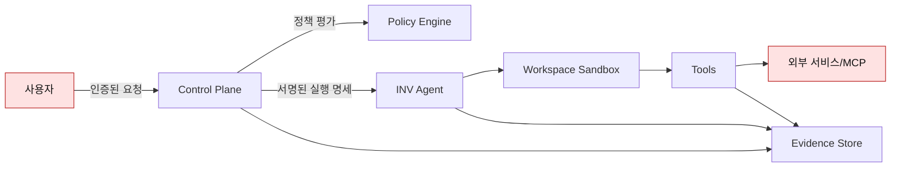

> [!important] 기존 설계 원문 참조
> 충돌 시 [[최종 개발 계획 - 모든 개발의 지침]]과 [[설계 충돌 정정 및 ADR]]을 따릅니다. 이 문서는 원문 보존용이며 확정 구현 사양이 아닙니다. 원본은 Git `docs/sources/40_Governance/보안 평가 운영 가이드.md`에 SHA-256과 함께 보존됩니다.

# 보안 평가 운영 가이드

> [!summary]
> SaintVision은 Agent의 지능보다 권한 경계와 증거 가능성을 먼저 설계한다. ROOF Engineering은 위험 통제, 관찰성, 소유권·승인, 실패 억제·대체를 모든 실행 단계에 덮는 공통 운영 계층이다.

## 1. ROOF 운영 모델

| 축 | 질문 | 필수 산출물 |
|---|---|---|
| Risk controls | 무엇을 금지·제한·승인할 것인가? | 정책, 데이터 분류, 위협 모델 |
| Observability | 무엇이 왜 일어났는지 재구성 가능한가? | 로그, 메트릭, 트레이스, Evidence |
| Ownership & approvals | 누가 결정하고 누가 책임지는가? | RACI, 승인 매트릭스, 만료 |
| Failure containment & fallback | 실패 영향이 어디까지이며 어떻게 회복하는가? | 예산, 격리, kill switch, 복구 절차 |

## 2. 신뢰 경계

다음 입력은 모두 기본적으로 신뢰하지 않는다.

- 자연어 사용자 요청
- 저장소 문서와 주석
- 웹 검색 결과와 외부 API 응답
- MCP 서버가 제공하는 도구 설명·결과
- 모델이 생성한 계획·도구 인자·위험 등급
- Worker가 보고하는 자원 상태

신뢰는 출처가 아니라 검증된 계약, 인증, 권한, 정책, 실행 증거를 통해 단계별로 부여한다.

## 3. 인증과 권한

- 사람: 조직 IdP의 OIDC/OAuth 2.1과 MFA 사용
- 서비스: 짧은 수명의 워크로드 ID 또는 상호 TLS 사용
- Node: 최초 등록 시 일회성 bootstrap token, 이후 장치별 키 사용
- Agent Run: 사용자 권한을 그대로 복제하지 않고 목적 제한 토큰으로 축소
- Tool: Workspace, Project, 데이터 분류, 환경, 동작별 ABAC 적용
- 관리자: 일상 계정과 분리하고 고위험 작업은 추가 인증

권한 결정은 `주체 + 동작 + 자원 + 환경 + 데이터 민감도 + 영향 반경`의 조합으로 수행한다.

## 4. 데이터 분류

| 등급 | 예시 | 처리 기준 |
|---|---|---|
| Public | 공개 문서, 공개 코드 | 일반 통제 |
| Internal | 설계, 내부 로그 | 조직 내 제한 |
| Confidential | 고객 데이터, 사내 소스 | 암호화, 최소 권한, 반출 승인 |
| Restricted | 비밀값, 개인정보, 의료 원본 | 격리, 강한 감사, 외부 모델 전송 기본 금지 |

컨텍스트 구성기는 데이터 등급과 모델·도구의 처리 위치를 비교하여 허용되지 않은 전송을 차단해야 한다.

## 5. 명령 위험 등급

### L0 — 관찰

- 상태·메타데이터 읽기
- 지정 저장소의 읽기 전용 탐색
- 로그·테스트 결과 조회

기본 자동 실행. 단, 민감 데이터 조회는 별도 권한이 필요하다.

### L1 — 제한된 변경

- Workspace 내부의 새 파일·패치 생성
- 테스트·린트·빌드 실행
- 임시 아티팩트 생성

정책과 예산 안에서 자동 실행 가능. Workspace 밖 쓰기와 외부 전송은 금지한다.

### L2 — 중요 변경

- 패키지 설치
- 컨테이너 실행
- 외부 시스템 쓰기
- 배포 또는 공유 자원 변경

사람의 명시적 승인과 만료 시간이 필요하다. 승인 화면에는 대상, diff, 영향, 비용, 롤백을 표시한다.

### L3 — 파괴적·민감

- 파일·데이터 삭제
- 자격 증명·방화벽·관리자 권한 변경
- 운영 데이터베이스 쓰기
- 광범위 외부 네트워크 또는 데이터 반출

기본 금지한다. 필요한 예외는 작업별 이중 확인, 강한 인증, 사전 백업, 제한된 시간창, 사후 검토를 요구한다.

## 6. Prompt Injection 방어

1. 시스템 지시와 검색·문서 콘텐츠를 구조적으로 분리한다.
2. 외부 콘텐츠는 명령이 아닌 데이터로 태깅한다.
3. 모델이 도구 허용 목록이나 정책을 변경할 수 없게 한다.
4. 도구 인자를 스키마와 정책으로 재검증한다.
5. 중요 부수 효과는 사람 승인을 요구한다.
6. 비밀값을 컨텍스트에 직접 삽입하지 않는다.
7. MCP 서버와 도구는 서버별 신뢰·권한 등급을 가진다.
8. 인젝션 평가셋을 회귀 테스트에 포함한다.

모델 기반 탐지기는 보조 통제일 뿐이며, 결정론적 권한 통제를 대체하지 않는다.

## 7. MCP와 외부 도구 안전

- 허용된 서버 ID와 TLS 인증서만 연결한다.
- 서버가 선언한 도구 설명을 정책 근거로 단독 사용하지 않는다.
- OAuth 토큰은 사용자·서버·scope에 묶고 최소 수명으로 발급한다.
- 서버별 네트워크·데이터·부수 효과 범위를 제한한다.
- 도구 목록 변경을 감지하고 재승인한다.
- 응답 크기, 시간, 리디렉션, 파일 참조를 제한한다.
- 외부 서버 오류가 전체 Run을 교착시키지 않도록 circuit breaker를 둔다.
- 고위험 결과는 실행 전에 사람이 검토 가능한 diff로 바꾼다.

## 8. 비밀 관리

- 비밀은 코드, Prompt, ContextBundle, 로그, Evidence에 원문으로 저장하지 않는다.
- `secretRef`만 계약에 포함하고 실행 직전에 대상 프로세스에 주입한다.
- 도구별 최소 scope와 짧은 TTL을 사용한다.
- 출력 필터가 키·토큰·연결 문자열 패턴을 마스킹한다.
- 의심 유출 시 자동 폐기, 회전, 관련 실행 격리 절차를 제공한다.
- 운영자는 비밀 원문을 볼 수 없어도 참조 사용 이력은 감사할 수 있어야 한다.

## 9. 샌드박스와 노드 보호

- Agent는 전용 저권한 OS 계정 또는 격리 컨테이너에서 실행한다.
- 허용된 Workspace 루트만 마운트한다.
- 호스트 홈, SSH 키, 시스템 폴더, 브라우저 프로필은 기본 차단한다.
- 네트워크는 egress allowlist를 적용한다.
- CPU, GPU, 메모리, 디스크, 프로세스 수, 시간 제한을 둔다.
- Node Agent 업데이트는 서명 검증과 롤백을 지원한다.
- Node가 변조되었다고 판단하면 인증서를 폐기하고 스케줄 대상에서 격리한다.

## 10. 실패 억제와 복구

| 실패 | 감지 | 자동 대응 | 사람 개입 |
|---|---|---|---|
| 모델 반복 루프 | step/token/time budget | 루프 중단, 요약 저장 | 필요 시 재계획 승인 |
| Tool timeout | deadline | 제한 재시도, circuit break | 지속 장애 조사 |
| Node 이탈 | heartbeat/lease | fencing 후 재스케줄 | Node 복구 |
| 정책 서비스 장애 | health check | fail closed | 서비스 복구 |
| Evidence 저장 실패 | write ack | 완료 상태 보류 | 저장소 복구 |
| 의심 비밀 유출 | 탐지 규칙 | 실행 격리, token 폐기 | 사고 대응 |
| 중복 실행 | idempotency/fence | 오래된 실행 차단 | 원인 분석 |

복구는 “다시 해보기”가 아니라 `실패 분류 → 영향 격리 → 상태 확인 → 안전한 재개/보상 → 결과 검증` 순서를 따른다.

## 11. 관찰성 기준

### 필수 상관관계

`traceId → runId → stepId → toolCallId → artifactId/evidenceId`

### 메트릭

- 요청·실행 성공률
- 단계별 latency와 queue time
- 모델 토큰·추론 비용
- 도구 실패율과 재시도율
- 노드 가용 CPU/GPU/메모리
- 승인 대기시간과 거절률
- 정책 차단·인젝션 탐지 건수
- 컨텍스트 적중·누락·압축률
- 복구 성공률과 중복 실행 수

### 로그

구조화 JSON을 사용하고 시간, 서비스, 환경, 상관관계 ID, 행위자, 이벤트 종류, 결과, 오류 코드를 포함한다. Prompt와 사용자 데이터는 해시·버전·요약을 우선하고 원문 수집은 별도 동의와 보존 정책이 있을 때만 허용한다.

## 12. 평가 체계

평가는 단일 최종 성공률이 아니라 계층별로 원인을 분해한다.

| 계층 | 대표 지표 | 실패 예시 |
|---|---|---|
| Prompt | 스키마 유효율, 지시 준수, 모호성 감지 | 잘못된 목적·제약 |
| Context | 출처 정확도, 관련성, 누락률, 오염 저항 | 오래된 상태, 권한 밖 자료 |
| Harness | 도구 성공률, 재현성, 격리, 로그 완전성 | 환경 불일치 |
| Graph | 올바른 전이, 복구율, 교착·중복 0 | 재개 후 이중 실행 |
| ROOF | 정책 차단율, 승인 준수, 비밀 유출 0 | 승인 우회 |
| Agent | 업무 성공률, 수정 품질, 비용, 사람 개입률 | 테스트만 맞춘 잘못된 수정 |

### 평가셋 구성

- 정상 작업
- 모호한 요청
- 충돌하는 지시
- 악성 문서·도구 결과
- 자원 부족과 노드 장애
- 실패하는 테스트와 flaky test
- 장시간·다단계 작업
- 예산 초과
- 승인 거절과 만료
- 한국어·영어 혼합 표현

모든 평가 사례에는 입력, 기대 결과, 허용 가능한 변형, 금지 결과, 필요한 증거를 기록한다.

## 13. 릴리스 게이트

| 영역 | 차단 조건 |
|---|---|
| 기능 | 핵심 사용자 여정 종단간 실패 |
| 안전 | L2/L3 승인 우회 또는 금지 경로 접근 |
| 보안 | 알려진 Critical/High 미완화 취약점 |
| 비밀 | 로그·아티팩트에 원문 비밀 노출 |
| 신뢰성 | fencing 없는 중복 부수 효과 |
| 감사 | Run을 재구성할 Evidence 누락 |
| 평가 | 기준 버전 대비 중요 지표 회귀 |
| 운영 | 롤백·kill switch·사고 연락망 미검증 |

예외 릴리스에는 위험 소유자, 기간, 보완 통제, 철회 조건을 기록한다.

## 14. SLO 초안

| 서비스 지표 | 목표 |
|---|---:|
| Control Plane 월 가용성 | 99.5% |
| Run 상태 이벤트 전달 P95 | 5초 이하 |
| 스케줄 결정 P95 | 2초 이하 |
| 취소 요청 반영 P95 | 10초 이하 |
| 정책 결정 P95 | 200ms 이하 |
| Evidence 기록 성공률 | 99.99% |
| 노드 이탈 감지 | 60초 이하 |

파일럿에서는 목표값과 실제값을 함께 보고하고, 충분한 데이터가 쌓이기 전에는 위반을 숨기지 않는다.

## 15. 사고 대응

1. 탐지: 경보와 증거를 보존한다.
2. 격리: Run, Workspace, Node, credential 중 필요한 최소 범위를 차단한다.
3. 근절: 악성 입력, 취약 도구, 잘못된 정책을 제거한다.
4. 복구: 깨끗한 체크포인트와 회전된 자격 증명으로 재개한다.
5. 검증: 재현 테스트와 보안 평가를 통과한다.
6. 회고: 근본 원인, 탐지 지연, 통제 개선, 소유자와 기한을 남긴다.

중요 사고에서는 자동 요약만 신뢰하지 않고 원본 Evidence와 시스템 로그를 함께 검토한다.

## 16. 거버넌스 기준 연결

- NIST AI RMF의 Govern, Map, Measure, Manage를 제품 위험 등록부와 릴리스 게이트에 연결한다.
- NIST GenAI Profile의 생성형 AI 특화 위험을 Prompt·Context·Agent 평가에 반영한다.
- OWASP Agentic AI 위협을 도구 오용, 권한 상승, 메모리 오염, 다중 Agent 통신, 과도한 자율성 테스트에 반영한다.
- OpenTelemetry의 GenAI 의미 규약을 참고하되 실험 상태 필드는 내부 안정 스키마로 감싼다.

## 17. 운영 점검 주기

| 주기 | 점검 |
|---|---|
| 매 Run | 정책, 예산, Evidence 완전성 |
| 매일 | 실패율, 비밀 탐지, 격리 Node |
| 매주 | 평가 회귀, 권한 예외, 비용 이상 |
| 매월 | 접근 권한 재검토, SLO, 사고·근접사고 |
| 분기 | 위협 모델, 데이터 분류, 복구 훈련 |
| 릴리스 전 | 전체 보안·평가·롤백 게이트 |

## 관련 문서

- [[용어 사전과 6단계 통합 모델]]
- [[공통 계약 요구사항과 완료 기준]]
- [[24주 구현 로드맵과 백로그]]
- [[최신 기술 출처와 설계 근거]]
