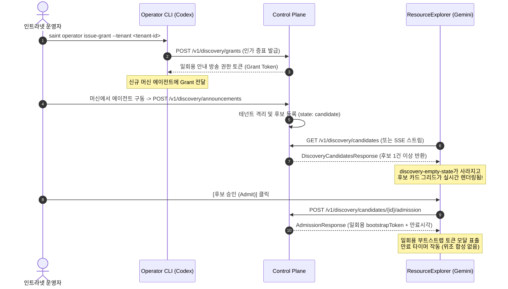

# 화면 개발 정직성 5대 원칙 및 사례집

## 1. 서문: 화면 정직성의 필요성과 기본 원칙

시스템의 보안과 신뢰성은 백엔드의 거절 로직만으로 완성되지 않는다. 백엔드가 권한 없는 요청을 403 Forbidden이나 ProblemDetails로 철저히 차단하더라도, 프런트엔드가 임의의 자리표시자(UUID, 가짜 식별자)를 합성하거나, 발생하지 않은 성공을 조기에 표시하거나, 실패를 이전 캐시 뒤로 숨긴다면 사용자에게 거짓된 운영 상태를 제공하게 되며 보안 경계를 우회하려는 공격 표면을 생성한다.

> [!IMPORTANT]
> **화면은 백엔드 보안 경계를 우회하거나 왜곡하지 않는 첫 번째 방어선이다.**
> 화면 개발자는 UI의 외관을 꾸미기 위해 데이터를 날조하지 않으며, "모르면 모른다고 표시하고, 부를 근거가 없으면 네트워크 요청 자체를 하지 않는다"는 정직성의 원칙을 엄격히 준수해야 한다.

---

## 2. 화면 개발 정직성 5대 핵심 원칙과 실제 사례

### 원칙 ①: 백엔드가 주지 않는 것을 만들지 않는다 (Never Synthesize)
프런트엔드는 서버 API 응답에 없는 지표, 이력, 식별자, 평가 결과를 화면의 완성도를 위해 임의로 채워 넣지 않는다. 서버가 데이터를 제공하지 않으면 빈 상태(Empty State) 또는 미지정(Unspecified) 상태로 정직하게 남겨둔다.

- **사례 1: `mlopsEngine.ts` 가짜 모델 계보 합성 제거**
  - **결함**: 백엔드에 모델 계보 API가 연결되지 않았음에도, `INITIAL_LINEAGES` 상수에 임의의 모델 정확도(0.948, 0.892, 0.812), F1-Score, 학습 손실 이력을 합성하여 화면에 표시함.
  - **정정**: 프로덕션 엔진 기본값을 `[]`(빈 배열)로 엄격히 비우고, 유닛 테스트용 mock은 `apps/web/tests/fixtures/model-lineage.ts`로 완전히 격리함.
- **사례 2: `StorageObservationView` 반-합성(Anti-Synthesis) 가드**
  - **결함**: 샤드 스토리지 관측 뷰에서 백엔드가 운영 인수 평가(`operationalAcceptanceAssessed`)를 수행하지 않았음에도 UI에서 임의로 `healthy: true`를 단정할 위험 존재.
  - **정정**: 백엔드 응답이 부재하거나 미평가 상태일 경우 `currentHealth: "unknown"`, `operationalAcceptanceAssessed: false`를 강제하고 상태 배너에 "미평가(Unassessed)"를 명시.
- **사례 3: `RunDetail.tsx` 실시간 SSE 로그 가짜 스트림 제거**
  - **결함**: 백엔드에서 로그를 수신하지 못했을 때(`!logView`), 모의 로그 스트림(`[SSE Streaming: /v1/runs/...]`, `Workspace [wsp-saint-pilot] 마운트 완료`, `[단위 테스트 48/48 통과]`, `exit code 0`)을 마치 실제 실행 로그처럼 날조 출력.
  - **정정**: 날조 블록을 전면 삭제하고, `기록된 실행 로그가 없습니다. (서버 응답 없음)`의 정직한 빈 상태 표시로 대체.
- **사례 4: `DeveloperStudio.tsx` 실행 세션 식별자 fallback 제거**
  - **결함**: 활성 실행 세션이 없을 때 `activeRunId || 'run_01JABCDE0001'`로 가짜 runId를 화면에 노출.
  - **정정**: `activeRunId || '미지정'`으로 수정하여 실행이 없음을 정직하게 전달.

---

### 원칙 ②: 부를 근거가 없으면 부르지 않는다 (0-Network Calls Without Basis)
필수 인자(테넌트 식별자, 인증 토큰, 승인 명령 식별자)가 부재할 경우, 임의의 자리표시자(UUID)나 더미 기본값으로 백엔드 API를 호출하지 않고 **호출 횟수를 0회로 차단**한다.

- **사례 1: `ResourceExplorer.tsx:420` 하드코딩 테넌트 UUID 제거 및 0-Call 차단**
  - **결함**: 미등록 머신 디스커버리 안내 방송 전송 시 세션 테넌트가 없음에도 하드코딩 UUID(`'00000000-0000-0000-0000-000000000001'`)를 전송. (미인증 호출자가 임의 테넌트에 후보를 주입하거나 500개 후보 한도를 고갈시킬 수 있는 보안 취약점).
  - **정정**: `!tenantId || !tenantId.trim()` 검사를 추가하여 세션 테넌트가 없으면 버튼을 `disabled` 처리하고, 안내 방송 API 호출을 0회로 원천 차단함.
- **사례 2: `WebTerminal.tsx` 가짜 commandId 티켓 발급 요청 차단**
  - **결함**: 승인된 명령이 없는 상태에서 더미 commandId(`11111111-1111-4111-8111-111111111111`)를 넣어 제어 평면에 30초 일회용 티켓 발급(`/terminal-tickets`)을 요청함.
  - **정정**: `isAuthorizedCommandId` 가드를 도입하여 더미 UUID 또는 빈값일 경우 백엔드 호출을 0회로 중단하고, 대기 출력에 `[승인 실행 필요]` 경고를 게시.
- **사례 3: `ModelLineageView.tsx` 빈 planRunId 및 approvalInput 가드**
  - **결함**: `approvalInput`의 기본값으로 `'apr_01JXYZ889900'`을 채워 넣고 배포 버튼을 활성화함.
  - **정정**: 기본값을 `""`(빈 문자열)로 초기화하고, 실제 승인 토큰이 입력되지 않으면 배포 요청을 보내지 못하도록 버튼을 비활성화함.
- **사례 4: `DeveloperStudio.tsx` 미지정 실행에 대한 영수증 조회 차단**
  - **결함**: `activeRunId`가 null일 때 `handleInspectReceipt('rcp_01JABCDEF')`를 호출하여 서버에 404 요청을 전송.
  - **정정**: `disabled={isLoadingReceipt || !activeRunId}`로 잠그고 `activeRunId`가 존재할 때만 정규 영수증을 조회하도록 수정.

---

### 원칙 ③: 일어나지 않은 일을 일어났다고 표시하지 않는다 (No Premature Success Display)
비동기 핸드셰이크, 복구 절차, 백엔드 이벤트가 실제로 성공하기 전에 화면에 "완료", "연결됨", "복구됨" 문구를 조기 표기하지 않는다.

- **사례 1: `WebTerminal.tsx` WebSocket 연결 전 Connected 문구 조기 출력 차단**
  - **결함**: WebSocket 소켓이 열리기도 전에 초기 터미널 버퍼에 `Connected via secure WebSocket with 30s one-time ticket.` 문구를 기본 포함하여 실제 연결 실패 시에도 연결된 것처럼 오인 유발.
  - **정정**: 초기 버퍼에서는 연결 대기 메시지만 표기하고, 실제 `WsTerminalClient`의 `onopen` 콜백이 수신된 후에만 Connected 안내를 출력하도록 수정.
- **사례 2: `WebTerminal.tsx` 티켓(권한 증표) 로깅 원천 금지**
  - **결함**: 일회용 티켓의 프리픽스나 값을 `console.log` 또는 터미널 화면에 출력함. 티켓은 권한 증표이므로 노출 즉시 탈취 위험.
  - **정정**: 티켓 원문 로깅을 전면 금지하고, 발급 여부와 유효기간(30초) 메타데이터만 기록.
- **사례 3: `InvFileExplorer.tsx` 클라이언트 타이머 기반 가짜 복구 시뮬레이션 제거**
  - **결함**: 백엔드 복구 API가 구현되지 않았음에도, 클라이언트 타이머로 1초 뒤 `"Replica repaired: node-1 -> node-2"`를 성공 처리하고 정상 레플리카 수를 임의 증가시킴.
  - **정정**: 가짜 시뮬레이션을 전면 철거하고, 실제 복구 핸들러(`onRepairReplicas`)가 주어지지 않으면 "서버 복구 API 부재로 복구 불가(정직한 거절)" 에러를 명시하도록 개정.

---

### 원칙 ④: 검증 못 함과 검증 통과를 같게 표시하지 않는다 (Strict Tri-State: unverified ≠ verified)
데이터 검증 상태는 이분법(`참` / `거짓`)이 아닌 **엄격한 3상태(`verified` | `mismatch/tampered` | `unverified`)**로 관리되어야 한다. 네트워크가 연결되지 않았거나 데모 데이터여서 검증을 수행하지 못한 것을 검증 통과(`verified`)로 올려치지 않는다.

- **사례 1: `InvFileExplorer.tsx` 파일 무결성 해시 3갈래 엄격 검증**
  - **3갈래 분기**:
    - 1) `verified`: 커널 체크아웃 원시 바이트(`WorkspaceEditView`)를 실제로 로드하여 계산한 SHA-256이 카탈로그 체크섬과 정확히 일치할 때만 부여.
    - 2) `mismatch`: 바이트가 존재하나 해시가 불일치할 때 (변조 의심).
    - 3) `unverified`: 체크아웃 바이트가 없거나, 인메모리 데모 데이터이거나, 체크섬이 미등록된 경우. (배선이 성공했다고 해서 검증됨으로 승격하지 않음).
- **사례 2: `ModelStudioView.tsx` 모델 체크섬 미지원에 대한 정직한 거절**
  - **결함**: 모델 검증 라우트가 구현되지 않았을 때 임의로 초록색 통과 배너를 띄우던 관행.
  - **정정**: 라우트 404 수신 시 정직한 거절(`RES-MODEL-404`)을 UI에 표기하고 검증 미지원 상태를 유지.

---

### 원칙 ⑤: 실패를 캐시나 이전 결과로 가리지 않는다 (Never Mask Fresh Failures)
최신 API 호출이 500 내부 오류, 401 인증 만료, 503 서비스 불가 등으로 실패했을 때, 이전에 성공했던 캐시나 로컬 메모리 상태를 조용히 유지하여 실패를 덮어버리지 않는다.

- **사례 1: `DeveloperStudio.tsx` 다운로드 프로브 404 전용 폴백**
  - **결함**: 신규 라우트 호출이 500 에러나 네트워크 끊김으로 실패했을 때도 catch하여 로컬 아티팩트 다운로드로 조용히 넘어가 서버 오류를 은폐함.
  - **정정**: 오직 `HTTP 404`(라우트 미구현)일 때만 레거시 경로로 폴백하고, `500`, `401`, 네트워크 단절은 즉시 사용자에게 경고(alert)하고 다운로드를 중단함.
- **사례 2: `InvFileExplorer.tsx` 재검증 실패 시 이전 상태 즉시 무효화**
  - **결함**: 이전에 `verified`였던 파일이 재검증 중 503 오류를 만나면 이전 `verified` 뱃지를 그대로 유지함.
  - **정정**: 최신 실패 발생 즉시 이전 검증 상태를 완전히 지우고 `error` 배너를 노출함.

---

## 3. 자동화 가능 vs 사람 판단 경계 (Automation vs Human Judgment Matrix)

Claude의 `GOV-EXISTS-VS-WORKS-CHECKS-001` 거버넌스 철학에 따라, 형식적인 검사는 **자동화 도구(`tools/check_frontend_integrity.py`)**로 강제하여 재발을 방지하고, 의미론적인 진위는 **사람/독립 검토**가 책임진다.

| 구분 | 검사 항목 | 집행 수단 | 한계 및 사람 판단 영역 |
| :--- | :--- | :--- | :--- |
| **자동화 가능 (구조적)** | 금지된 자리표시자 스캐너 (`00000000-...`, `run_01J...`, `apr_...`) | `tools/check_frontend_integrity.py` [RULE-1] | 정규 UUID 형식의 임의 값이 실제 존재하는 자원인지는 백엔드 DB와 대조 필요. |
| **자동화 가능 (구조적)** | 초기 상태/출력 조기 성공 문구 검사 (`Connected via secure WebSocket`) | `tools/check_frontend_integrity.py` [RULE-3] | 텍스트가 아닌 복합 SVG 아이콘이나 뱃지 색상으로 조기 성공을 암시하는 UI는 시각적 검토 필요. |
| **자동화 가능 (구조적)** | 권한 증표 / 티켓 console 로깅 탐지 (`ticket`, `bootstrapToken`) | `tools/check_frontend_integrity.py` [RULE-3] | 객체 전체를 직렬화하여 우회 로깅(`console.log(response)`)하는 패턴은 코드 리뷰로 확인. |
| **자동화 가능 (구조적)** | 엄격한 3상태(`verified`, `mismatch`, `unverified`) enum 집행 | `tools/check_frontend_integrity.py` [RULE-4] | 3상태가 정의되었더라도, 실제로 해시를 계산하는 대상 바이트의 진위(실제 커널 바이트인가?)는 의미론적 판단 필요. |
| **자동화 가능 (구조적)** | 테넌트/식별자 누락 시 API 호출 차단 0-Call 가드 | `tools/check_frontend_integrity.py` [RULE-2] | 가드가 존재하더라도, 상위 컴포넌트가 더미 prop을 내려줄 경우 뚫릴 수 있으므로 prop 체인 추적 필요. |
| **사람 판단 (의미론)** | 데이터 출처의 실질성 (Provenance) | 독립 Agent 검토 / E2E 테스트 | 계산된 해시가 실제 커널의 WorkspaceEditView 바이트에서 유래했는지 여부. |
| **사람 판단 (의미론)** | Fallback의 정당성 | 독립 Agent 검토 / E2E 테스트 | Fallback이 레거시 하위 호환인지, 아니면 백엔드 오류를 가리기 위한 가짜 응답인지 판정. |
| **사람 판단 (의미론)** | 빈 상태 UX의 진실성 | 브라우저 실측 / 접근성 검증 | 자원이 없을 때 사용자에게 다음 액션을 정직하게 안내하는지 여부. |

---

## 4. 전체 화면 감사 지도 (Consolidated Audit Scope Map)

오늘 수행된 프런트엔드 정직성 감사 내역과 현재까지의 감사 범위를 종합 집계한다.

| 화면 / 컴포넌트 | 감사 항목 (Audit Item) | 조치 내용 및 정직성 결과 | 상태 |
| :--- | :--- | :--- | :--- |
| **ResourceExplorer.tsx** | Tab 2 스토리지 관측 | `StorageObservationView` 정본 어댑터 연결, 미평가 시 unknown 강제 | ✅ 감사 및 수정 완료 |
| **ResourceExplorer.tsx** | Tab 5 디스커버리 안내 방송 | 하드코딩 테넌트 UUID 제거, tenantId 부재 시 0-call 가드 집행 | ✅ 감사 및 수정 완료 |
| **WebTerminal.tsx** | PTY 티켓 발급 및 핸드셰이크 | commandId denylist 가드(0-call), 티켓 로깅 차단, 조기 Connected 출력 제거 | ✅ 감사 및 수정 완료 |
| **InvFileExplorer.tsx** | 파일 무결성 대조 | `WorkspaceEditView` 실제 바이트 로드, 엄격 3상태 분기, 가짜 복구 타이머 제거 | ✅ 감사 및 수정 완료 |
| **DeveloperStudio.tsx** | 아티팩트 다운로드 프로브 | 404 경로 부재만 폴백 허용, 500/401/네트워크 에러 시 캐시 다운로드 차단 | ✅ 감사 및 수정 완료 |
| **DeveloperStudio.tsx** | 세션 ID 및 영수증 조회 | fallback runId 제거, activeRunId 부재 시 영수증 버튼 disabled (0-call) | ✅ 감사 및 수정 완료 |
| **ModelLineageView.tsx** | 계보 배포 및 승인 입력 | approvalInput 빈값 기본값, planRunId 빈값 가드 집행, 배포 버튼 disabled | ✅ 감사 및 수정 완료 |
| **mlopsEngine.ts** | 모의 계보 mock 배열 | `TEST_FIXTURE_LINEAGES` 프로덕션 엔진에서 테스트 fixture 디렉터리로 분리 | ✅ 감사 및 수정 완료 |
| **RunDetail.tsx** | 실시간 SSE 로그 | 로그 부재 시 합성되던 가짜 테스트 통과 스트림 제거 -> 정직한 빈 상태 표시 | ✅ 감사 및 수정 완료 |
| **AdminSecurityConsole.tsx** | 노드 격리/재개 오케스트레이션 | 현재 상태: 제어 평면 API 호출 연동되어 있으나 백엔드 CAS 충돌 시 UI 복구 흐름 | ⚠️ 미감사 (Unaudited) |
| **MonacoWorkspaceEditor.tsx** | 초기 파일 템플릿 | 현재 상태: `INITIAL_FILES` 샘플 파일이 Git 실제 체크아웃 바이트와 동기화되는지 | ⚠️ 미감사 (Unaudited) |
| **IntranetDeploymentView.tsx** | 운영자 서명 및 TLS 상태 | 현재 상태: `usr_operator_lead` 하드코딩 및 TLS 1.3 뱃지가 실제 엔터프라이즈 CA와 연동되는지 | ⚠️ 미감사 (Unaudited) |
| **ReleaseCandidateView.tsx** | 롤백 검증 패널 | 현재 상태: 롤백 클릭 시 실제 라우팅 트래픽 스위칭 여부 미검증 | ⚠️ 미감사 (Unaudited) |

---

## 5. 디스커버리 화면 및 운영자 CLI 연동 예측 (Discovery & Operator CLI Onboarding)

### 5.1 현재 디스커버리 화면 동작 (`ResourceExplorer.tsx` Tab 5)
1. **인증된 `tenantId`가 부재할 때**:
   - `discovery-tenant-required-notice` 표시: `"⚠️ [테넌트 격리 차단]: 인증된 세션 테넌트 식별자(tenantId)가 없어 안내 방송 전송이 비활성화되었습니다."`
   - 안내 방송 브로드캐스트 버튼이 `disabled` 처리되며 백엔드 API 요청이 0회로 차단됨.
2. **인증된 `tenantId`가 존재하나 등록된 후보가 없을 때**:
   - `getDiscoveryCandidates()`가 성공하여 빈 배열(`[]`)을 반환함.
   - `discovery-empty-state` 표시: `"ℹ️ 승인 대기 중인 디스커버리 후보가 없습니다."`
   - UI 편의를 위한 가짜 후보 카드를 합성하지 않고 진실한 빈 화면을 유지함.

### 5.2 Codex 운영자 CLI 자격증명 발급 완료 시 화면 연동 흐름
Codex가 운영자 CLI(`saint operator issue-grant` / `admit-node`) 자격증명 발급 트랙을 완료하면 다음과 같이 화면 동작이 유기적으로 전환된다:

1. **안내 방송 수신 및 전환**:
   - CLI를 통해 인가받은 머신이 안내 방송을 등록하면, `loadDiscoveryCandidates()` 호출 시 실제 `DiscoveryCandidateResponse` 객체들이 전달됨.
   - 화면은 `discovery-empty-state`에서 후보 목록 카드로 매끄럽게 전환되며, 각 카드는 머신 보고값(`claimedCpu`, `claimedRam`, `claimedGpu`)과 `verified: false` 배너를 정직하게 표시함.
2. **승인 및 일회용 토큰 취급**:
   - 운영자가 화면에서 `handleAdmitCandidate`를 누르면 `POST /v1/discovery/candidates/{id}/admission`이 호출되어 암호화된 일회용 `bootstrapToken`이 모달에 1회 표출됨.
   - 이 토큰은 브라우저 로컬스토리지에 저장되거나 로그에 남지 않고 만료 시각과 함께 운영자에게 전달됨.
3. **가짜 후보 시뮬레이션 금지 유지**:
   - CLI 연동이 완성되기 전까지 화면은 계속해서 정직한 `discovery-empty-state`를 유지하며, 테스트용 가짜 노드를 화면 코드에 하드코딩하지 않는다.

---

## 6. 결론 및 향후 계획

- 오늘 구축된 `tools/check_frontend_integrity.py` 검사 도구는 프런트엔드 CI 파이프라인 및 개발 루틴에 포함되어 5대 정직성 원칙 위반이 재축적되는 것을 구조적으로 방지한다.
- 미감사 영역으로 식별된 `AdminSecurityConsole`, `MonacoWorkspaceEditor`, `IntranetDeploymentView`는 후속 작업 카드 착수 시 본 정직성 지침에 따라 순차적으로 감사를 진행한다.
