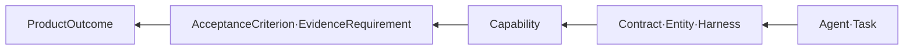

# Reverse-Ontology 최종 설계

## 목표에서 역산

Reverse-Ontology는 완성 프로그램을 예상하고 그 완성 조건에서 구현 의존성을 역산하는 SaintVision 내부 설계 방법이다. 예측 결과는 `planned`, 실행에서 관측된 사실은 Evidence로 구별한다.

설계 순서는 Outcome → AcceptanceCriterion → EvidenceRequirement → Capability → Contract/DomainEntity → Task → Agent다. 구현 결과는 Task → Commit → Build → Evidence → AcceptanceCriterion → Outcome으로 정방향 검증한다.

## 연결할 개념

| 계층 | 클래스 | 필수 관계·실행 기록 |
|---|---|---|
| 목표 | ProductOutcome, AcceptanceCriterion, EvidenceRequirement | outcome requiresCriterion; criterion requiresEvidence |
| 구현 | Capability, Contract, DevelopmentTask | task realizes outcome, usesContract, dependsOn task |
| 책임 | AgentProfile, SkillSpec | task ownedBy / reviewedBy; agent usesSkill |
| AI 구성 | PromptSpec, ContextBundle, HarnessProfile, RunGraph, PolicyBundle | 불변 버전·scope·입출력·제약·예산 |
| 실제 실행 | Run, RunAttempt, Checkpoint, EvidenceEnvelope | 실행별 snapshot/구성/토큰과 결과 |
| 개발 이력 | CodeCommit, Build, DevelopmentReport, ErrorRecord, ResolutionRecord | task→commit→build→report; error resolvedBy resolution |

`dev:PromptSpec`, `dev:SkillSpec` 등은 프로젝트 namespace에 추가한다. 제품의 기술 Capability와 개발 목표 Capability는 의미를 구분한다. PostgreSQL은 실행 정본, RDF는 의미 교환/검증/검색 projection이다. RDF store를 MVP 필수 서비스로 추가하지 않는다.

## 여덟 구성 요소의 계약

Prompt는 목표·제약·출력 형식·버전, Context는 출처·TTL·권한·내용 hash, Harness는 workspace·도구·검증 명령, Skill은 절차·입출력·복구·버전을 가진다. ROOF는 위험·관찰·책임·승인·복구를 관통한다. Graph는 Run/Resource/Knowledge를 구별한다. Agent는 권한·owner·budget, Ontology는 모든 개념의 관계·출처·제약을 연결한다. 비밀이나 내부 추론 원문 대신 결정 요약과 검증 가능한 근거를 기록한다.

## S05 예시

OUT-05: 초과 예약 없는 5노드 배치 → AC-05: 동일 잔여 자원에 50개 동시 요청 시 초과 예약 0 → Evidence: connection별 결과·Lease 합계·stale token 차단 → ResourceLease/ResourceOffer/Allocation/PlacementPlan → S05-DB/BE Codex, S05-FE Gemini, S05-ST Codex → Claude의 독립 검토.

예상 시험 계획은 실제 테스트 통과가 아니다. 실제 결과는 Commit·Build·Evidence ID를 연결한 뒤 상태를 갱신한다.

## Ontology 산출물

`ontology/schema.ttl`은 TBox, `ontology/example.ttl`과 `ontology/example.jsonld`는 동일 ABox의 두 직렬화다. `ontology/shapes.ttl`은 SHACL 제약, `ontology/queries/`는 competency queries다. 기존 [[saintvision-inv.ttl]]과 [[saintvision-inv.example.jsonld]]는 원문 참조로 보존한다.

예제 query는 올바른 ml:hasLocation/ml:consumesDataset/ml:registersModel prefix를 사용한다. 누락된 RunAttempt/Checkpoint/AgentProfile/Tenant/ProvenanceRecord 및 본 설계 클래스를 추가한다. 예제에는 실제 환자/계정/장비 사실을 넣지 않는다.

## 검증과 운영

Turtle parse, undefined project terms, SHACL positive/negative fixtures, TTL/JSON-LD isomorphism, competency query의 비어 있지 않은 기대 결과를 검사한다. ontology/version·DB migration·contract version을 Release Manifest에서 연결한다. JSON Schema와 SHACL은 서로 대체하지 않으며 API와 RDF 각각을 검증한다.

근거: [W3C SHACL](https://www.w3.org/TR/shacl/). 이 방법의 최종 합격 판단은 SHACL 하나가 아니라 코드·정책·통합 시험을 함께 사용한다.
