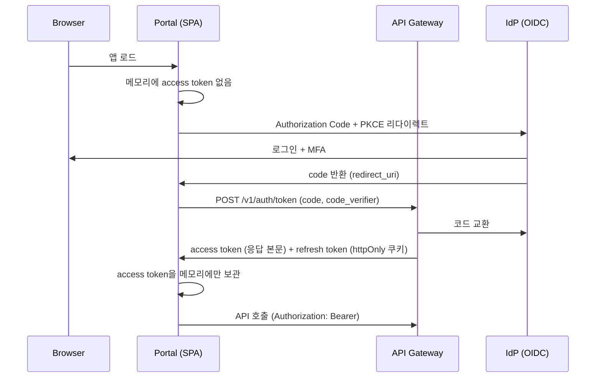

> [!important] 기존 설계 원문 참조
> 충돌 시 [[최종 개발 계획 - 모든 개발의 지침]]과 [[설계 충돌 정정 및 ADR]]을 따릅니다. 이 문서는 원문 보존용이며 확정 구현 사양이 아닙니다. 원본은 Git `docs/sources/60_Gaps/10_Frontend 보완 설계.md`에 SHA-256과 함께 보존됩니다.

# Frontend 보완 설계

## 이 문서가 메우는 공백

기존 설계에서 프론트엔드는 가장 얇은 영역이다. 전 문서를 통틀어 확정된 프론트엔드 기술은 **`xterm.js`(터미널 렌더러)와 `Monaco Editor`(그마저 code-server와 택일 미정)** 두 개뿐이다. 화면은 이름만 나열되어 있고, 라우팅·상태관리·실시간 전송·인증 흐름·i18n이 전부 비어 있다.

이 문서는 그 공백을 구현 가능한 수준으로 채운다.

## 1. 기술 스택 확정

`시스템 아키텍처와 기술 스택`의 "React, TypeScript, Vite, TanStack Query" 선택을 유지하고, 미정 항목을 채운다.

| 영역 | 선택 | 근거 |
|---|---|---|
| 프레임워크 | React 19 + TypeScript | 기존 설계 선택. 사내 `SaintviewPACSai/frontend`가 동일 스택으로 가동 중 |
| 빌드 | Vite | 동상 |
| 서버 상태 | TanStack Query v5 | 기존 설계 선택. 폴링·무효화·낙관적 갱신이 Run 상태 화면에 그대로 필요 |
| 라우팅 | TanStack Router | 타입 안전 라우트 파라미터. `runId`, `nodeId` 등을 문자열로 흘리지 않음 |
| 클라이언트 상태 | Zustand | 터미널 세션·패널 레이아웃 등 서버와 무관한 상태만. 전역 스토어를 크게 키우지 않음 |
| 터미널 | xterm.js + `@xterm/addon-fit`, `@xterm/addon-web-links` | 기존 설계 선택 |
| 편집기 | Monaco Editor | MVP는 파일 편집과 diff까지만. code-server는 라이선스 검토 완료 후 Adapter로 별도 판단 |
| 폼·검증 | React Hook Form + Zod | Zod 스키마를 계약 JSON Schema에서 생성해 백엔드와 검증 규칙 일치 |
| 테스트 | Vitest + Testing Library, Playwright | |

> **SSR은 도입하지 않는다.** 기존 설계의 "SSR 필요성이 생길 때만 Next.js 검토"를 그대로 따른다. Portal은 인증 뒤에 있는 대시보드이므로 SEO·초기 렌더 요구가 없다.

### 부트스트랩

`SaintviewPACSai/frontend`의 `tsconfig.app.json`, `eslint.config.js`, `vite.config.ts`를 출발점으로 복사해 조직 내 설정을 일치시킨다. 단 의존성은 그대로 가져오지 않는다 — PACS AI의 Cornerstone3D 계열 패키지는 INV Portal에 불필요하다.

## 2. 실시간 전송 방식 결정 (착수 차단 항목)

기존 설계는 "터미널 스트림", "이벤트 스트림", "Run 상태 이벤트 전달 P95 5초"를 요구하면서 프로토콜을 정하지 않았다. 용도가 다르므로 하나로 통일하지 않고 **둘로 나눈다**.

### 결정

| 용도 | 프로토콜 | 근거 |
|---|---|---|
| Workspace / Node Terminal | **WebSocket** | PTY는 본질적으로 양방향이다. 키 입력과 출력이 동시에 흐르고, 리사이즈(`SIGWINCH`) 같은 제어 메시지도 클라이언트에서 서버로 간다 |
| Run 상태 전이, 로그 tail, 승인 대기 알림 | **SSE (Server-Sent Events)** | 단방향이면 충분하고, 재연결과 `Last-Event-ID` 기반 유실 복구가 프로토콜에 내장되어 있다. 이벤트 버스가 at-least-once이므로 클라이언트 중복 제거와 궁합이 맞다 |

gRPC-Web은 채택하지 않는다. 브라우저 측 프록시(Envoy 등)가 추가로 필요하고, 이 프로젝트의 API 진입점은 이미 REST + WebSocket으로 정해져 있다.

### SSE 계약

```
GET /v1/runs/{runId}/events
Accept: text/event-stream
Last-Event-ID: evt_01J...        # 재연결 시
```

```
id: evt_01JABCDEF
event: run.state.changed
data: {"runId":"run_01J...","from":"scheduled","to":"running","occurredAt":"2026-09-09T14:29:00+09:00"}

id: evt_01JABCDEG
event: run.log.appended
data: {"runId":"run_01J...","stepId":"stp_01J...","seq":1042,"chunk":"..."}
```

클라이언트 규칙:

- 이벤트 버스가 at-least-once이므로 **`id`(eventId) 기반 중복 제거**를 클라이언트에서도 수행한다. 최근 1000개 ID를 링 버퍼로 유지한다.
- 재연결은 지수 백오프 + jitter (1s → 2s → 4s → … 최대 30s).
- 브라우저의 도메인당 HTTP/1.1 연결 6개 제한을 피하기 위해 **HTTP/2 이상에서 서비스**한다. HTTP/1.1 폴백 환경에서는 Run 상세 화면 1개만 SSE를 열고 목록 화면은 TanStack Query 폴링(5초)으로 처리한다.

### `Run 상태 이벤트 P95 ≤5초` SLO 클라이언트 측정

이벤트 페이로드의 `occurredAt`과 수신 시각의 차이를 기록해 `run_event_delivery_lag_ms` 히스토그램으로 백엔드에 전송한다. 서버 측 발행 시각만 재는 것으로는 이 SLO를 검증할 수 없다 — 사용자가 체감하는 지연은 브라우저 도착 시점 기준이기 때문이다. 클라이언트 시계 오차는 SSE 연결 수립 시 서버가 내려주는 `serverTime`으로 보정한다.

## 3. 화면 명세

기존 설계가 이름만 남긴 화면에 라우트·데이터 소스·권한·상태를 부여한다.

| 라우트 | 화면 | 주 데이터 소스 | 최소 권한 |
|---|---|---|---|
| `/` | 클러스터 개요 (Nodes / Healthy / Virtual CPU / RAM / GPU / VRAM / Storage) | `GET /v1/resource-graph` | project:read |
| `/nodes` | Node 인벤토리와 상태 | `GET /v1/nodes` | node:read |
| `/nodes/{nodeId}` | Node 상세 — Capability, Offer, 활성 Lease, 최근 Snapshot | `GET /v1/nodes/{id}`, `GET /v1/resources/snapshot?nodeId=` | node:read |
| `/projects` | Project 목록 | `GET /v1/projects` | project:read |
| `/projects/{projectId}/workspaces` | Workspace 목록과 생성 | `GET/POST /v1/workspaces` | workspace:write |
| `/workspaces/{wsId}/terminal` | Web Terminal | WebSocket `/v1/workspaces/{id}/terminals/{sid}` | workspace:exec |
| `/workspaces/{wsId}/editor` | 파일 탐색·편집·diff | `GET /v1/workspaces/{id}/files` | workspace:write |
| `/runs` | Run 목록 (상태·프로젝트·기간 필터) | `GET /v1/runs?cursor=&status=` | run:read |
| `/runs/{runId}` | Run 상세 — 탭 4개 (타임라인 / 로그 / 아티팩트 / Explain) | `GET /v1/runs/{id}`, SSE, `GET /v1/runs/{id}/explain` | run:read |
| `/runs/{runId}/evidence` | Evidence 조회 | `GET /v1/runs/{id}/evidence` | audit:read |
| `/approvals` | 승인 대기 목록 | `GET /v1/approvals?status=pending` | approval:decide |
| `/approvals/{approvalId}` | **승인 상세 (최우선 구현)** | `GET /v1/approvals/{id}` | approval:decide |
| `/audit` | 감사 이벤트 검색 | `GET /v1/audit-events` | audit:read |
| `/settings/tools` | AI CLI Adapter 상태와 인증 연결 | `GET /v1/ai-tools` | project:admin |

### 모든 화면의 공통 상태 처리

각 화면은 아래 5개 상태를 반드시 구현한다. 기존 설계에는 정상 경로만 서술되어 있다.

1. **로딩** — 스켈레톤. 스피너 전면 차단 금지
2. **빈 상태** — 다음 행동을 제시한다 (예: Node 0대 → "INV Agent 설치 안내" 링크)
3. **오류** — `code`와 `traceId`를 화면에 노출한다 (§6 참조)
4. **권한 없음** — 403은 빈 화면이 아니라 "이 프로젝트에 대한 `run:read` 권한이 필요합니다"로 표시
5. **부분 실패** — 목록의 일부 항목만 조회 실패한 경우 나머지를 계속 보여준다

## 4. 승인 화면 — 최우선 구현 대상

`보안 평가 운영 가이드`가 유일하게 필드 수준까지 요구한 화면이다. L2/L3 실행이 이 화면을 통과하므로, 여기가 부실하면 "승인 없는 L2/L3 실행 0건"이라는 파일럿 지표를 만족할 수 없다.

### 필수 표시 항목

| 항목 | 원 요구 | 구현 |
|---|---|---|
| 대상 | "대상" | 명령/도구 이름, 대상 Node, Workspace, 경로 |
| diff | "diff" | 변경 예정 파일의 unified diff. 바이너리는 크기 변화만 |
| 영향 | "영향" | 영향 반경 (Workspace 내부 / 외부 시스템 / 공유 자원), 되돌릴 수 있는지 여부 |
| 비용 | "비용" | 예상 토큰·GPU 시간·금액. `AgentRunSpec.spec.constraints.maxCost` 대비 잔여 |
| 롤백 | "롤백" | 롤백 절차 유무와 방법. **롤백 계획이 없으면 그 사실을 붉게 표시** |
| 만료 | "승인에 만료 시간과 일회성 nonce" | 남은 시간 카운트다운. 만료 60초 전 경고 |
| 위험 등급 | L0~L3 | 등급과 **정책 엔진이 재계산한 근거**. 모델이 제안한 등급은 표시하되 "제안값"으로 구분 |

### 안전 장치

- **일회성 nonce**: 승인 요청 로드 시 서버가 발급한 nonce를 제출에 포함한다. 재제출·중복 승인 차단.
- **만료 후 제출 차단**: 클라이언트 카운트다운이 0이 되면 버튼을 비활성화하고, 서버도 독립적으로 만료를 검증한다. 클라이언트 시계를 신뢰하지 않는다.
- **L3 이중 확인**: L3는 기본 차단이므로 화면에 승인 버튼을 노출하지 않는다. 예외 승인 경로가 활성화된 경우에만, 별도 확인 단계와 사유 입력을 요구한다.
- **diff 미로드 시 승인 불가**: diff 조회에 실패했다면 승인 버튼을 비활성화한다. 무엇을 승인하는지 모르는 상태의 승인을 막는다.
- **두 사람 규칙(two-person rule)**: 정책이 요구하는 작업은 승인자 2인이 필요하며, 첫 승인 후 상태를 "1/2 승인됨"으로 표시하고 **첫 승인자는 두 번째 승인을 할 수 없다**.

## 5. 인증 흐름 (착수 차단 항목)

기존 설계는 "OIDC와 MFA", "OAuth 2.1"을 쓴다는 사실만 적혀 있다. 클라이언트 측 구현을 정한다.

### 흐름



### 규칙

- **Authorization Code + PKCE**. Implicit flow는 사용하지 않는다.
- **access token은 메모리에만** 보관한다. `localStorage`·`sessionStorage`에 저장하지 않는다 — XSS 시 토큰이 그대로 유출된다.
- **refresh token은 `httpOnly` + `Secure` + `SameSite=Strict` 쿠키**로 서버가 설정한다. JavaScript가 접근할 수 없다.
- **401 인터셉터**: 자동으로 refresh를 1회 시도하고, 실패하면 로그인으로 보낸다. 동시 다발 401에 대해 refresh 요청은 **1개만** 나가도록 큐잉한다(thundering herd 방지).
- **CSRF**: refresh 엔드포인트는 쿠키 기반이므로 `SameSite=Strict`에 더해 double-submit 토큰을 요구한다.
- **탭 새로고침**: access token이 메모리에 없으므로 refresh 쿠키로 조용히 재발급한다. 이때 로그인 화면이 깜빡이지 않도록 초기 로딩 상태를 둔다.
- **로그아웃**: 서버가 refresh 쿠키를 만료시키고 IdP end-session endpoint로 리다이렉트한다. 메모리 토큰도 폐기한다.
- **WebSocket 인증**: 브라우저 WebSocket은 커스텀 헤더를 보낼 수 없다. 연결 직전 `POST /v1/workspaces/{id}/terminals`로 **단기 세션 티켓**(TTL 30초, 1회용)을 받아 쿼리 파라미터로 전달한다. access token을 URL에 넣지 않는다 — 서버 로그와 브라우저 히스토리에 남는다.

## 6. 오류 처리와 상관관계 ID

### traceId 전파

모든 요청에 클라이언트가 `X-Trace-Id`를 생성해 보낸다(W3C Trace Context `traceparent` 형식). 응답 오류 시 이 값을 화면에 노출한다.

```
요청을 처리하지 못했습니다.

  코드     RES-0003 (자원 부족)
  메시지   요청한 VRAM 16GiB를 제공할 수 있는 Node가 없습니다.
  추적 ID  4bf92f3577b34da6a3ce929d0e0e4736

  [다시 시도]  [추적 ID 복사]
```

기존 설계는 관찰성에서 상관관계 ID 전파를 요구하지만 **사용자에게 보여주는 부분**이 없었다. 지원 요청 시 이 ID 하나로 서버 로그·트레이스·Evidence를 모두 찾을 수 있어야 한다.

### 오류 코드군별 UI 처리

| 코드군 | 사용자에게 보이는 처리 |
|---|---|
| `VAL-*` | 해당 폼 필드에 인라인 오류 표시 |
| `AUTH-*` | 권한 안내. 필요한 권한 이름을 명시 |
| `CTX-*` | "정보가 오래되었습니다" + 새로고침 버튼 |
| `TOOL-*` | 재시도 가능 여부(`retryable`)에 따라 재시도 버튼 노출 |
| `RES-*` | 자원 부족 상세와 대안 Node 제안 |
| `NET-*` | 자동 재시도 중임을 표시 (사용자 조작 불필요) |
| `GRAPH-*` | Run 상세로 이동 링크 |
| `VERIFY-*` | 실패한 검증 항목과 로그 링크 |
| `SEC-*` | 관리자 문의 안내. **상세 사유는 노출하지 않는다** |
| `BUDGET-*` | 초과한 예산 항목과 추가 승인 요청 경로 |

## 7. 디자인 시스템, 접근성, i18n

### 디자인 토큰

CSS 커스텀 프로퍼티 기반. 라이트/다크 두 테마. 상태 색은 의미 단위로 정의한다 — `--color-status-online`, `--color-risk-l3` 등. 위험 등급 색은 색상만으로 구분하지 않고 아이콘·라벨을 함께 쓴다(색각 이상 대응).

### 접근성 범위 (MVP)

- 키보드만으로 승인 화면 전체 조작 가능
- 폼 오류를 `aria-live="polite"`로 안내
- 명도 대비 WCAG AA
- **터미널은 예외로 둔다.** xterm.js의 스크린리더 지원은 제한적이며, 대체 경로로 `GET /v1/runs/{id}/logs`(텍스트)를 제공한다. 이 한계를 문서에 명시한다.

### i18n

기존 설계는 한국어·영어 혼합을 **평가셋에서만** 다루고 UI 정책이 없었다.

- 기본 언어 한국어, 영어 리소스 병행
- 리소스는 `locales/{ko,en}/*.json`으로 분리, 하드코딩 문자열 금지 (ESLint 규칙으로 강제)
- **날짜·시간은 RFC 3339 UTC로 받아 브라우저 타임존으로 표시한다.** 계약 예제가 `+09:00`을 쓰지만, 원격 노드가 다른 타임존에 있을 수 있으므로 표시 시점에 변환한다.
- 로그·터미널 출력은 번역하지 않는다 (원문 보존)

## 8. 디렉터리 구조

```
apps/web/
  src/
    routes/            # TanStack Router 파일 기반 라우트
    features/
      nodes/           # 각 기능: api.ts, hooks.ts, components/, types.ts
      runs/
      approvals/
      workspaces/
      terminal/
      audit/
    shared/
      api/             # fetch 래퍼, 인터셉터, traceId 주입
      auth/            # OIDC 흐름, 토큰 관리
      realtime/        # SSE 클라이언트, WebSocket 클라이언트
      ui/              # 디자인 시스템 컴포넌트
      i18n/
    contracts/         # 계약 JSON Schema에서 생성된 TS 타입 (수정 금지)
  tests/
    e2e/               # Playwright
```

`contracts/`는 [[20_Backend 보완 설계]]의 코드 생성 파이프라인 산출물이다. 손으로 고치지 않는다.

## 9. 테스트

| 계층 | 도구 | 대상 |
|---|---|---|
| 단위 | Vitest | 오류 코드 매핑, 토큰 갱신 큐잉, SSE 중복 제거 링 버퍼 |
| 컴포넌트 | Testing Library | 승인 화면의 만료·diff 미로드·two-person 규칙 분기 |
| E2E | Playwright | S10 데모 시나리오: 요청 → 승인 → 진행 확인 → diff 검토 → 결과 다운로드 |
| 시각 회귀 | Playwright 스냅샷 | 라이트/다크 두 테마의 주요 화면 |

E2E는 백엔드 모킹이 아니라 **로컬 compose 스택 전체**를 띄워 실행한다. 실시간 전송과 인증 흐름은 모킹으로 검증되지 않는다.

## 10. 착수 순서

1. 부트스트랩 + 인증 흐름 + `shared/api` (traceId, 오류 매핑)
2. `/nodes`, `/nodes/{id}` — 첫 수직 기능("한 Node 등록 → 웹에서 상태 확인")의 프론트 절반
3. `/approvals/{id}` 승인 화면 — 안전 지표가 걸려 있음
4. `/runs/{id}` + SSE
5. `/workspaces/{id}/terminal` + WebSocket
6. 나머지 화면

## 관련 문서

- [[00_보완 설계 종합 요약]]
- [[20_Backend 보완 설계]]
- [[시스템 아키텍처와 기술 스택]]
- [[Dev Workspace CLI Git Docker MLOps AI CLI 통합 설계]]
- [[보안 평가 운영 가이드]]

---
> 본 문서는 Claude가 분석·설계·작성했습니다.
> 작성 일시: 2026-09-09 14:29 (Asia/Seoul)
