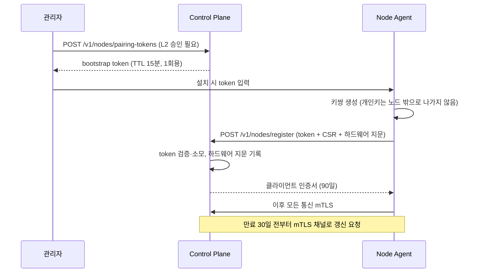

> [!important] 기존 설계 원문 참조
> 충돌 시 [[최종 개발 계획 - 모든 개발의 지침]]과 [[설계 충돌 정정 및 ADR]]을 따릅니다. 이 문서는 원문 보존용이며 확정 구현 사양이 아닙니다. 원본은 Git `docs/sources/60_Gaps/20_Backend 보완 설계.md`에 SHA-256과 함께 보존됩니다.

# Backend 보완 설계

## 이 문서가 메우는 공백

기존 설계는 백엔드에 대해 **계약과 정책은 상세하나 구현 규약이 없다**. API는 메서드+경로+목적까지만 적혀 있고 두 문서의 초안이 서로 다르다. 서비스 언어는 Node Agent(Go)만 지정되었다. HTTP 에러 표현, 페이지네이션, 서비스 분해 단위, 인증 시퀀스가 비어 있다.

## 1. 언어와 런타임 배치 (ADR)

### 결정

| 컴포넌트 | 언어·런타임 | 배포 형태 |
|---|---|---|
| **INV Node Agent** | **Go 1.23+** | 단일 정적 바이너리. Windows service / Linux systemd |
| **Control Plane** (API, Project/Workspace, Scheduler, RunGraph, Approval, Context Assembler, Tool Gateway) | **Python 3.12 + FastAPI + Pydantic v2 + SQLAlchemy 2.0** | 컨테이너 |
| **Agent Gateway** | TypeScript (Node.js 22) | 컨테이너 |
| **ML Worker** | Python (Ray, PyTorch, vLLM) | 컨테이너 |

### 근거

기존 설계는 Control Plane도 Go로 지정했다. 이를 Python으로 바꾸는 이유:

- **Node Agent는 Go가 필수적이다.** 5대의 이기종 Windows/Linux PC에 런타임 의존성 없이 배포해야 한다. 사용자 PC에 Python 런타임을 설치·관리시키는 것은 "기존 운영체제와 일상 작업을 침해하지 않는다"는 제품 경계와 충돌한다. 서명 검증과 롤백이 가능한 단일 바이너리가 요구사항에 직결된다.
- **Control Plane은 그렇지 않다.** 중앙 서버 1대에 컨테이너로 배포되므로 런타임 배포 부담이 없다.
- **사내 자산 재사용.** `C:\Project\SaintviewPACSai\backend`가 FastAPI + SQLAlchemy 2.0 + Alembic + pgvector로 이미 가동 중이다. 계층 구조(`api/`, `models/`, `repositories/`, `services/`), 마이그레이션 관행, 인증 구현을 그대로 가져올 수 있다.
- **Context/AI 계층이 Python 생태계에 있다.** ContextBundle 조립, 임베딩, 평가(eval) 파이프라인, MLflow 연동이 모두 Python이다. Control Plane이 Go면 이 경계에서 프로세스가 한 번 더 갈라진다.

### 트레이드오프와 철회 조건

- Python은 Go보다 동시성 처리량이 낮다. 다만 목표는 **5노드·동시 실행 10개 이하**이며, SLO는 `P95 읽기 300ms`, `스케줄 결정 P95 2초`다. FastAPI의 async I/O로 충분한 범위다.
- **철회 조건**: 부하시험에서 스케줄 결정 P95가 2초를 넘거나, 노드 수가 20대를 넘어 event 처리량이 병목이 되면 Scheduler만 Go로 분리한다. 이를 위해 Scheduler는 처음부터 **순수 함수 형태의 결정 로직**(입력: ResourceSnapshot + Policy + Request, 출력: PlacementPlan)으로 분리해 두어 이식 비용을 낮춘다.

## 2. 서비스 분해 — 모듈러 모놀리스

기존 설계는 `node-agent`, `workspace-manager`, `terminal-gateway`, `tool-gateway`, `approval service`, `context assembler service`를 나열하지만 **프로세스 단위인지 모듈인지 배포 단위인지** 밝히지 않았다.

### 결정

MVP는 **Control Plane 1개 프로세스 + Node Agent 바이너리 + Agent Gateway 1개 프로세스**로 시작한다. Control Plane 내부는 도메인 모듈로 나누되 프로세스를 쪼개지 않는다.

근거: 5노드 파일럿에서 마이크로서비스로 나누면 분산 트랜잭션·서비스 디스커버리·배포 복잡도가 얻는 것보다 크다. 기존 설계 자체가 "5 Node MVP에서 완전한 Kubernetes 플랫폼을 먼저 구축하지 않는다"를 비목표로 두고 있다.

대신 **경계를 코드로 강제**해 나중에 쪼갤 수 있게 한다.

```
services/control-plane/
  src/inv/
    contracts/        # 생성된 Pydantic 모델 (수정 금지)
    identity/
    project/
    resource/         # Node, Capability, Offer, Snapshot
    scheduling/       # Scheduler, Lease, PlacementPlan
    execution/        # RunGraph, Task, TerminalSession
    policy/           # OPA 연동, Approval
    context/          # ContextBundle 조립
    tooling/          # Tool Gateway, Adapter
    storage/          # Artifact, Dataset 메타데이터
    audit/            # Evidence, AuditEvent
    platform/         # 공통 provider: clock, telemetry, secret, event bus
```

### 의존 규칙 강제

기존 설계의 계층 규칙 `types → config → repository → service → runtime → transport`와 "서비스 간 database table 직접 접근 금지, schema owner를 한 서비스로 지정"을 **`import-linter`로 CI에서 검증**한다.

```ini
# .importlinter
[importlinter:contract:layers]
name = INV 계층 규칙
type = layers
layers =
    inv.transport
    inv.runtime
    inv.service
    inv.repository
    inv.config
    inv.contracts

[importlinter:contract:domain-isolation]
name = 도메인 모듈은 서로의 repository를 직접 임포트하지 않는다
type = forbidden
source_modules =
    inv.scheduling
    inv.execution
    inv.policy
forbidden_modules =
    inv.resource.repository
    inv.project.repository
```

도메인 간 접근은 서비스 계층의 공개 함수를 통해서만 한다. 이 규칙이 지켜지면 나중에 모듈 하나를 프로세스로 분리하는 비용이 낮다.

## 3. 계약 단일 원본과 코드 생성 (착수 차단 항목)

기존 설계는 "JSON Schema와 언어별 타입을 단일 원본에서 생성한다", "source of truth를 중복 운영하지 않음"이라고만 적혀 있다. 도구를 정한다.

### 파이프라인

```
contracts/*.schema.json          ← 단일 원본 (사람이 작성)
        │
        ├─ datamodel-code-generator ─→ services/control-plane/src/inv/contracts/*.py  (Pydantic v2)
        ├─ quicktype                ─→ apps/web/src/contracts/*.ts                    (TypeScript)
        ├─ go-jsonschema            ─→ agents/node-agent/internal/contracts/*.go      (Go)
        └─ (OpenAPI는 FastAPI가 런타임에 자동 생성 → docs/generated/openapi.json으로 추출)
```

Protobuf는 **MVP에서 도입하지 않는다.** 기존 설계는 "Protobuf, JSON Schema, OpenAPI"를 나란히 나열하지만, gRPC를 쓰지 않는 상태에서 Protobuf를 병행하면 원본이 둘이 된다("source of truth를 중복 운영하지 않음" 원칙 위배). Node Agent ↔ Control Plane도 JSON over mTLS로 충분하다. 노드 수가 늘어 직렬화 비용이 문제가 되면 그때 도입한다.

### 최초 작성 대상 (0단계 `INV-003`~`INV-005` 대응)

`AgentRunSpec`, `ToolManifest`, `EvidenceEnvelope`, `NodeRegistration`, `Heartbeat`, `ResourceSnapshot`, `WorkloadSpec`, `IntentSpec`, `ContextBundle`, `RunGraphSpec`, `PolicyDecision`, `ResourceLease`, `StepResult`, `RunRecord`

> `RunRecord`는 기존 계약 8종 목록에 없으면서 여러 문서가 참조하는 공백이다. [[30_DB 보완 설계]]에서 정의한다.

### CI 검증

- 모든 스키마에 `"additionalProperties": false` — "스키마에 없는 필드는 기본적으로 거부한다" 원칙의 기계적 구현
- **하위 호환 검사**: 이전 태그의 스키마와 비교해 필드 삭제·타입 변경·필수 필드 추가를 차단한다. 위반 시 메이저 버전 증가를 요구
- 생성된 코드가 커밋된 것과 일치하는지 확인 (`git diff --exit-code`)

## 4. API 규약 정본

[[00_보완 설계 종합 요약]] §4 정본표 #3, #4를 적용한 확정 목록이다.

### 공통 규약

- 경로 버저닝 `/v1`. 계약 본문의 `apiVersion`(`inv.saintvision.ai/v1alpha1`)과는 별개 축이다
- 모든 mutation에 `Idempotency-Key` 헤더 **필수**. 없으면 400
- 모든 요청에 `traceparent` (W3C Trace Context)
- 커서 페이지네이션: `?cursor=<opaque>&limit=<1..200>`. 응답에 `nextCursor`. 오프셋 페이지네이션은 사용하지 않는다 (Run 목록이 계속 늘어나는 동안 페이지가 밀린다)
- 필터: `?status=running,verifying&projectId=prj_...&since=<RFC3339>`
- 정렬: `?sort=-createdAt` (`-` 접두는 내림차순)

### 엔드포인트

| Method | Path | 목적 | 위험 |
|---|---|---|---|
| POST | `/v1/auth/token` | OIDC code 교환 | L0 |
| POST | `/v1/auth/refresh` | 토큰 갱신 | L0 |
| POST | `/v1/nodes/pairing-tokens` | Node pairing token 발급 | L2 |
| POST | `/v1/nodes/register` | Node 등록 (bootstrap token → 인증서) | L2 |
| POST | `/v1/nodes/{nodeId}/heartbeats` | 상태·Snapshot 보고 | L0 |
| GET | `/v1/nodes` `/v1/nodes/{nodeId}` | Node 조회 | L0 |
| POST | `/v1/nodes/{nodeId}/drain` | Node 드레인 | L2 |
| GET | `/v1/resource-graph` | 논리 자원과 토폴로지 | L0 |
| GET | `/v1/resources/snapshot` | 시점 자원 측정값 | L0 |
| GET/POST | `/v1/projects` | Project | L1 |
| GET/POST | `/v1/workspaces` | Workspace | L1 |
| POST | `/v1/workspaces/{wsId}/terminals` | TerminalSession + 세션 티켓 발급 | L1 |
| WS | `/v1/workspaces/{wsId}/terminals/{sid}` | PTY 스트림 | L1 |
| POST | `/v1/workloads` | Workload 제출 | L1 |
| POST | `/v1/workloads/{wlId}/plan` | 배치 계획 (dry-run, 부수 효과 없음) | L0 |
| POST | `/v1/runs` | 승인된 실행 시작 | L1/L2 |
| GET | `/v1/runs` `/v1/runs/{runId}` | Run 조회 | L0 |
| POST | `/v1/runs/{runId}/cancel` | 취소 | L1 |
| GET | `/v1/runs/{runId}/events` | SSE 이벤트 스트림 | L0 |
| GET | `/v1/runs/{runId}/logs` | 로그 조회 | L0 |
| GET | `/v1/runs/{runId}/explain` | 배치·정책 사유 | L0 |
| GET | `/v1/runs/{runId}/evidence` | Evidence 조회 | L0 |
| GET | `/v1/approvals` `/v1/approvals/{aprId}` | 승인 조회 | L0 |
| POST | `/v1/approvals/{aprId}/decision` | 승인·거절 | L2 |
| GET | `/v1/artifacts/{artId}` | Artifact 메타데이터 | L0 |
| POST | `/v1/artifacts/{artId}/download-url` | presigned 다운로드 URL | L1 |
| GET | `/v1/audit-events` | 감사 이벤트 검색 | L0 |
| POST | `/v1/agent-runs` | Agent Run 시작 | 정책 기반 |

`POST /v1/workloads/{wlId}/plan`은 GET이 아니라 POST다 — 계산 비용이 있고 요청 본문이 필요하지만, **부수 효과가 없음을 문서와 OpenAPI `description`에 명시**한다.

## 5. 오류 모델

기존 설계는 오류 코드군 10종을 정의했으나 HTTP 표현이 없다. **RFC 9457 Problem Details**를 확장해 쓴다.

```json
{
  "type": "https://saintvision.ai/errors/RES-0003",
  "title": "요청한 자원을 제공할 수 있는 Node가 없습니다",
  "status": 409,
  "detail": "VRAM 16GiB 이상, CUDA 12 호환 Node를 찾지 못했습니다. 후보 5개 중 3개는 VRAM 부족, 2개는 오프라인입니다.",
  "instance": "/v1/workloads/wld_01J.../plan",
  "code": "RES-0003",
  "category": "RES",
  "retryable": true,
  "traceId": "4bf92f3577b34da6a3ce929d0e0e4736",
  "causeRef": null,
  "evidenceId": "evd_01J..."
}
```

`code`, `category`, `retryable`, `causeRef`, `evidenceId`는 공통 계약 문서가 "모든 오류는 …를 가져야 한다"고 요구한 필드다. `message`는 RFC 9457의 `detail`에 대응시킨다.

### HTTP 상태 매핑

| 코드군 | HTTP | 근거 |
|---|---|---|
| `VAL-*` | 422 | 문법은 맞으나 의미 검증 실패. 스키마 파싱 실패는 400 |
| `AUTH-*` | 401 (미인증) / 403 (권한·정책 거부) | 정책 거부는 인증이 되어 있으므로 403 |
| `CTX-*` | 409 | 컨텍스트 만료·충돌은 상태 충돌 |
| `TOOL-*` | 502 | 하위 도구·어댑터 실패 |
| `RES-*` | 409 | 자원 부족·임대 만료 |
| `NET-*` | 504 | 네트워크 일시 장애 |
| `GRAPH-*` | 409 | 잘못된 전이·교착 |
| `VERIFY-*` | 422 | 검증 실패 |
| `SEC-*` | 403 | **상세를 응답에 담지 않는다.** `detail`은 일반 문구, 실제 사유는 감사 로그에만 |
| `BUDGET-*` | 402 | 예산 초과 |

`retryable=true`인 경우 `Retry-After` 헤더를 함께 보낸다.

## 6. 인증·인가 구현 (착수 차단 항목)

### 주체별 방식

| 주체 | 방식 | 수명 |
|---|---|---|
| 사람 | OIDC Authorization Code + PKCE, MFA는 IdP에 위임 | access 15분 / refresh 8시간 |
| Node Agent | 일회성 bootstrap token → 장치별 클라이언트 인증서 (mTLS) | 인증서 90일, 만료 30일 전부터 자동 갱신 |
| 서비스 간 | mTLS | — |
| Agent Run | **목적 제한 토큰** — 사용자 권한의 부분집합 | Run 수명 또는 최대 2시간 |
| Terminal WebSocket | 단기 세션 티켓 (1회용) | 30초 |

### Node pairing 시퀀스

기존 설계는 "노드 pairing token + certificate + 주기적 갱신"까지만 적혀 있다.



- bootstrap token은 **1회용**이다. 소모 후 재사용 시도는 `AUTH-*`로 거부하고 감사 기록한다.
- 하드웨어 지문(머신 GUID + MAC 해시)을 등록 시 기록해, 인증서가 다른 기기로 복사되면 탐지한다.
- 인증서 폐기(CRL 또는 짧은 수명 + 화이트리스트)로 격리된 Node를 즉시 차단한다.

### 인가

- **OPA를 policy decision point로, 각 서비스와 Node Agent를 enforcement point로** — 기존 설계 그대로.
- OPA는 Control Plane과 같은 호스트에 **사이드카**로 배치한다. 네트워크 왕복을 줄여 `정책 결정 P95 ≤200ms` SLO를 확보한다.
- **fail-closed**: OPA 응답 실패·타임아웃은 거부로 처리한다. 기존 설계의 실패 매트릭스가 "정책 서비스 장애 → fail closed"를 명시한다.
- Node Agent는 **로컬 fallback 정책**을 보유한다. Control Plane과 단절되어도 L0만 허용하고 L1 이상은 거부한다.
- 권한 결정 입력: `주체 + 동작 + 자원 + 환경 + 데이터 민감도 + 영향 반경` (거버넌스 문서 그대로).

### Agent Run 토큰 축소

기존 설계의 "사용자 권한을 그대로 복제하지 않고 목적 제한 토큰으로 축소" 구현:

```json
{
  "sub": "agt_supervisor_v1",
  "act": {"sub": "usr_01J..."},
  "scope": ["git.read", "test.run", "artifact.write"],
  "aud": "inv-tool-gateway",
  "run_id": "run_01J...",
  "workspace_id": "wsp_01J...",
  "max_risk_level": 1,
  "exp": 1789012345
}
```

`act`는 RFC 8693의 actor claim이다 — "누가 시켰는가"를 보존한다. `scope`는 `AgentRunSpec.spec.constraints.allowedTools`에서 파생되며, 사용자 권한과의 교집합으로 계산한다. **모델이 제안한 값을 그대로 쓰지 않는다.**

## 7. 이벤트와 일관성

### Outbox 패턴

기존 설계가 "DB outbox로 일관성 확보", "PostgreSQL transaction과 outbox"를 요구한다. 구현:

1. 상태 변경과 outbox 삽입을 **같은 트랜잭션**에서 수행
2. 별도 워커가 outbox를 폴링해 NATS JetStream에 발행
3. 발행 성공 후 outbox 행을 `published_at` 표시 (삭제하지 않음 — 재발행 추적용)
4. 소비자는 **at-least-once 전제**로 `eventId` 기반 중복 제거

이 순서가 지켜지면 "DB에는 반영됐는데 이벤트가 안 나갔다" 또는 그 반대가 발생하지 않는다.

### 이벤트 카탈로그 (초안)

| eventType | 발행 시점 | 주요 data |
|---|---|---|
| `inv.node.registered` | Node 등록 완료 | nodeId, clusterId |
| `inv.node.status.changed` | online/draining/offline/quarantined 전이 | from, to, reason |
| `inv.resource.snapshot.reported` | Heartbeat 수신 | nodeId, observedAt |
| `inv.run.state.changed` | Run 상태 전이 | from, to, placementPlanId |
| `inv.run.log.appended` | 로그 청크 | stepId, seq |
| `inv.lease.granted` / `inv.lease.expired` | Lease 수명주기 | leaseId, fencingToken |
| `inv.approval.requested` / `inv.approval.decided` | 승인 흐름 | approvalId, effect |
| `inv.policy.denied` | 정책 거부 | policyId, reason |
| `inv.evidence.recorded` | Evidence 기록 | evidenceId |

Envelope은 기존 설계의 `Event Envelope` 형식을 그대로 쓴다 (`eventId`, `eventType`, `schemaVersion`, `occurredAt`, `producer`, `tenantId`, `correlationId`, `subject`, `data`).

### 멱등성

모든 mutation의 `Idempotency-Key`를 Redis에 저장한다. 키 → (요청 본문 해시, 응답 상태, 응답 본문), TTL 24시간.

- 같은 키 + 같은 본문 해시 → 저장된 응답을 그대로 반환
- 같은 키 + **다른** 본문 해시 → 422 `VAL-*` (키 재사용 오류)

## 8. Scheduler 구현

### 파이프라인

기존 설계의 6단계를 그대로 따르되, 각 단계의 구현을 명시한다.

```
1. Hard Filter        → SQL WHERE 절로 후보 Node 축소
2. Policy 조정        → OPA 질의로 실제 제공 가능량 계산
3. Scoring            → 순수 함수. 입력·출력 모두 직렬화 가능
4. Lease 예약         → 원자적 INSERT (30_DB 보완 설계 §3 참조)
5. Node 측 재검증     → Agent가 Lease 수령 시 로컬 자원 재확인, 불일치 시 반납
6. Explain 저장       → 선택 사유 + 제외 사유를 run_explanations에 기록
```

3단계를 **순수 함수로 분리**하는 것이 중요하다. 시뮬레이션 테스트(기존 설계의 "Scheduler·Graph 시뮬레이션 테스트")가 DB 없이 실행되고, 나중에 Go로 이식할 때 이 함수만 옮기면 된다.

### 점수 가중치 기본값

기존 설계에는 공식만 있고 값이 없다. 5노드 랩 기준 초기값을 제안한다. **모든 값은 정책 버전과 함께 기록**되며, 파일럿 데이터로 조정한다.

```yaml
# policies/scheduler-weights/v1.yaml
version: 1
weights:
  data_locality:    0.30   # 데이터 지역성 우선 원칙이 설계의 핵심
  resource_fit:     0.20
  cache:            0.15   # 이미지·모델 캐시 적중
  network:          0.10
  reliability:      0.10
  transfer:        -0.25   # 예상 전송 시간 (음수 가중)
  host_load:       -0.20   # Host 사용자 간섭
  thermal:         -0.05
  cost:            -0.05
normalization: minmax      # 각 항목을 0..1로 정규화한 뒤 가중합
```

`data_locality`와 `transfer`의 절댓값을 가장 크게 둔 이유: 설계 원칙 6번이 "Data locality first"이고, 1GbE LAN에서 대형 Dataset 전송이 실행 시간을 지배하기 때문이다.

> **AI는 이 가중치를 직접 변경하지 않는다.** 기존 설계 그대로. 운영 데이터로 평가한 뒤 승인된 config version만 반영한다.

### 결정론 보장

같은 (ResourceSnapshot, PolicyVersion, WeightVersion, Request)에서 같은 결과가 나와야 한다.

- 동점 시 `node_id` 오름차순으로 결정 (해시·랜덤 금지)
- 부동소수점 비교는 `1e-9` 허용 오차
- 스냅샷 ID와 정책·가중치 버전을 `run_explanations`에 함께 저장해 재현 가능하게 한다

## 9. Rate limit과 Quota

기존 설계는 항목으로만 존재한다. 기본값을 제시한다.

| 축 | 한도 | 저장소 |
|---|---|---|
| 사용자별 API | 600 req/min (burst 100) | Redis 토큰 버킷 |
| 사용자별 mutation | 60 req/min | 동상 |
| 프로젝트별 동시 Run | 10 | DB 카운트 (파일럿 가정이 "동시 실행 10개 이하") |
| 프로젝트별 월 비용 | `maxCost` 합산 상한 | DB |
| Node별 heartbeat | 12 req/min (5초 간격 + 여유) | Redis |
| Agent Run 토큰·시간·비용 | `AgentRunSpec.constraints` | 실행 중 누적 검사 |

초과 시 429 + `Retry-After`. `BUDGET-*`은 402로 구분한다(예산 초과는 재시도로 해결되지 않는다).

## 10. 관찰성

### 스택 확정

기존 설계가 "Loki와 Tempo 또는 호환 backend"로 열어둔 것을 확정한다.

| 신호 | 백엔드 |
|---|---|
| Traces | OpenTelemetry Collector → Tempo |
| Metrics | OTel Collector → Prometheus → Grafana |
| Logs | 구조화 JSON → Promtail → Loki |
| Evidence | PostgreSQL (별도. 관찰성 스택과 분리 — 감사 대상이므로 보존 정책이 다르다) |

민감정보 마스킹은 **Collector의 processor에서** 수행한다. 애플리케이션이 아니라 Collector에 두는 이유는 마스킹 규칙 변경 시 서비스 재배포가 필요 없기 때문이다.

### 상관관계 체인

[[00_보완 설계 종합 요약]] §4 정본표 #12에 따라:

- **계층 체인** (span 부모-자식): `traceId → runId → stepId → toolCallId → evidenceId`
- **span attribute** (부가 속성): `workspaceId`, `nodeId`, `projectId`, `tenantId`
- **버전 텔레메트리**: `model.name`, `prompt.version`, `context.version`, `tool.version`, `policy.version`, `scheduler.weights.version`

### 알람 임계값

기존 설계의 SLO 초안에 임계값과 라우팅을 붙인다.

| SLO | 목표 | 경고 | 심각 | 라우팅 |
|---|---|---|---|---|
| Control Plane 가용성 | 99.5%/월 | 오류율 1% (5분) | 오류율 5% (5분) | 심각 → 즉시 호출 |
| 스케줄 결정 | P95 ≤2초 | P95 >2초 (10분) | P95 >5초 (5분) | |
| 정책 결정 | P95 ≤200ms | P95 >200ms (10분) | OPA 응답 실패 >0 | 심각 → 즉시 (fail-closed로 전체 차단됨) |
| Evidence 기록 성공률 | 99.99% | <99.99% (1시간) | 실패 >0 (5분) | **심각 → 즉시. 완료 처리가 보류된다** |
| Run 이벤트 전달 | P95 ≤5초 | P95 >5초 (10분) | P95 >30초 | |
| Node 이탈 감지 | ≤60초 | — | 감지 지연 >60초 | |
| 취소 반영 | P95 ≤10초 | P95 >10초 | | |
| 비밀 원문 노출 | 0건 | — | >0건 | **심각 → 즉시 + 사고 대응 절차 개시** |

파일럿 단계에서는 "목표값과 실제값을 함께 보고하고, 충분한 데이터가 쌓이기 전에는 위반을 숨기지 않는다"는 기존 원칙을 따른다.

## 11. 디렉터리 구조

기존 설계의 monorepo 구조를 Python 기준으로 조정한다.

```
SaintVision-Invion/
  AGENTS.md  ARCHITECTURE.md  README.md
  pyproject.toml  uv.lock  package.json  pnpm-workspace.yaml  go.work
  contracts/                    # JSON Schema 단일 원본
  apps/
    web/                        # 10_Frontend 보완 설계
    inv-cli/                    # Python (Control Plane과 코드 공유)
  services/
    control-plane/              # FastAPI 모듈러 모놀리스
    agent-gateway/              # TypeScript
  agents/
    node-agent/                 # Go
  workers/
    ml-runtime/                 # Python
  policies/
    rego/  tests/  scheduler-weights/
  prompts/
    catalog.yaml  templates/
  evals/
    datasets/  graders/
  deploy/
    compose/  windows/  linux/
  docs/
    design-docs/  adr/  generated/
  tests/
    contract/  integration/  e2e/  chaos/
```

`G0` 게이트의 "저장소가 한 명령으로 개발 환경을 시작함"은 **`docker compose -f deploy/compose/dev.yml up`** 으로 충족한다. PostgreSQL, Redis, NATS, MinIO, OPA, OTel Collector를 포함한다.

## 12. 테스트

기존 설계의 8계층 테스트에 도구를 붙인다.

| 계층 | 도구 | 핵심 대상 |
|---|---|---|
| 스키마 | pytest + jsonschema | 미지 필드 거부, 하위 호환, 경계값 |
| 단위 | pytest | Scheduler 점수 함수(순수 함수), 오류 분류, 상태 전이 허용 목록 |
| 계약 | schemathesis (OpenAPI 기반 속성 테스트) | API 계약 준수, Tool Adapter |
| 통합 | pytest + testcontainers | Lease 원자성, outbox, 체크포인트, 취소 |
| 시뮬레이션 | pytest | 노드 장애, 네트워크 분할, 재시도 폭주 |
| 보안 | pytest + 전용 시나리오 | 인젝션, 경로 탈출, 비밀 유출, 승인 우회 |
| 에이전트 평가 | 자체 러너 | 성공률, 도구 선택, 정책 준수 |
| 종단간 | Playwright + compose | 자연어 요청 → Evidence 보고서 |

**Lease 동시성 테스트**가 가장 중요하다. "노드 한 대 중단에도 중복 할당 없음"(G4)과 "중복 부수 효과 0건"(파일럿 지표)이 걸려 있다. 동일 자원에 N개 스레드가 동시에 Lease를 요청해 정확히 1개만 성공하는지 검증한다.

## 관련 문서

- [[00_보완 설계 종합 요약]]
- [[10_Frontend 보완 설계]]
- [[30_DB 보완 설계]]
- [[40_Storage 보완 설계]]
- [[시스템 아키텍처와 기술 스택]]
- [[공통 계약 요구사항과 완료 기준]]
- [[기술 문서]]

---
> 본 문서는 Claude가 분석·설계·작성했습니다.
> 작성 일시: 2026-09-09 14:29 (Asia/Seoul)
